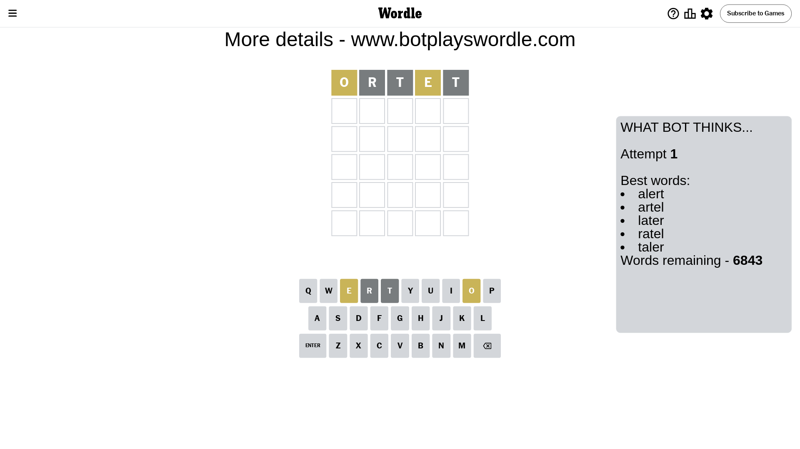
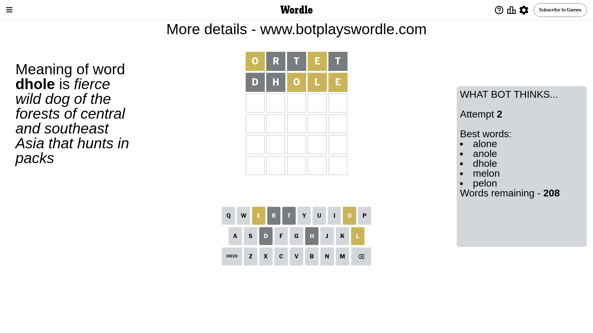
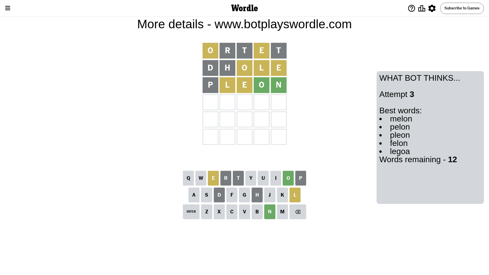
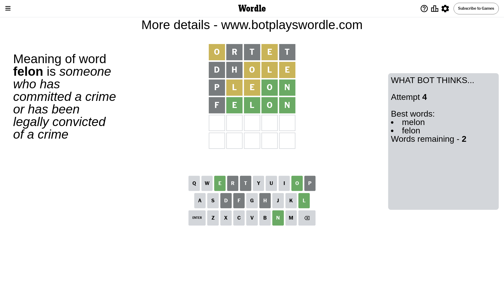
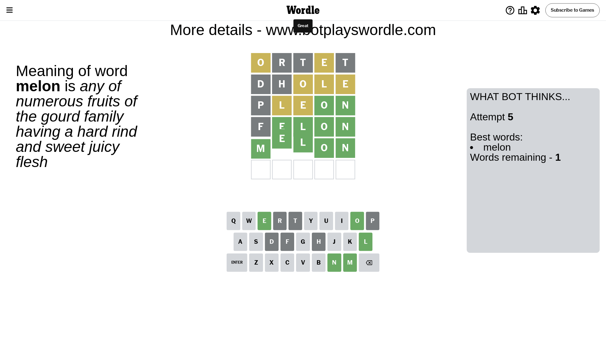

# Wordle for June 7, 2024 - \#1084

## Attempt 1

This is the first attempt and we'll choose a random word to start with.

Let's start with word `ortet`

Attempt for `ortet` gives us 0 correct letters, 2 present letters and 3 wrong letters.

If we look into details, we can see that:

Letter `o` is on a different spot - this means that it cannot be at position 1

Letter `r` is not present in the word and we will not use it any more

Letter `t` is not present in the word and we will not use it any more

Letter `e` is on a different spot - this means that it cannot be at position 4

Letter `t` is not present in the word and we will not use it any more

Some letters are missing (like `r`, `t`) but it's also important piece of information

Word should contain letters `[o e]`

That was a great guess that limited number of remaining words

## Attempt 2

Right now we have 208 words to choose from and best of them seem to be `[alone anole dhole melon pelon]`

So far we know that possible letters are:

At position 1: `[a b c d e f g h i j k l m n p q s u v w x y z]`

At position 2: `[a b c d e f g h i j k l m n o p q s u v w x y z]`

At position 3: `[a b c d e f g h i j k l m n o p q s u v w x y z]`

At position 4: `[a b c d f g h i j k l m n o p q s u v w x y z]`

At position 5: `[a b c d e f g h i j k l m n o p q s u v w x y z]`

Next guess is `dhole`, let's see what it gives us

Attempt for `dhole` gives us 0 correct letters, 3 present letters and 2 wrong letters.

If we look into details, we can see that:

Letter `d` is not present in the word and we will not use it any more

Letter `h` is not present in the word and we will not use it any more

Letter `o` is on a different spot - this means that it cannot be at position 3

Letter `l` is on a different spot - this means that it cannot be at position 4

Letter `e` is on a different spot - this means that it cannot be at position 5

Some letters are missing (like `d`, `h`) but it's also important piece of information

Word should contain letters `[o e l]`

That was a great guess that limited number of remaining words

## Attempt 3

Right now we have 12 words to choose from and best of them seem to be `[melon pelon pleon felon legoa]`

So far we know that possible letters are:

At position 1: `[a b c e f g i j k l m n p q s u v w x y z]`

At position 2: `[a b c e f g i j k l m n o p q s u v w x y z]`

At position 3: `[a b c e f g i j k l m n p q s u v w x y z]`

At position 4: `[a b c f g i j k m n o p q s u v w x y z]`

At position 5: `[a b c f g i j k l m n o p q s u v w x y z]`

Next guess is `pleon`, let's see what it gives us

Attempt for `pleon` gives us 2 correct letters, 2 present letters and 1 wrong letters.

If we look into details, we can see that:

Letter `p` is not present in the word and we will not use it any more

Letter `l` is on a different spot - this means that it cannot be at position 2

Letter `e` is on a different spot - this means that it cannot be at position 3

Letter `o` should be at position 4

Letter `n` should be at position 5

We got information about the correct letters and it should make next attempt easier

Some letters are missing (like `p`) but it's also important piece of information

Word should contain letters `[o e l n]`

Not a bad guess in general

## Attempt 4

Right now we have 2 words to choose from and best of them seem to be `[melon felon]`

So far we know that possible letters are:

At position 1: `[a b c e f g i j k l m n q s u v w x y z]`

At position 2: `[a b c e f g i j k m n o q s u v w x y z]`

At position 3: `[a b c f g i j k l m n q s u v w x y z]`

At position 4: `[o]`

At position 5: `[n]`

Next guess is `felon`, let's see what it gives us

Attempt for `felon` gives us 4 correct letters, 0 present letters and 1 wrong letters.

If we look into details, we can see that:

Letter `f` is not present in the word and we will not use it any more

Letter `e` should be at position 2

Letter `l` should be at position 3

We got information about the correct letters and it should make next attempt easier

Some letters are missing (like `f`) but it's also important piece of information

Word should contain letters `[o e l n]`

This was a waste, almost no valuable information...

## Attempt 5

Right now we have 1 words to choose from and best of them seem to be `[melon]`

So far we know that possible letters are:

At position 1: `[a b c e g i j k l m n q s u v w x y z]`

At position 2: `[e]`

At position 3: `[l]`

At position 4: `[o]`

At position 5: `[n]`

It must be `melon`

That's the correct answer! The word is `melon`!

## Conclusion

Today's word is `melon` and it took 5 attempts to guess it

