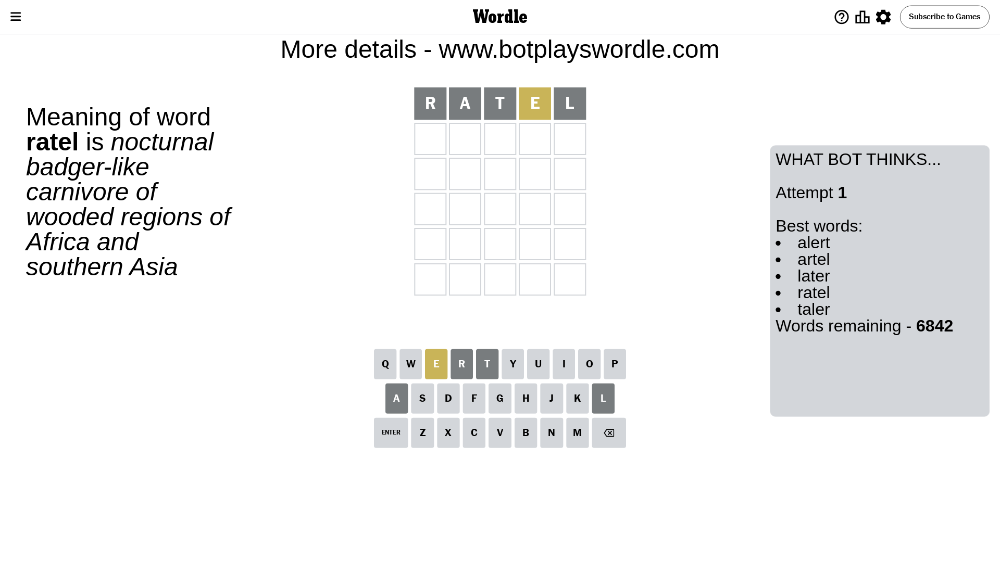

# Wordle for June 8, 2024 - \#1085

## Attempt 1

This is the first attempt and we'll choose a random word to start with.

Let's start with word `ratel`

Attempt for `ratel` gives us 0 correct letters, 1 present letters and 4 wrong letters.

If we look into details, we can see that:

Letter `r` is not present in the word and we will not use it any more

Letter `a` is not present in the word and we will not use it any more

Letter `t` is not present in the word and we will not use it any more

Letter `e` is on a different spot - this means that it cannot be at position 4

Letter `l` is not present in the word and we will not use it any more

Some letters are missing (like `r`, `a`, `t`, `l`) but it's also important piece of information

Word should contain letters `[e]`

That was a great guess that limited number of remaining words

## Attempt 2

Right now we have 449 words to choose from and best of them seem to be `[shend hynde snide unode indue]`

So far we know that possible letters are:

At position 1: `[b c d e f g h i j k m n o p q s u v w x y z]`

At position 2: `[b c d e f g h i j k m n o p q s u v w x y z]`

At position 3: `[b c d e f g h i j k m n o p q s u v w x y z]`

At position 4: `[b c d f g h i j k m n o p q s u v w x y z]`

At position 5: `[b c d e f g h i j k m n o p q s u v w x y z]`

Next guess is `hynde`, let's see what it gives us

Attempt for `hynde` gives us 3 correct letters, 0 present letters and 2 wrong letters.

If we look into details, we can see that:

Letter `h` should be at position 1

Letter `y` is not present in the word and we will not use it any more

Letter `n` should be at position 3

Letter `d` is not present in the word and we will not use it any more

Letter `e` should be at position 5

We got information about the correct letters and it should make next attempt easier

Some letters are missing (like `y`, `d`) but it's also important piece of information

Word should contain letters `[e h n]`

That was a great guess that limited number of remaining words

## Attempt 3

Right now we have 2 words to choose from and best of them seem to be `[hinge hence]`

So far we know that possible letters are:

At position 1: `[h]`

At position 2: `[b c e f g h i j k m n o p q s u v w x z]`

At position 3: `[n]`

At position 4: `[b c f g h i j k m n o p q s u v w x z]`

At position 5: `[e]`

Next guess is `hinge`, let's see what it gives us

Attempt for `hinge` gives us 3 correct letters, 0 present letters and 2 wrong letters.

If we look into details, we can see that:

Letter `i` is not present in the word and we will not use it any more

Letter `g` is not present in the word and we will not use it any more

Some letters are missing (like `i`, `g`) but it's also important piece of information

Word should contain letters `[e h n]`

This was a waste, almost no valuable information...

## Attempt 4

Right now we have 1 words to choose from and best of them seem to be `[hence]`

So far we know that possible letters are:

At position 1: `[h]`

At position 2: `[b c e f h j k m n o p q s u v w x z]`

At position 3: `[n]`

At position 4: `[b c f h j k m n o p q s u v w x z]`

At position 5: `[e]`

It must be `hence`

That's the correct answer! The word is `hence`!

## Conclusion

Today's word is `hence` and it took 4 attempts to guess it

