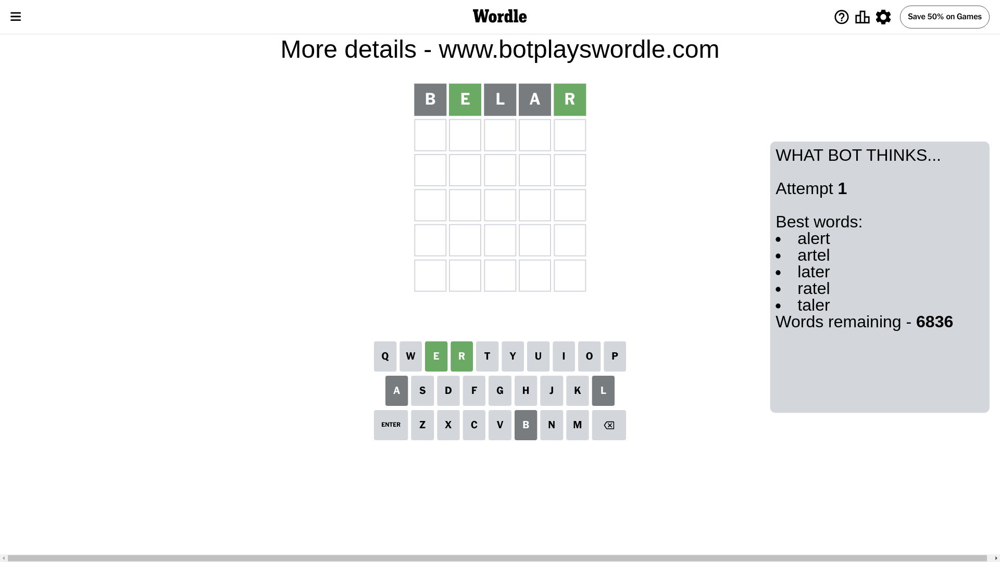
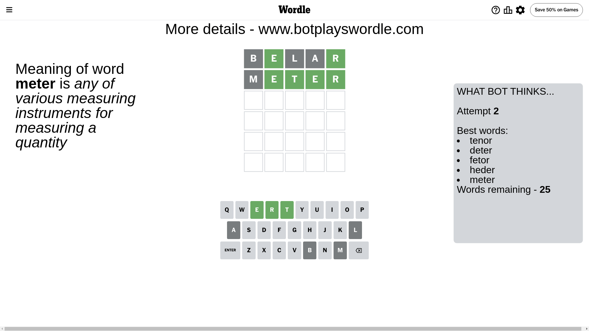
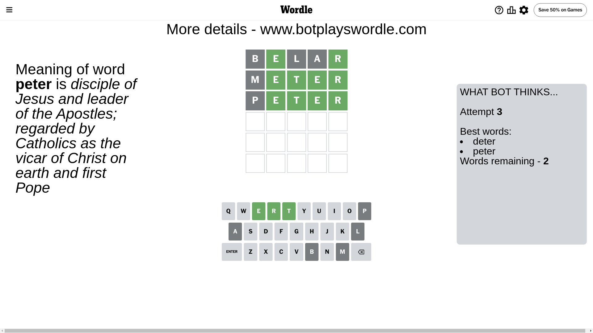
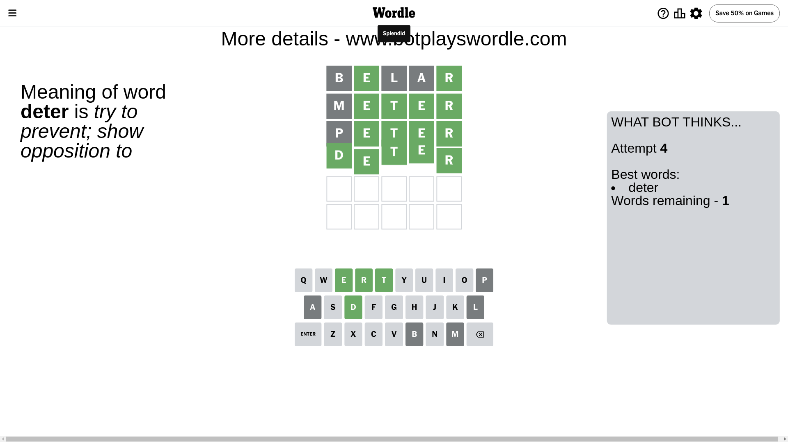

# Wordle for June 12, 2024 - \#1089

## Attempt 1

This is the first attempt and we'll choose a random word to start with.

Let's start with word `belar`

Attempt for `belar` gives us 2 correct letters, 0 present letters and 3 wrong letters.

If we look into details, we can see that:

Letter `b` is not present in the word and we will not use it any more

Letter `e` should be at position 2

Letter `l` is not present in the word and we will not use it any more

Letter `a` is not present in the word and we will not use it any more

Letter `r` should be at position 5

We got information about the correct letters and it should make next attempt easier

Some letters are missing (like `b`, `l`, `a`) but it's also important piece of information

Word should contain letters `[e r]`

That was a great guess that limited number of remaining words

## Attempt 2

Right now we have 25 words to choose from and best of them seem to be `[tenor deter fetor heder meter]`

So far we know that possible letters are:

At position 1: `[c d e f g h i j k m n o p q r s t u v w x y z]`

At position 2: `[e]`

At position 3: `[c d e f g h i j k m n o p q r s t u v w x y z]`

At position 4: `[c d e f g h i j k m n o p q r s t u v w x y z]`

At position 5: `[r]`

Next guess is `meter`, let's see what it gives us

Attempt for `meter` gives us 4 correct letters, 0 present letters and 1 wrong letters.

If we look into details, we can see that:

Letter `m` is not present in the word and we will not use it any more

Letter `t` should be at position 3

Letter `e` should be at position 4

We got information about the correct letters and it should make next attempt easier

Some letters are missing (like `m`) but it's also important piece of information

Word should contain letters `[e r t]`

That was a great guess that limited number of remaining words

## Attempt 3

Right now we have 2 words to choose from and best of them seem to be `[deter peter]`

So far we know that possible letters are:

At position 1: `[c d e f g h i j k n o p q r s t u v w x y z]`

At position 2: `[e]`

At position 3: `[t]`

At position 4: `[e]`

At position 5: `[r]`

Next guess is `peter`, let's see what it gives us

Attempt for `peter` gives us 4 correct letters, 0 present letters and 1 wrong letters.

If we look into details, we can see that:

Letter `p` is not present in the word and we will not use it any more

Some letters are missing (like `p`) but it's also important piece of information

Word should contain letters `[e r t]`

This was a waste, almost no valuable information...

## Attempt 4

Right now we have 1 words to choose from and best of them seem to be `[deter]`

So far we know that possible letters are:

At position 1: `[c d e f g h i j k n o q r s t u v w x y z]`

At position 2: `[e]`

At position 3: `[t]`

At position 4: `[e]`

At position 5: `[r]`

It must be `deter`

That's the correct answer! The word is `deter`!

## Conclusion

Today's word is `deter` and it took 4 attempts to guess it

