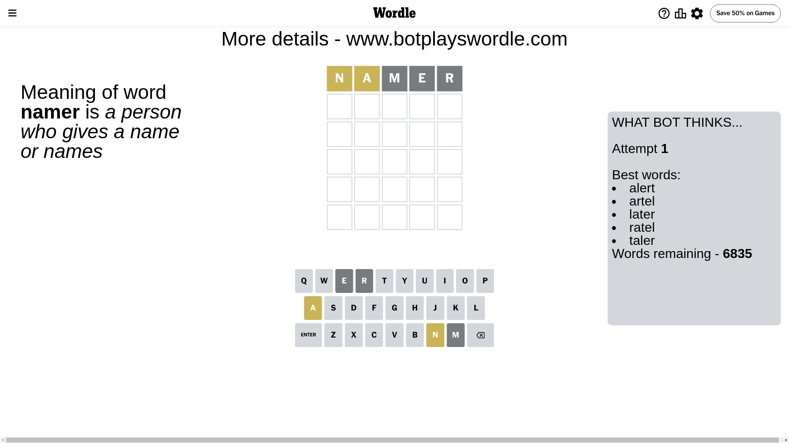
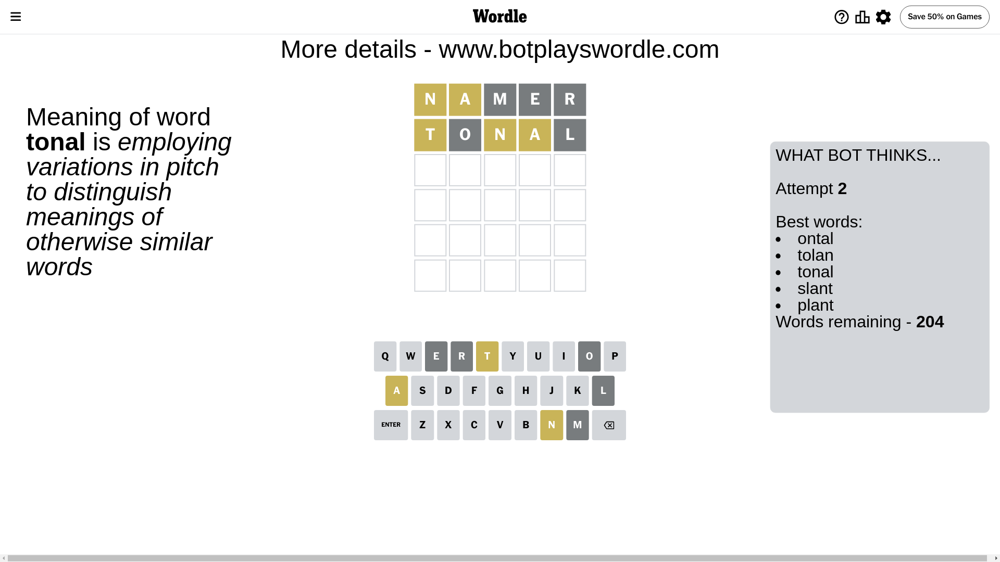
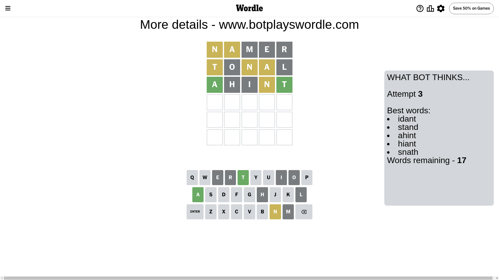
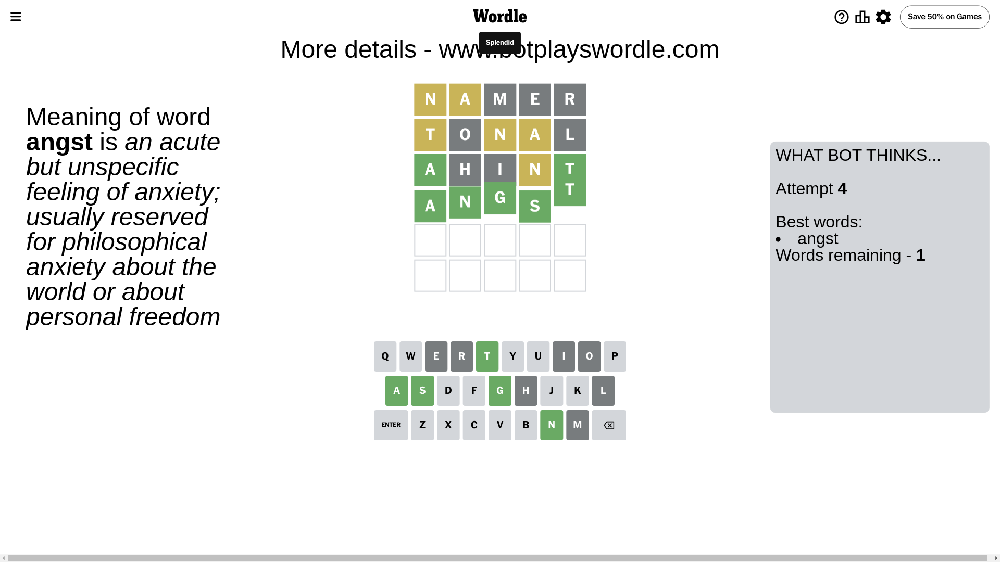

# Wordle for June 13, 2024 - \#1090

## Attempt 1

This is the first attempt and we'll choose a random word to start with.

Let's start with word `namer`

Attempt for `namer` gives us 0 correct letters, 2 present letters and 3 wrong letters.

If we look into details, we can see that:

Letter `n` is on a different spot - this means that it cannot be at position 1

Letter `a` is on a different spot - this means that it cannot be at position 2

Letter `m` is not present in the word and we will not use it any more

Letter `e` is not present in the word and we will not use it any more

Letter `r` is not present in the word and we will not use it any more

Some letters are missing (like `m`, `e`, `r`) but it's also important piece of information

Word should contain letters `[n a]`

That was a great guess that limited number of remaining words

## Attempt 2

Right now we have 204 words to choose from and best of them seem to be `[ontal tolan tonal slant plant]`

So far we know that possible letters are:

At position 1: `[a b c d f g h i j k l o p q s t u v w x y z]`

At position 2: `[b c d f g h i j k l n o p q s t u v w x y z]`

At position 3: `[a b c d f g h i j k l n o p q s t u v w x y z]`

At position 4: `[a b c d f g h i j k l n o p q s t u v w x y z]`

At position 5: `[a b c d f g h i j k l n o p q s t u v w x y z]`

Next guess is `tonal`, let's see what it gives us

Attempt for `tonal` gives us 0 correct letters, 3 present letters and 2 wrong letters.

If we look into details, we can see that:

Letter `t` is on a different spot - this means that it cannot be at position 1

Letter `o` is not present in the word and we will not use it any more

Letter `n` is on a different spot - this means that it cannot be at position 3

Letter `a` is on a different spot - this means that it cannot be at position 4

Letter `l` is not present in the word and we will not use it any more

Some letters are missing (like `o`, `l`) but it's also important piece of information

Word should contain letters `[n a t]`

That was a great guess that limited number of remaining words

## Attempt 3

Right now we have 17 words to choose from and best of them seem to be `[idant stand ahint hiant snath]`

So far we know that possible letters are:

At position 1: `[a b c d f g h i j k p q s u v w x y z]`

At position 2: `[b c d f g h i j k n p q s t u v w x y z]`

At position 3: `[a b c d f g h i j k p q s t u v w x y z]`

At position 4: `[b c d f g h i j k n p q s t u v w x y z]`

At position 5: `[a b c d f g h i j k n p q s t u v w x y z]`

Next guess is `ahint`, let's see what it gives us

Attempt for `ahint` gives us 2 correct letters, 1 present letters and 2 wrong letters.

If we look into details, we can see that:

Letter `a` should be at position 1

Letter `h` is not present in the word and we will not use it any more

Letter `i` is not present in the word and we will not use it any more

Letter `n` is on a different spot - this means that it cannot be at position 4

Letter `t` should be at position 5

We got information about the correct letters and it should make next attempt easier

Some letters are missing (like `h`, `i`) but it's also important piece of information

Word should contain letters `[n a t]`

That was a great guess that limited number of remaining words

## Attempt 4

Right now we have 1 words to choose from and best of them seem to be `[angst]`

So far we know that possible letters are:

At position 1: `[a]`

At position 2: `[b c d f g j k n p q s t u v w x y z]`

At position 3: `[a b c d f g j k p q s t u v w x y z]`

At position 4: `[b c d f g j k p q s t u v w x y z]`

At position 5: `[t]`

It must be `angst`

That's the correct answer! The word is `angst`!

## Conclusion

Today's word is `angst` and it took 4 attempts to guess it

