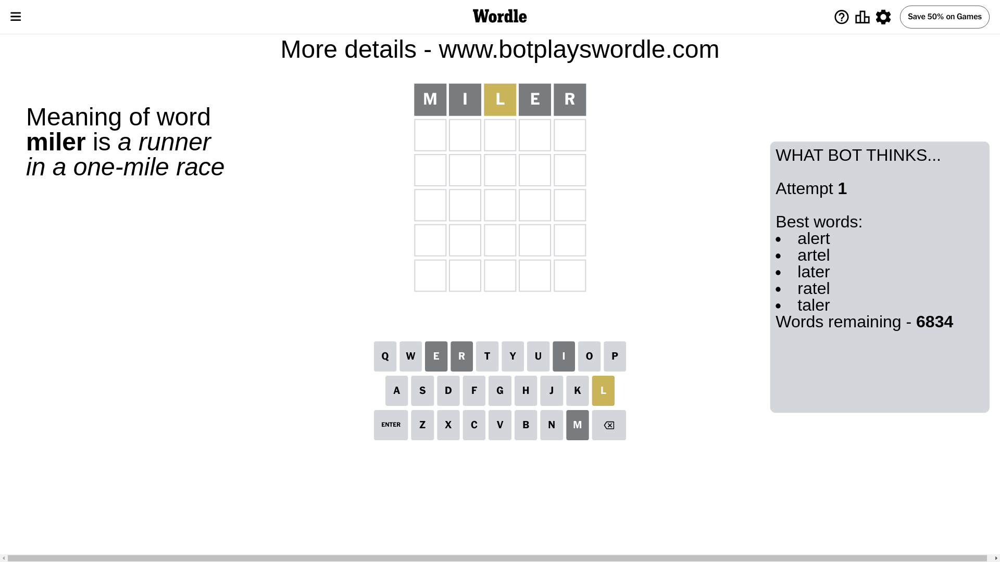
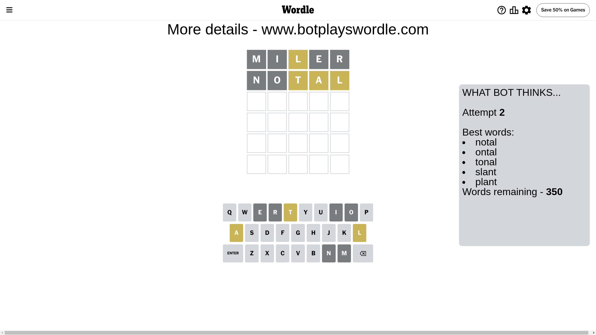
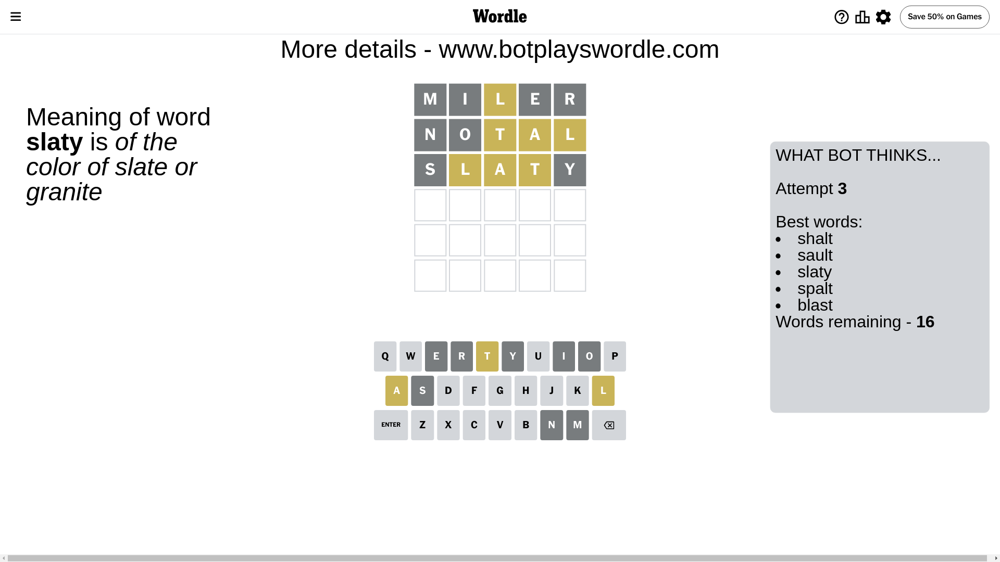
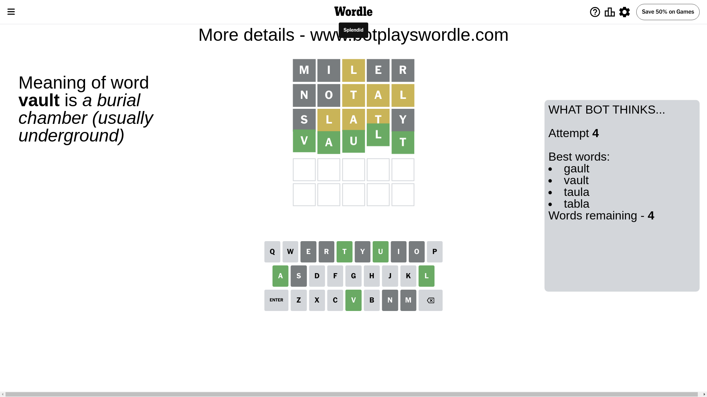

# Wordle for June 14, 2024 - \#1091

## Attempt 1

This is the first attempt and we'll choose a random word to start with.

Let's start with word `miler`

Attempt for `miler` gives us 0 correct letters, 1 present letters and 4 wrong letters.

If we look into details, we can see that:

Letter `m` is not present in the word and we will not use it any more

Letter `i` is not present in the word and we will not use it any more

Letter `l` is on a different spot - this means that it cannot be at position 3

Letter `e` is not present in the word and we will not use it any more

Letter `r` is not present in the word and we will not use it any more

Some letters are missing (like `m`, `i`, `e`, `r`) but it's also important piece of information

Word should contain letters `[l]`

That was a great guess that limited number of remaining words

## Attempt 2

Right now we have 350 words to choose from and best of them seem to be `[notal ontal tonal slant plant]`

So far we know that possible letters are:

At position 1: `[a b c d f g h j k l n o p q s t u v w x y z]`

At position 2: `[a b c d f g h j k l n o p q s t u v w x y z]`

At position 3: `[a b c d f g h j k n o p q s t u v w x y z]`

At position 4: `[a b c d f g h j k l n o p q s t u v w x y z]`

At position 5: `[a b c d f g h j k l n o p q s t u v w x y z]`

Next guess is `notal`, let's see what it gives us

Attempt for `notal` gives us 0 correct letters, 3 present letters and 2 wrong letters.

If we look into details, we can see that:

Letter `n` is not present in the word and we will not use it any more

Letter `o` is not present in the word and we will not use it any more

Letter `t` is on a different spot - this means that it cannot be at position 3

Letter `a` is on a different spot - this means that it cannot be at position 4

Letter `l` is on a different spot - this means that it cannot be at position 5

Some letters are missing (like `n`, `o`) but it's also important piece of information

Word should contain letters `[l t a]`

That was a great guess that limited number of remaining words

## Attempt 3

Right now we have 16 words to choose from and best of them seem to be `[shalt sault slaty spalt blast]`

So far we know that possible letters are:

At position 1: `[a b c d f g h j k l p q s t u v w x y z]`

At position 2: `[a b c d f g h j k l p q s t u v w x y z]`

At position 3: `[a b c d f g h j k p q s u v w x y z]`

At position 4: `[b c d f g h j k l p q s t u v w x y z]`

At position 5: `[a b c d f g h j k p q s t u v w x y z]`

Next guess is `slaty`, let's see what it gives us

Attempt for `slaty` gives us 0 correct letters, 3 present letters and 2 wrong letters.

If we look into details, we can see that:

Letter `s` is not present in the word and we will not use it any more

Letter `l` is on a different spot - this means that it cannot be at position 2

Letter `a` is on a different spot - this means that it cannot be at position 3

Letter `t` is on a different spot - this means that it cannot be at position 4

Letter `y` is not present in the word and we will not use it any more

Some letters are missing (like `s`, `y`) but it's also important piece of information

Word should contain letters `[l t a]`

Could be a better guess

## Attempt 4

Right now we have 4 words to choose from and best of them seem to be `[gault vault taula tabla]`

So far we know that possible letters are:

At position 1: `[a b c d f g h j k l p q t u v w x z]`

At position 2: `[a b c d f g h j k p q t u v w x z]`

At position 3: `[b c d f g h j k p q u v w x z]`

At position 4: `[b c d f g h j k l p q u v w x z]`

At position 5: `[a b c d f g h j k p q t u v w x z]`

Next guess is `vault`, let's see what it gives us

That's the correct answer! The word is `vault`!

## Conclusion

Today's word is `vault` and it took 4 attempts to guess it

