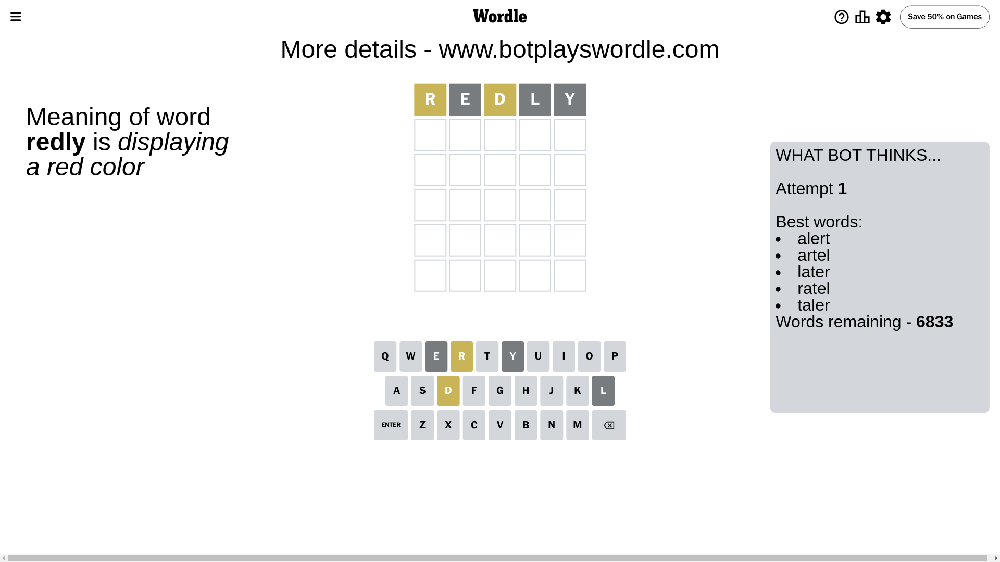
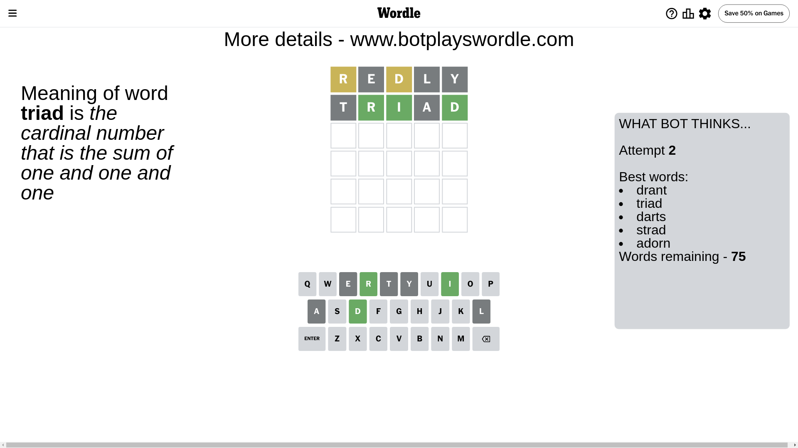
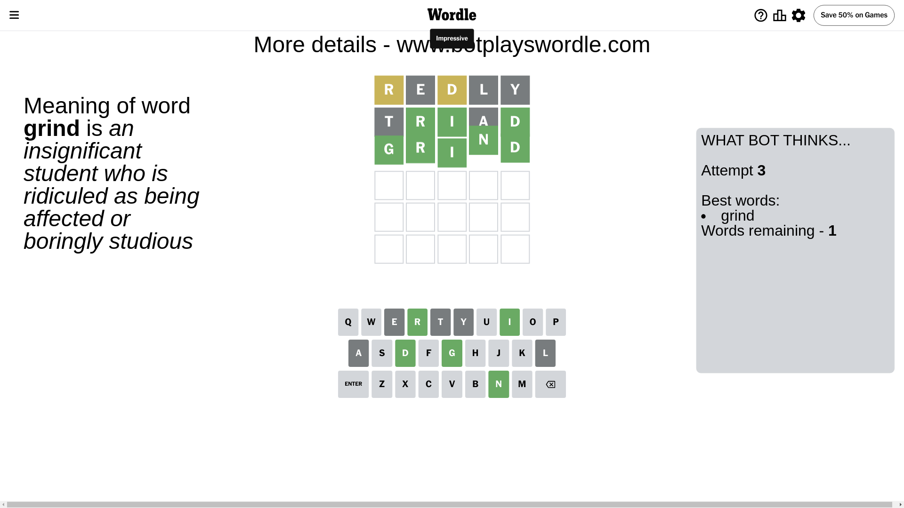

# Wordle for June 16, 2024 - \#1093

## Attempt 1

This is the first attempt and we'll choose a random word to start with.

Let's start with word `redly`

Attempt for `redly` gives us 0 correct letters, 2 present letters and 3 wrong letters.

If we look into details, we can see that:

Letter `r` is on a different spot - this means that it cannot be at position 1

Letter `e` is not present in the word and we will not use it any more

Letter `d` is on a different spot - this means that it cannot be at position 3

Letter `l` is not present in the word and we will not use it any more

Letter `y` is not present in the word and we will not use it any more

Some letters are missing (like `e`, `l`, `y`) but it's also important piece of information

Word should contain letters `[r d]`

That was a great guess that limited number of remaining words

## Attempt 2

Right now we have 75 words to choose from and best of them seem to be `[drant triad darts strad adorn]`

So far we know that possible letters are:

At position 1: `[a b c d f g h i j k m n o p q s t u v w x z]`

At position 2: `[a b c d f g h i j k m n o p q r s t u v w x z]`

At position 3: `[a b c f g h i j k m n o p q r s t u v w x z]`

At position 4: `[a b c d f g h i j k m n o p q r s t u v w x z]`

At position 5: `[a b c d f g h i j k m n o p q r s t u v w x z]`

Next guess is `triad`, let's see what it gives us

Attempt for `triad` gives us 3 correct letters, 0 present letters and 2 wrong letters.

If we look into details, we can see that:

Letter `t` is not present in the word and we will not use it any more

Letter `r` should be at position 2

Letter `i` should be at position 3

Letter `a` is not present in the word and we will not use it any more

Letter `d` should be at position 5

We got information about the correct letters and it should make next attempt easier

Some letters are missing (like `t`, `a`) but it's also important piece of information

Word should contain letters `[r d i]`

That was a great guess that limited number of remaining words

## Attempt 3

Right now we have 1 words to choose from and best of them seem to be `[grind]`

So far we know that possible letters are:

At position 1: `[b c d f g h i j k m n o p q s u v w x z]`

At position 2: `[r]`

At position 3: `[i]`

At position 4: `[b c d f g h i j k m n o p q r s u v w x z]`

At position 5: `[d]`

It must be `grind`

That's the correct answer! The word is `grind`!

## Conclusion

Today's word is `grind` and it took 3 attempts to guess it

