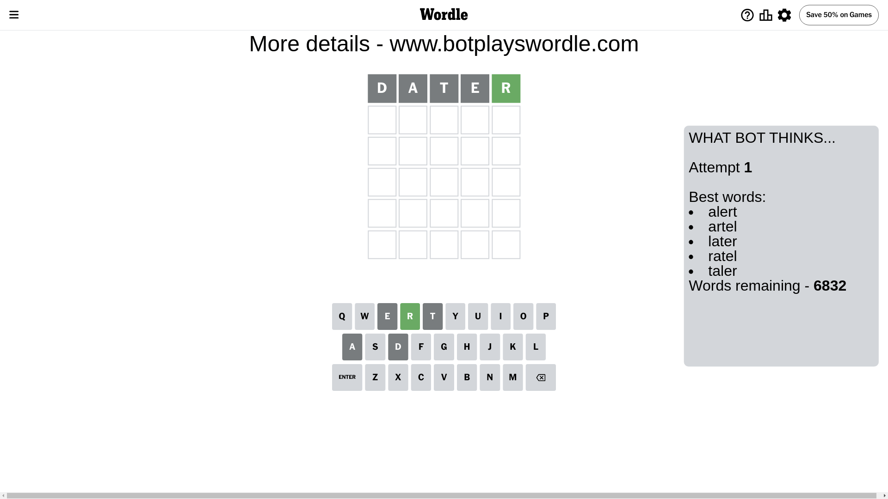
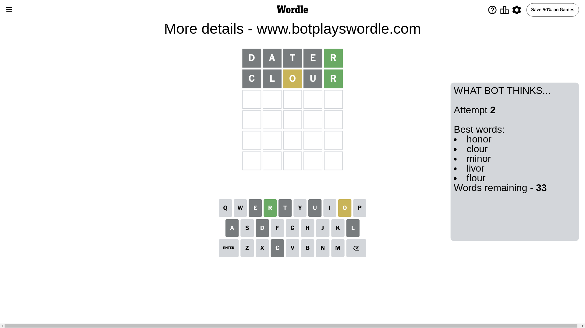
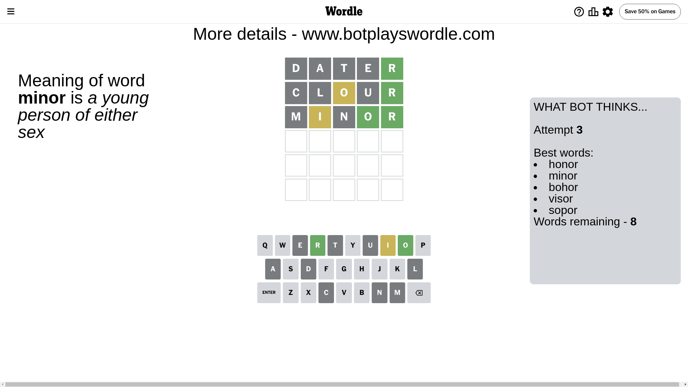
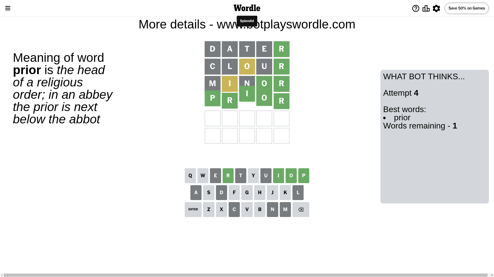

# Wordle for June 17, 2024 - \#1094

## Attempt 1

This is the first attempt and we'll choose a random word to start with.

Let's start with word `dater`

Attempt for `dater` gives us 1 correct letters, 0 present letters and 4 wrong letters.

If we look into details, we can see that:

Letter `d` is not present in the word and we will not use it any more

Letter `a` is not present in the word and we will not use it any more

Letter `t` is not present in the word and we will not use it any more

Letter `e` is not present in the word and we will not use it any more

Letter `r` should be at position 5

We got information about the correct letters and it should make next attempt easier

Some letters are missing (like `d`, `a`, `t`, `e`) but it's also important piece of information

Word should contain letters `[r]`

That was a great guess that limited number of remaining words

## Attempt 2

Right now we have 33 words to choose from and best of them seem to be `[honor clour minor livor flour]`

So far we know that possible letters are:

At position 1: `[b c f g h i j k l m n o p q r s u v w x y z]`

At position 2: `[b c f g h i j k l m n o p q r s u v w x y z]`

At position 3: `[b c f g h i j k l m n o p q r s u v w x y z]`

At position 4: `[b c f g h i j k l m n o p q r s u v w x y z]`

At position 5: `[r]`

Next guess is `clour`, let's see what it gives us

Attempt for `clour` gives us 1 correct letters, 1 present letters and 3 wrong letters.

If we look into details, we can see that:

Letter `c` is not present in the word and we will not use it any more

Letter `l` is not present in the word and we will not use it any more

Letter `o` is on a different spot - this means that it cannot be at position 3

Letter `u` is not present in the word and we will not use it any more

Some letters are missing (like `c`, `l`, `u`) but it's also important piece of information

Word should contain letters `[r o]`

Not a bad guess in general

## Attempt 3

Right now we have 8 words to choose from and best of them seem to be `[honor minor bohor visor sopor]`

So far we know that possible letters are:

At position 1: `[b f g h i j k m n o p q r s v w x y z]`

At position 2: `[b f g h i j k m n o p q r s v w x y z]`

At position 3: `[b f g h i j k m n p q r s v w x y z]`

At position 4: `[b f g h i j k m n o p q r s v w x y z]`

At position 5: `[r]`

Next guess is `minor`, let's see what it gives us

Attempt for `minor` gives us 2 correct letters, 1 present letters and 2 wrong letters.

If we look into details, we can see that:

Letter `m` is not present in the word and we will not use it any more

Letter `i` is on a different spot - this means that it cannot be at position 2

Letter `n` is not present in the word and we will not use it any more

Letter `o` should be at position 4

We got information about the correct letters and it should make next attempt easier

Some letters are missing (like `m`, `n`) but it's also important piece of information

Word should contain letters `[r o i]`

Not a bad guess in general

## Attempt 4

Right now we have 1 words to choose from and best of them seem to be `[prior]`

So far we know that possible letters are:

At position 1: `[b f g h i j k o p q r s v w x y z]`

At position 2: `[b f g h j k o p q r s v w x y z]`

At position 3: `[b f g h i j k p q r s v w x y z]`

At position 4: `[o]`

At position 5: `[r]`

It must be `prior`

That's the correct answer! The word is `prior`!

## Conclusion

Today's word is `prior` and it took 4 attempts to guess it

