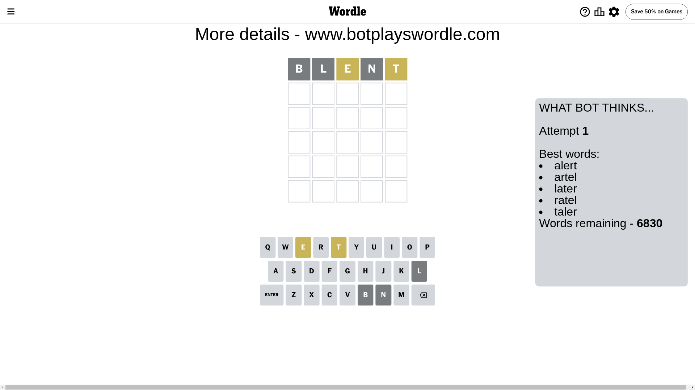
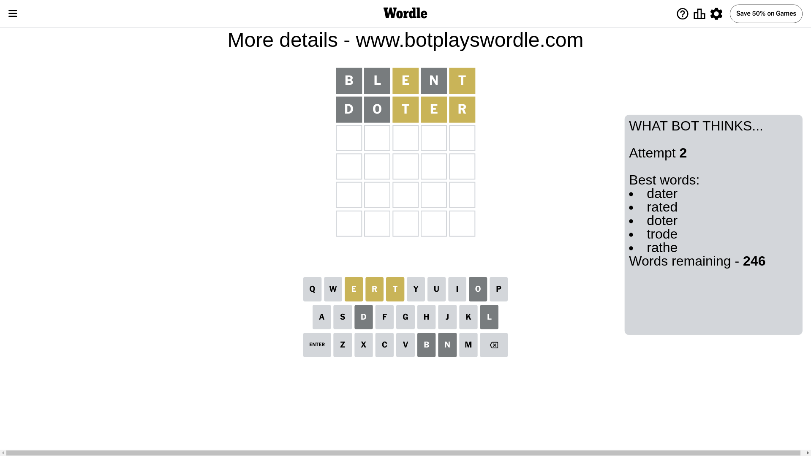
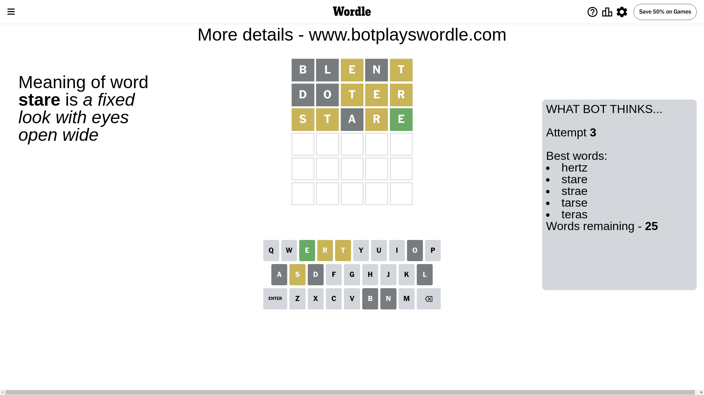
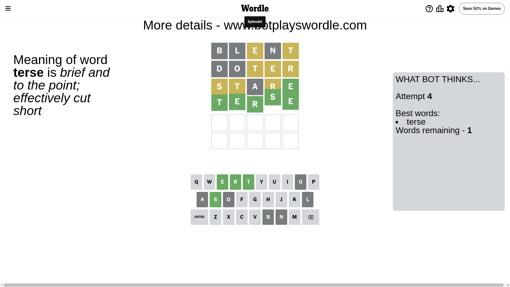

# Wordle for June 19, 2024 - \#1096

## Attempt 1

This is the first attempt and we'll choose a random word to start with.

Let's start with word `blent`

Attempt for `blent` gives us 0 correct letters, 2 present letters and 3 wrong letters.

If we look into details, we can see that:

Letter `b` is not present in the word and we will not use it any more

Letter `l` is not present in the word and we will not use it any more

Letter `e` is on a different spot - this means that it cannot be at position 3

Letter `n` is not present in the word and we will not use it any more

Letter `t` is on a different spot - this means that it cannot be at position 5

Some letters are missing (like `b`, `l`, `n`) but it's also important piece of information

Word should contain letters `[e t]`

That was a great guess that limited number of remaining words

## Attempt 2

Right now we have 246 words to choose from and best of them seem to be `[dater rated doter trode rathe]`

So far we know that possible letters are:

At position 1: `[a c d e f g h i j k m o p q r s t u v w x y z]`

At position 2: `[a c d e f g h i j k m o p q r s t u v w x y z]`

At position 3: `[a c d f g h i j k m o p q r s t u v w x y z]`

At position 4: `[a c d e f g h i j k m o p q r s t u v w x y z]`

At position 5: `[a c d e f g h i j k m o p q r s u v w x y z]`

Next guess is `doter`, let's see what it gives us

Attempt for `doter` gives us 0 correct letters, 3 present letters and 2 wrong letters.

If we look into details, we can see that:

Letter `d` is not present in the word and we will not use it any more

Letter `o` is not present in the word and we will not use it any more

Letter `t` is on a different spot - this means that it cannot be at position 3

Letter `e` is on a different spot - this means that it cannot be at position 4

Letter `r` is on a different spot - this means that it cannot be at position 5

Some letters are missing (like `d`, `o`) but it's also important piece of information

Word should contain letters `[e t r]`

That was a great guess that limited number of remaining words

## Attempt 3

Right now we have 25 words to choose from and best of them seem to be `[hertz stare strae tarse teras]`

So far we know that possible letters are:

At position 1: `[a c e f g h i j k m p q r s t u v w x y z]`

At position 2: `[a c e f g h i j k m p q r s t u v w x y z]`

At position 3: `[a c f g h i j k m p q r s u v w x y z]`

At position 4: `[a c f g h i j k m p q r s t u v w x y z]`

At position 5: `[a c e f g h i j k m p q s u v w x y z]`

Next guess is `stare`, let's see what it gives us

Attempt for `stare` gives us 1 correct letters, 3 present letters and 1 wrong letters.

If we look into details, we can see that:

Letter `s` is on a different spot - this means that it cannot be at position 1

Letter `t` is on a different spot - this means that it cannot be at position 2

Letter `a` is not present in the word and we will not use it any more

Letter `r` is on a different spot - this means that it cannot be at position 4

Letter `e` should be at position 5

We got information about the correct letters and it should make next attempt easier

Some letters are missing (like `a`) but it's also important piece of information

Word should contain letters `[e t r s]`

That was a great guess that limited number of remaining words

## Attempt 4

Right now we have 1 words to choose from and best of them seem to be `[terse]`

So far we know that possible letters are:

At position 1: `[c e f g h i j k m p q r t u v w x y z]`

At position 2: `[c e f g h i j k m p q r s u v w x y z]`

At position 3: `[c f g h i j k m p q r s u v w x y z]`

At position 4: `[c f g h i j k m p q s t u v w x y z]`

At position 5: `[e]`

It must be `terse`

That's the correct answer! The word is `terse`!

## Conclusion

Today's word is `terse` and it took 4 attempts to guess it

