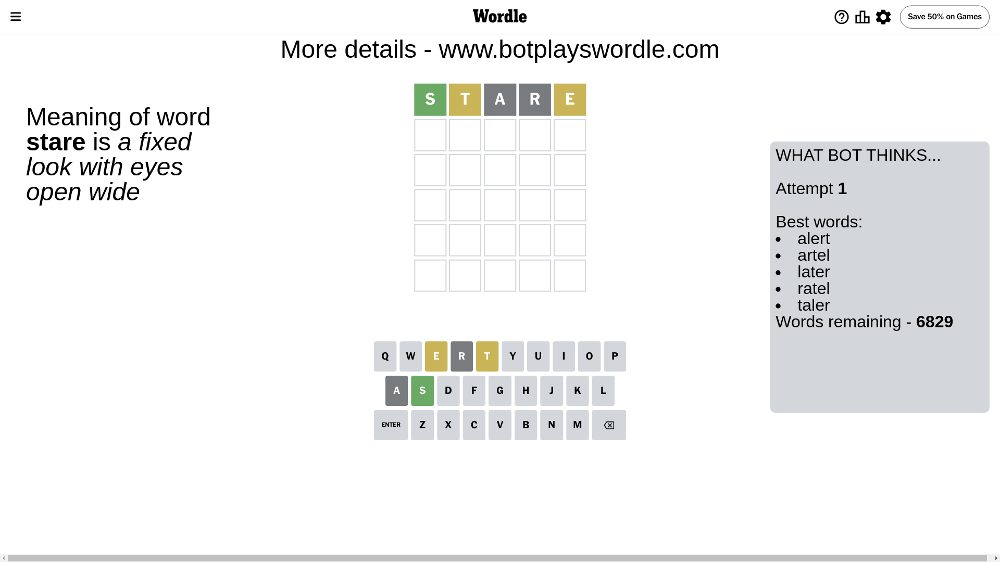
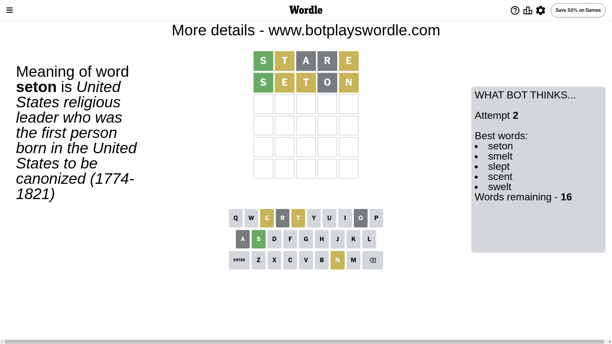
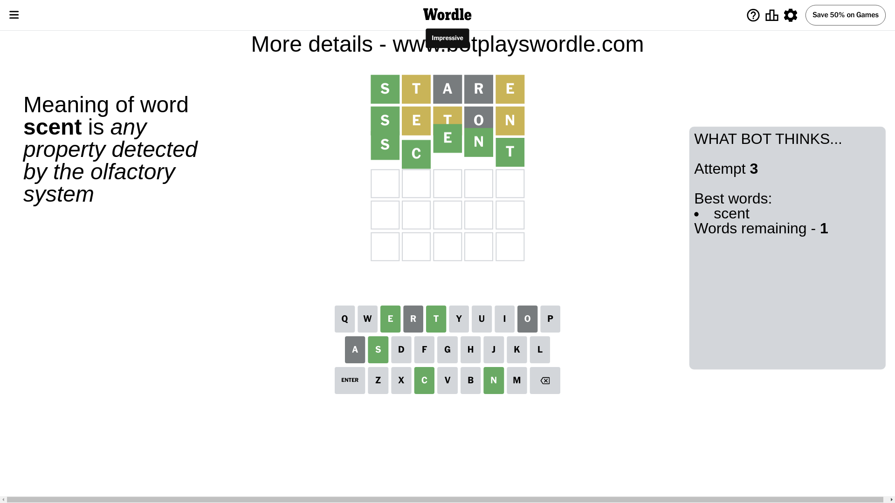

# Wordle for June 20, 2024 - \#1097

## Attempt 1

This is the first attempt and we'll choose a random word to start with.

Let's start with word `stare`

Attempt for `stare` gives us 1 correct letters, 2 present letters and 2 wrong letters.

If we look into details, we can see that:

Letter `s` should be at position 1

Letter `t` is on a different spot - this means that it cannot be at position 2

Letter `a` is not present in the word and we will not use it any more

Letter `r` is not present in the word and we will not use it any more

Letter `e` is on a different spot - this means that it cannot be at position 5

We got information about the correct letters and it should make next attempt easier

Some letters are missing (like `a`, `r`) but it's also important piece of information

Word should contain letters `[s t e]`

That was a great guess that limited number of remaining words

## Attempt 2

Right now we have 16 words to choose from and best of them seem to be `[seton smelt slept scent swelt]`

So far we know that possible letters are:

At position 1: `[s]`

At position 2: `[b c d e f g h i j k l m n o p q s u v w x y z]`

At position 3: `[b c d e f g h i j k l m n o p q s t u v w x y z]`

At position 4: `[b c d e f g h i j k l m n o p q s t u v w x y z]`

At position 5: `[b c d f g h i j k l m n o p q s t u v w x y z]`

Next guess is `seton`, let's see what it gives us

Attempt for `seton` gives us 1 correct letters, 3 present letters and 1 wrong letters.

If we look into details, we can see that:

Letter `e` is on a different spot - this means that it cannot be at position 2

Letter `t` is on a different spot - this means that it cannot be at position 3

Letter `o` is not present in the word and we will not use it any more

Letter `n` is on a different spot - this means that it cannot be at position 5

Some letters are missing (like `o`) but it's also important piece of information

Word should contain letters `[s t e n]`

That was a great guess that limited number of remaining words

## Attempt 3

Right now we have 1 words to choose from and best of them seem to be `[scent]`

So far we know that possible letters are:

At position 1: `[s]`

At position 2: `[b c d f g h i j k l m n p q s u v w x y z]`

At position 3: `[b c d e f g h i j k l m n p q s u v w x y z]`

At position 4: `[b c d e f g h i j k l m n p q s t u v w x y z]`

At position 5: `[b c d f g h i j k l m p q s t u v w x y z]`

It must be `scent`

That's the correct answer! The word is `scent`!

## Conclusion

Today's word is `scent` and it took 3 attempts to guess it

