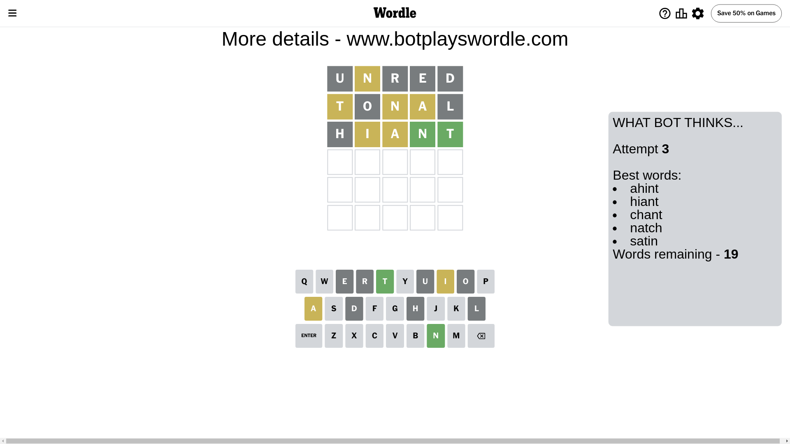

# Wordle for June 21, 2024 - \#1098

## Attempt 1

This is the first attempt and we'll choose a random word to start with.

Let's start with word `unred`

Attempt for `unred` gives us 0 correct letters, 1 present letters and 4 wrong letters.

If we look into details, we can see that:

Letter `u` is not present in the word and we will not use it any more

Letter `n` is on a different spot - this means that it cannot be at position 2

Letter `r` is not present in the word and we will not use it any more

Letter `e` is not present in the word and we will not use it any more

Letter `d` is not present in the word and we will not use it any more

Some letters are missing (like `u`, `r`, `e`, `d`) but it's also important piece of information

Word should contain letters `[n]`

That was a great guess that limited number of remaining words

## Attempt 2

Right now we have 475 words to choose from and best of them seem to be `[notal tolan tonal slant plant]`

So far we know that possible letters are:

At position 1: `[a b c f g h i j k l m n o p q s t v w x y z]`

At position 2: `[a b c f g h i j k l m o p q s t v w x y z]`

At position 3: `[a b c f g h i j k l m n o p q s t v w x y z]`

At position 4: `[a b c f g h i j k l m n o p q s t v w x y z]`

At position 5: `[a b c f g h i j k l m n o p q s t v w x y z]`

Next guess is `tonal`, let's see what it gives us

Attempt for `tonal` gives us 0 correct letters, 3 present letters and 2 wrong letters.

If we look into details, we can see that:

Letter `t` is on a different spot - this means that it cannot be at position 1

Letter `o` is not present in the word and we will not use it any more

Letter `n` is on a different spot - this means that it cannot be at position 3

Letter `a` is on a different spot - this means that it cannot be at position 4

Letter `l` is not present in the word and we will not use it any more

Some letters are missing (like `o`, `l`) but it's also important piece of information

Word should contain letters `[n t a]`

That was a great guess that limited number of remaining words

## Attempt 3

Right now we have 19 words to choose from and best of them seem to be `[ahint hiant chant natch satin]`

So far we know that possible letters are:

At position 1: `[a b c f g h i j k m n p q s v w x y z]`

At position 2: `[a b c f g h i j k m p q s t v w x y z]`

At position 3: `[a b c f g h i j k m p q s t v w x y z]`

At position 4: `[b c f g h i j k m n p q s t v w x y z]`

At position 5: `[a b c f g h i j k m n p q s t v w x y z]`

Next guess is `hiant`, let's see what it gives us

Attempt for `hiant` gives us 2 correct letters, 2 present letters and 1 wrong letters.

If we look into details, we can see that:

Letter `h` is not present in the word and we will not use it any more

Letter `i` is on a different spot - this means that it cannot be at position 2

Letter `a` is on a different spot - this means that it cannot be at position 3

Letter `n` should be at position 4

Letter `t` should be at position 5

We got information about the correct letters and it should make next attempt easier

Some letters are missing (like `h`) but it's also important piece of information

Word should contain letters `[n t a i]`

Not a bad guess in general

## Attempt 4

Right now we have 3 words to choose from and best of them seem to be `[maint paint faint]`

So far we know that possible letters are:

At position 1: `[a b c f g i j k m n p q s v w x y z]`

At position 2: `[a b c f g j k m p q s t v w x y z]`

At position 3: `[b c f g i j k m p q s t v w x y z]`

At position 4: `[n]`

At position 5: `[t]`

Next guess is `faint`, let's see what it gives us

Attempt for `faint` gives us 4 correct letters, 0 present letters and 1 wrong letters.

If we look into details, we can see that:

Letter `f` is not present in the word and we will not use it any more

Letter `a` should be at position 2

Letter `i` should be at position 3

We got information about the correct letters and it should make next attempt easier

Some letters are missing (like `f`) but it's also important piece of information

Word should contain letters `[n t a i]`

This was a waste, almost no valuable information...

## Attempt 5

Right now we have 2 words to choose from and best of them seem to be `[maint paint]`

So far we know that possible letters are:

At position 1: `[a b c g i j k m n p q s v w x y z]`

At position 2: `[a]`

At position 3: `[i]`

At position 4: `[n]`

At position 5: `[t]`

Next guess is `paint`, let's see what it gives us

That's the correct answer! The word is `paint`!

## Conclusion

Today's word is `paint` and it took 5 attempts to guess it

