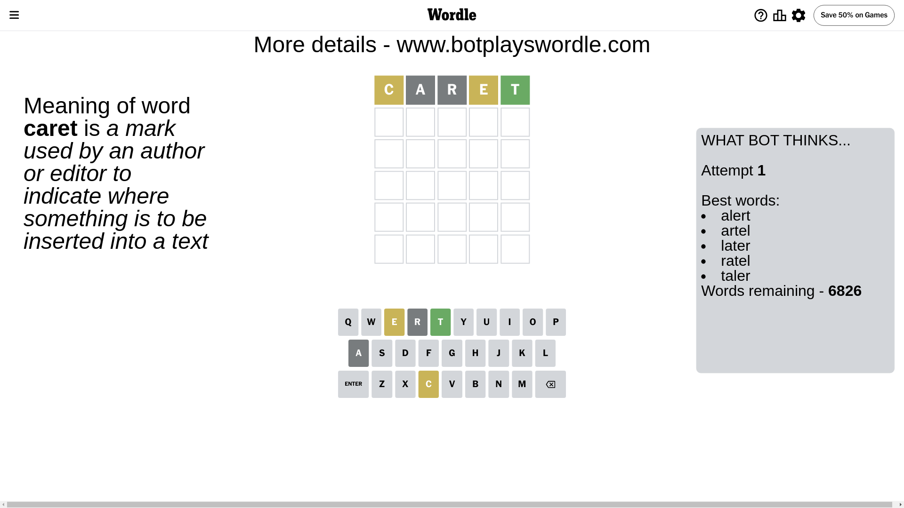
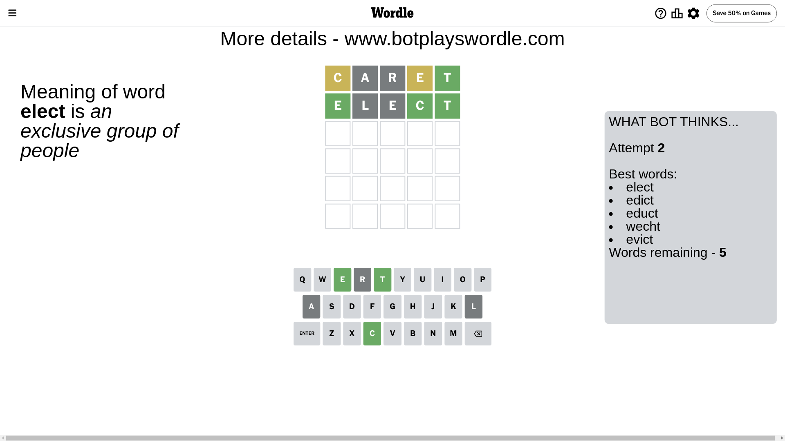
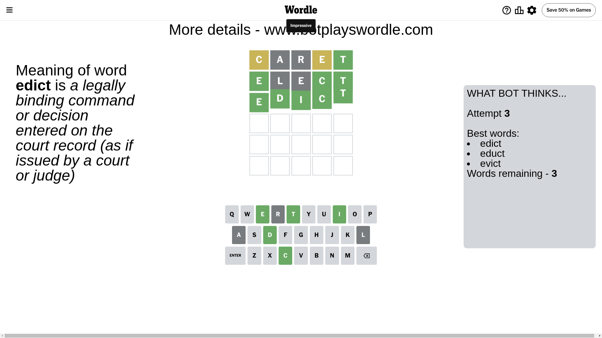

# Wordle for June 22, 2024 - \#1099

## Attempt 1

This is the first attempt and we'll choose a random word to start with.

Let's start with word `caret`

Attempt for `caret` gives us 1 correct letters, 2 present letters and 2 wrong letters.

If we look into details, we can see that:

Letter `c` is on a different spot - this means that it cannot be at position 1

Letter `a` is not present in the word and we will not use it any more

Letter `r` is not present in the word and we will not use it any more

Letter `e` is on a different spot - this means that it cannot be at position 4

Letter `t` should be at position 5

We got information about the correct letters and it should make next attempt easier

Some letters are missing (like `a`, `r`) but it's also important piece of information

Word should contain letters `[c e t]`

That was a great guess that limited number of remaining words

## Attempt 2

Right now we have 5 words to choose from and best of them seem to be `[elect edict educt wecht evict]`

So far we know that possible letters are:

At position 1: `[b d e f g h i j k l m n o p q s t u v w x y z]`

At position 2: `[b c d e f g h i j k l m n o p q s t u v w x y z]`

At position 3: `[b c d e f g h i j k l m n o p q s t u v w x y z]`

At position 4: `[b c d f g h i j k l m n o p q s t u v w x y z]`

At position 5: `[t]`

Next guess is `elect`, let's see what it gives us

Attempt for `elect` gives us 3 correct letters, 0 present letters and 2 wrong letters.

If we look into details, we can see that:

Letter `e` should be at position 1

Letter `l` is not present in the word and we will not use it any more

Letter `e` is not present in the word and we will not use it any more

Letter `c` should be at position 4

We got information about the correct letters and it should make next attempt easier

Some letters are missing (like `l`, `e`) but it's also important piece of information

Word should contain letters `[c e t]`

This was a waste, almost no valuable information...

## Attempt 3

Right now we have 3 words to choose from and best of them seem to be `[edict educt evict]`

So far we know that possible letters are:

At position 1: `[e]`

At position 2: `[b c d f g h i j k m n o p q s t u v w x y z]`

At position 3: `[b c d f g h i j k m n o p q s t u v w x y z]`

At position 4: `[c]`

At position 5: `[t]`

Next guess is `edict`, let's see what it gives us

That's the correct answer! The word is `edict`!

## Conclusion

Today's word is `edict` and it took 3 attempts to guess it

