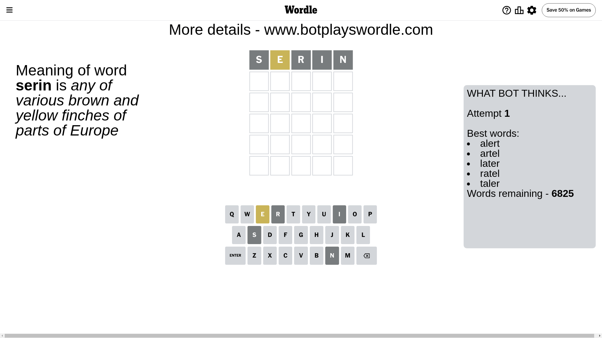
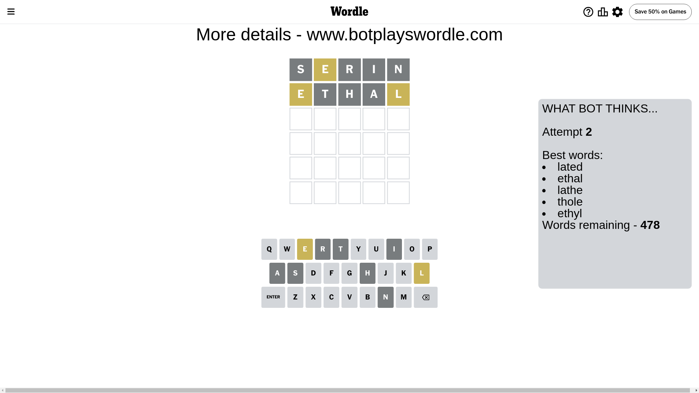
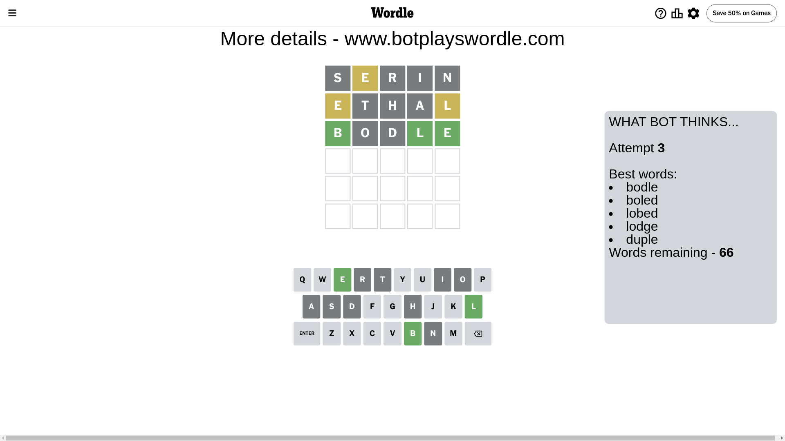
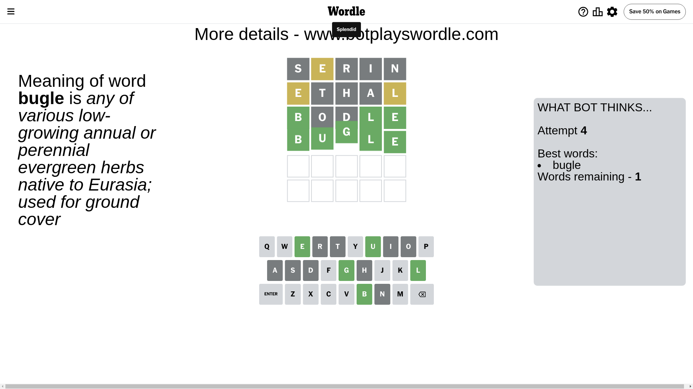

# Wordle for June 23, 2024 - \#1100

## Attempt 1

This is the first attempt and we'll choose a random word to start with.

Let's start with word `serin`

Attempt for `serin` gives us 0 correct letters, 1 present letters and 4 wrong letters.

If we look into details, we can see that:

Letter `s` is not present in the word and we will not use it any more

Letter `e` is on a different spot - this means that it cannot be at position 2

Letter `r` is not present in the word and we will not use it any more

Letter `i` is not present in the word and we will not use it any more

Letter `n` is not present in the word and we will not use it any more

Some letters are missing (like `s`, `r`, `i`, `n`) but it's also important piece of information

Word should contain letters `[e]`

That was a great guess that limited number of remaining words

## Attempt 2

Right now we have 478 words to choose from and best of them seem to be `[lated ethal lathe thole ethyl]`

So far we know that possible letters are:

At position 1: `[a b c d e f g h j k l m o p q t u v w x y z]`

At position 2: `[a b c d f g h j k l m o p q t u v w x y z]`

At position 3: `[a b c d e f g h j k l m o p q t u v w x y z]`

At position 4: `[a b c d e f g h j k l m o p q t u v w x y z]`

At position 5: `[a b c d e f g h j k l m o p q t u v w x y z]`

Next guess is `ethal`, let's see what it gives us

Attempt for `ethal` gives us 0 correct letters, 2 present letters and 3 wrong letters.

If we look into details, we can see that:

Letter `e` is on a different spot - this means that it cannot be at position 1

Letter `t` is not present in the word and we will not use it any more

Letter `h` is not present in the word and we will not use it any more

Letter `a` is not present in the word and we will not use it any more

Letter `l` is on a different spot - this means that it cannot be at position 5

Some letters are missing (like `t`, `h`, `a`) but it's also important piece of information

Word should contain letters `[e l]`

Not a bad guess in general

## Attempt 3

Right now we have 66 words to choose from and best of them seem to be `[bodle boled lobed lodge duple]`

So far we know that possible letters are:

At position 1: `[b c d f g j k l m o p q u v w x y z]`

At position 2: `[b c d f g j k l m o p q u v w x y z]`

At position 3: `[b c d e f g j k l m o p q u v w x y z]`

At position 4: `[b c d e f g j k l m o p q u v w x y z]`

At position 5: `[b c d e f g j k m o p q u v w x y z]`

Next guess is `bodle`, let's see what it gives us

Attempt for `bodle` gives us 3 correct letters, 0 present letters and 2 wrong letters.

If we look into details, we can see that:

Letter `b` should be at position 1

Letter `o` is not present in the word and we will not use it any more

Letter `d` is not present in the word and we will not use it any more

Letter `l` should be at position 4

Letter `e` should be at position 5

We got information about the correct letters and it should make next attempt easier

Some letters are missing (like `o`, `d`) but it's also important piece of information

Word should contain letters `[e l b]`

That was a great guess that limited number of remaining words

## Attempt 4

Right now we have 1 words to choose from and best of them seem to be `[bugle]`

So far we know that possible letters are:

At position 1: `[b]`

At position 2: `[b c f g j k l m p q u v w x y z]`

At position 3: `[b c e f g j k l m p q u v w x y z]`

At position 4: `[l]`

At position 5: `[e]`

It must be `bugle`

That's the correct answer! The word is `bugle`!

## Conclusion

Today's word is `bugle` and it took 4 attempts to guess it

