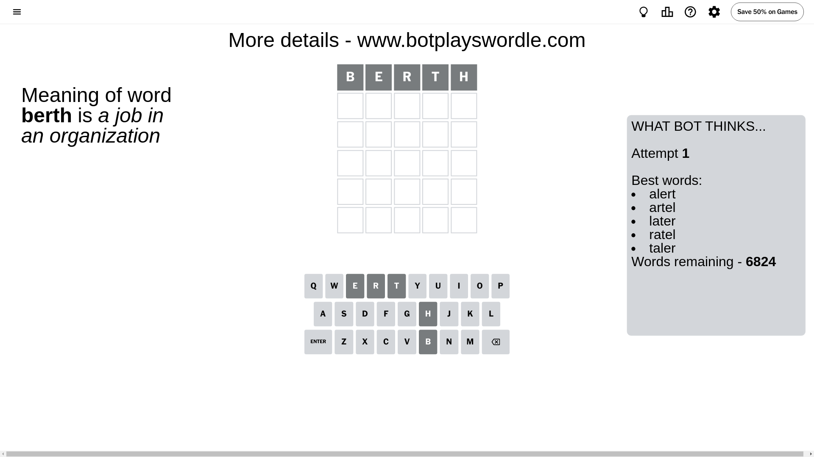
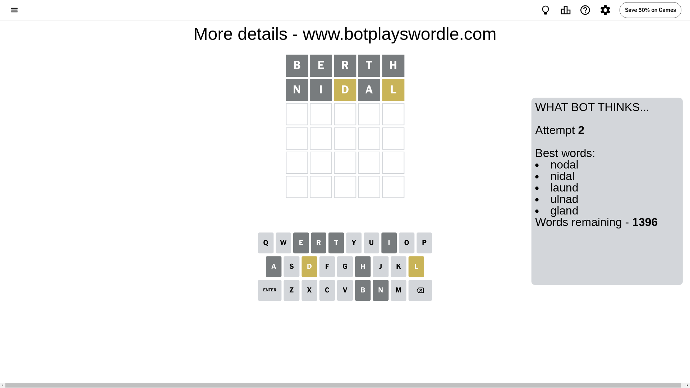
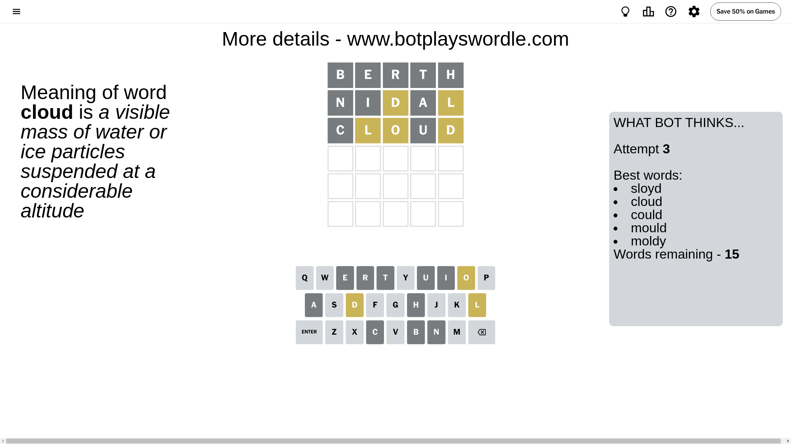
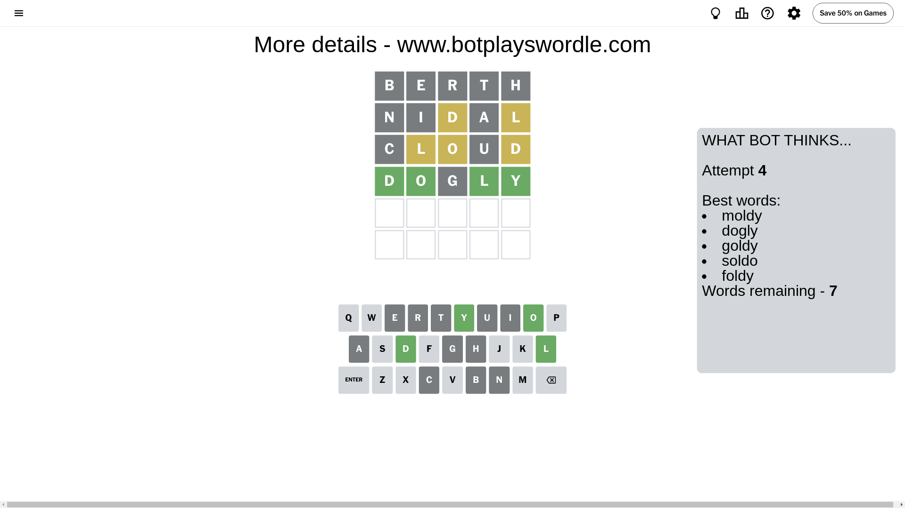
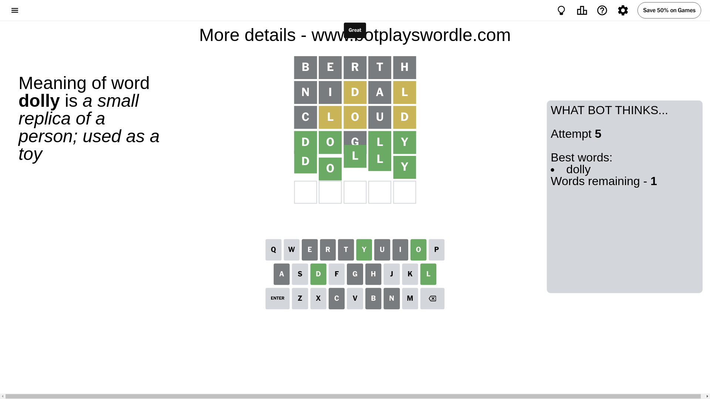

# Wordle for June 24, 2024 - \#1101

## Attempt 1

This is the first attempt and we'll choose a random word to start with.

Let's start with word `berth`

Attempt for `berth` gives us 0 correct letters, 0 present letters and 5 wrong letters.

If we look into details, we can see that:

Letter `b` is not present in the word and we will not use it any more

Letter `e` is not present in the word and we will not use it any more

Letter `r` is not present in the word and we will not use it any more

Letter `t` is not present in the word and we will not use it any more

Letter `h` is not present in the word and we will not use it any more

Some letters are missing (like `b`, `e`, `r`, `t`, `h`) but it's also important piece of information

So far we don't know any of the letters!

Not a bad guess in general

## Attempt 2

Right now we have 1396 words to choose from and best of them seem to be `[nodal nidal laund ulnad gland]`

So far we know that possible letters are:

At position 1: `[a c d f g i j k l m n o p q s u v w x y z]`

At position 2: `[a c d f g i j k l m n o p q s u v w x y z]`

At position 3: `[a c d f g i j k l m n o p q s u v w x y z]`

At position 4: `[a c d f g i j k l m n o p q s u v w x y z]`

At position 5: `[a c d f g i j k l m n o p q s u v w x y z]`

Next guess is `nidal`, let's see what it gives us

Attempt for `nidal` gives us 0 correct letters, 2 present letters and 3 wrong letters.

If we look into details, we can see that:

Letter `n` is not present in the word and we will not use it any more

Letter `i` is not present in the word and we will not use it any more

Letter `d` is on a different spot - this means that it cannot be at position 3

Letter `a` is not present in the word and we will not use it any more

Letter `l` is on a different spot - this means that it cannot be at position 5

Some letters are missing (like `n`, `i`, `a`) but it's also important piece of information

Word should contain letters `[d l]`

That was a great guess that limited number of remaining words

## Attempt 3

Right now we have 15 words to choose from and best of them seem to be `[sloyd cloud could mould moldy]`

So far we know that possible letters are:

At position 1: `[c d f g j k l m o p q s u v w x y z]`

At position 2: `[c d f g j k l m o p q s u v w x y z]`

At position 3: `[c f g j k l m o p q s u v w x y z]`

At position 4: `[c d f g j k l m o p q s u v w x y z]`

At position 5: `[c d f g j k m o p q s u v w x y z]`

Next guess is `cloud`, let's see what it gives us

Attempt for `cloud` gives us 0 correct letters, 3 present letters and 2 wrong letters.

If we look into details, we can see that:

Letter `c` is not present in the word and we will not use it any more

Letter `l` is on a different spot - this means that it cannot be at position 2

Letter `o` is on a different spot - this means that it cannot be at position 3

Letter `u` is not present in the word and we will not use it any more

Letter `d` is on a different spot - this means that it cannot be at position 5

Some letters are missing (like `c`, `u`) but it's also important piece of information

Word should contain letters `[d l o]`

Could be a better guess

## Attempt 4

Right now we have 7 words to choose from and best of them seem to be `[moldy dogly goldy soldo foldy]`

So far we know that possible letters are:

At position 1: `[d f g j k l m o p q s v w x y z]`

At position 2: `[d f g j k m o p q s v w x y z]`

At position 3: `[f g j k l m p q s v w x y z]`

At position 4: `[d f g j k l m o p q s v w x y z]`

At position 5: `[f g j k m o p q s v w x y z]`

Next guess is `dogly`, let's see what it gives us

Attempt for `dogly` gives us 4 correct letters, 0 present letters and 1 wrong letters.

If we look into details, we can see that:

Letter `d` should be at position 1

Letter `o` should be at position 2

Letter `g` is not present in the word and we will not use it any more

Letter `l` should be at position 4

Letter `y` should be at position 5

We got information about the correct letters and it should make next attempt easier

Some letters are missing (like `g`) but it's also important piece of information

Word should contain letters `[d l o y]`

Not a bad guess in general

## Attempt 5

Right now we have 1 words to choose from and best of them seem to be `[dolly]`

So far we know that possible letters are:

At position 1: `[d]`

At position 2: `[o]`

At position 3: `[f j k l m p q s v w x y z]`

At position 4: `[l]`

At position 5: `[y]`

It must be `dolly`

That's the correct answer! The word is `dolly`!

## Conclusion

Today's word is `dolly` and it took 5 attempts to guess it

