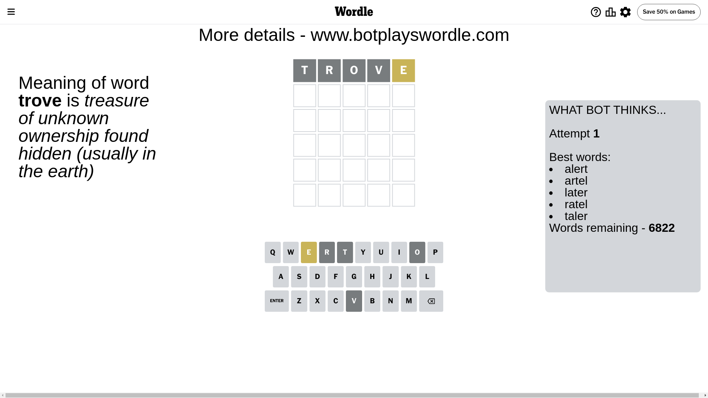
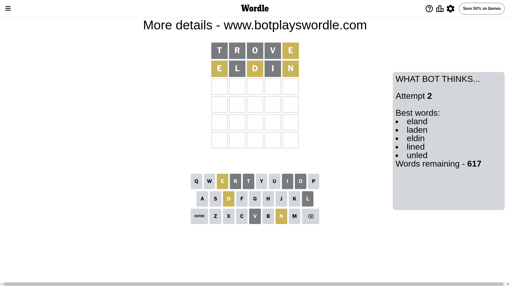
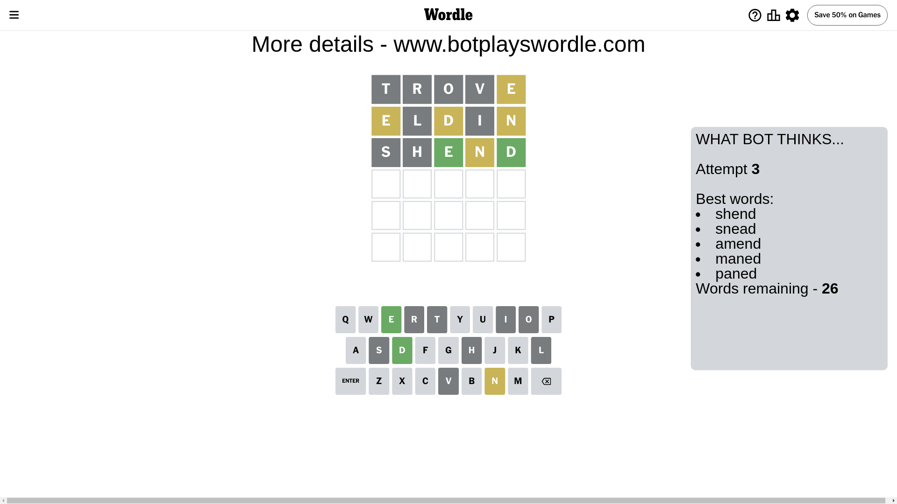
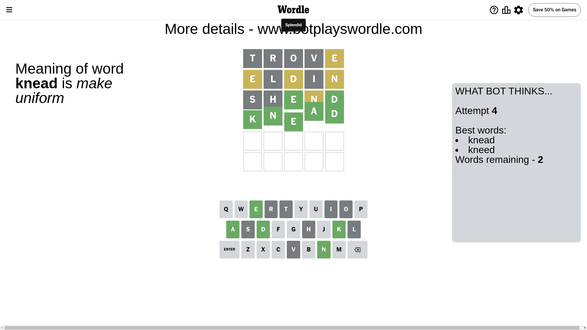

# Wordle for June 26, 2024 - \#1103

## Attempt 1

This is the first attempt and we'll choose a random word to start with.

Let's start with word `trove`

Attempt for `trove` gives us 0 correct letters, 1 present letters and 4 wrong letters.

If we look into details, we can see that:

Letter `t` is not present in the word and we will not use it any more

Letter `r` is not present in the word and we will not use it any more

Letter `o` is not present in the word and we will not use it any more

Letter `v` is not present in the word and we will not use it any more

Letter `e` is on a different spot - this means that it cannot be at position 5

Some letters are missing (like `t`, `r`, `o`, `v`) but it's also important piece of information

Word should contain letters `[e]`

That was a great guess that limited number of remaining words

## Attempt 2

Right now we have 617 words to choose from and best of them seem to be `[eland laden eldin lined unled]`

So far we know that possible letters are:

At position 1: `[a b c d e f g h i j k l m n p q s u w x y z]`

At position 2: `[a b c d e f g h i j k l m n p q s u w x y z]`

At position 3: `[a b c d e f g h i j k l m n p q s u w x y z]`

At position 4: `[a b c d e f g h i j k l m n p q s u w x y z]`

At position 5: `[a b c d f g h i j k l m n p q s u w x y z]`

Next guess is `eldin`, let's see what it gives us

Attempt for `eldin` gives us 0 correct letters, 3 present letters and 2 wrong letters.

If we look into details, we can see that:

Letter `e` is on a different spot - this means that it cannot be at position 1

Letter `l` is not present in the word and we will not use it any more

Letter `d` is on a different spot - this means that it cannot be at position 3

Letter `i` is not present in the word and we will not use it any more

Letter `n` is on a different spot - this means that it cannot be at position 5

Some letters are missing (like `l`, `i`) but it's also important piece of information

Word should contain letters `[e d n]`

That was a great guess that limited number of remaining words

## Attempt 3

Right now we have 26 words to choose from and best of them seem to be `[shend snead amend maned paned]`

So far we know that possible letters are:

At position 1: `[a b c d f g h j k m n p q s u w x y z]`

At position 2: `[a b c d e f g h j k m n p q s u w x y z]`

At position 3: `[a b c e f g h j k m n p q s u w x y z]`

At position 4: `[a b c d e f g h j k m n p q s u w x y z]`

At position 5: `[a b c d f g h j k m p q s u w x y z]`

Next guess is `shend`, let's see what it gives us

Attempt for `shend` gives us 2 correct letters, 1 present letters and 2 wrong letters.

If we look into details, we can see that:

Letter `s` is not present in the word and we will not use it any more

Letter `h` is not present in the word and we will not use it any more

Letter `e` should be at position 3

Letter `n` is on a different spot - this means that it cannot be at position 4

Letter `d` should be at position 5

We got information about the correct letters and it should make next attempt easier

Some letters are missing (like `s`, `h`) but it's also important piece of information

Word should contain letters `[e d n]`

That was a great guess that limited number of remaining words

## Attempt 4

Right now we have 2 words to choose from and best of them seem to be `[knead kneed]`

So far we know that possible letters are:

At position 1: `[a b c d f g j k m n p q u w x y z]`

At position 2: `[a b c d e f g j k m n p q u w x y z]`

At position 3: `[e]`

At position 4: `[a b c d e f g j k m p q u w x y z]`

At position 5: `[d]`

Next guess is `knead`, let's see what it gives us

That's the correct answer! The word is `knead`!

## Conclusion

Today's word is `knead` and it took 4 attempts to guess it

