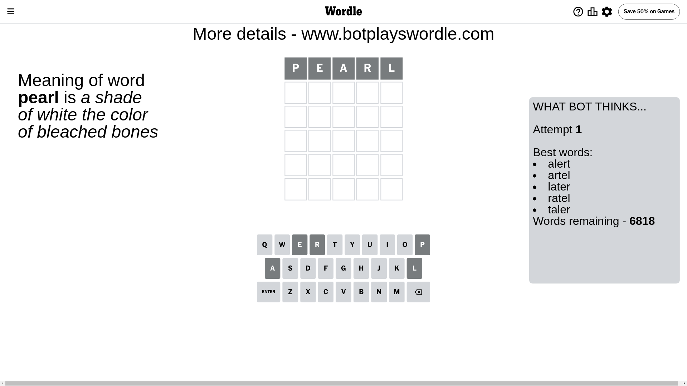
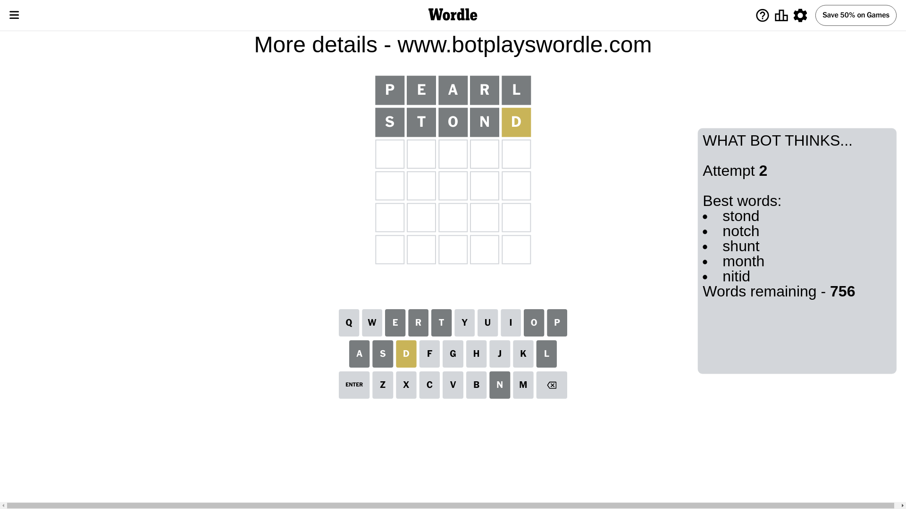
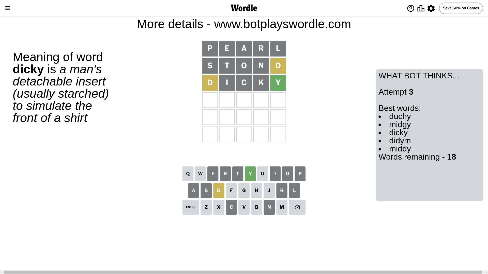
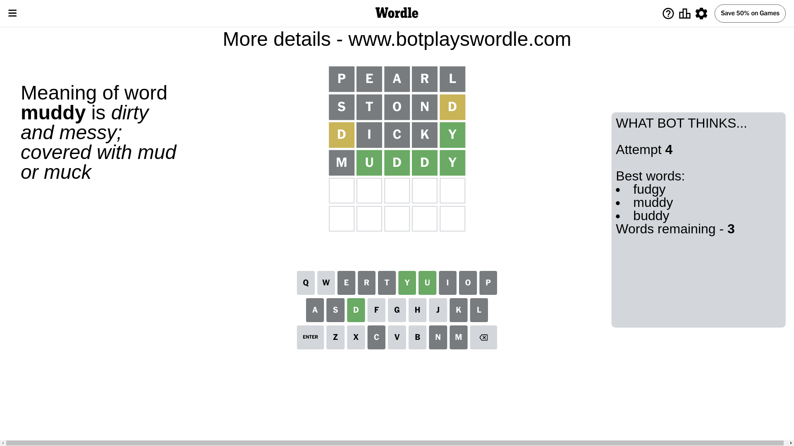
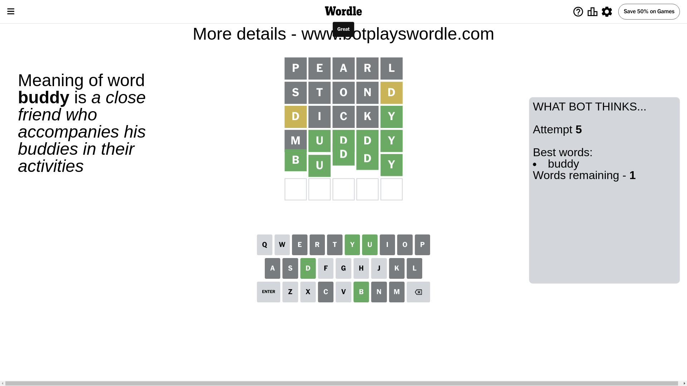

# Wordle for June 30, 2024 - \#1107

## Attempt 1

This is the first attempt and we'll choose a random word to start with.

Let's start with word `pearl`

Attempt for `pearl` gives us 0 correct letters, 0 present letters and 5 wrong letters.

If we look into details, we can see that:

Letter `p` is not present in the word and we will not use it any more

Letter `e` is not present in the word and we will not use it any more

Letter `a` is not present in the word and we will not use it any more

Letter `r` is not present in the word and we will not use it any more

Letter `l` is not present in the word and we will not use it any more

Some letters are missing (like `p`, `e`, `a`, `r`, `l`) but it's also important piece of information

So far we don't know any of the letters!

That was a great guess that limited number of remaining words

## Attempt 2

Right now we have 756 words to choose from and best of them seem to be `[stond notch shunt month nitid]`

So far we know that possible letters are:

At position 1: `[b c d f g h i j k m n o q s t u v w x y z]`

At position 2: `[b c d f g h i j k m n o q s t u v w x y z]`

At position 3: `[b c d f g h i j k m n o q s t u v w x y z]`

At position 4: `[b c d f g h i j k m n o q s t u v w x y z]`

At position 5: `[b c d f g h i j k m n o q s t u v w x y z]`

Next guess is `stond`, let's see what it gives us

Attempt for `stond` gives us 0 correct letters, 1 present letters and 4 wrong letters.

If we look into details, we can see that:

Letter `s` is not present in the word and we will not use it any more

Letter `t` is not present in the word and we will not use it any more

Letter `o` is not present in the word and we will not use it any more

Letter `n` is not present in the word and we will not use it any more

Letter `d` is on a different spot - this means that it cannot be at position 5

Some letters are missing (like `s`, `t`, `o`, `n`) but it's also important piece of information

Word should contain letters `[d]`

That was a great guess that limited number of remaining words

## Attempt 3

Right now we have 18 words to choose from and best of them seem to be `[duchy midgy dicky didym middy]`

So far we know that possible letters are:

At position 1: `[b c d f g h i j k m q u v w x y z]`

At position 2: `[b c d f g h i j k m q u v w x y z]`

At position 3: `[b c d f g h i j k m q u v w x y z]`

At position 4: `[b c d f g h i j k m q u v w x y z]`

At position 5: `[b c f g h i j k m q u v w x y z]`

Next guess is `dicky`, let's see what it gives us

Attempt for `dicky` gives us 1 correct letters, 1 present letters and 3 wrong letters.

If we look into details, we can see that:

Letter `d` is on a different spot - this means that it cannot be at position 1

Letter `i` is not present in the word and we will not use it any more

Letter `c` is not present in the word and we will not use it any more

Letter `k` is not present in the word and we will not use it any more

Letter `y` should be at position 5

We got information about the correct letters and it should make next attempt easier

Some letters are missing (like `i`, `c`, `k`) but it's also important piece of information

Word should contain letters `[d y]`

Not a bad guess in general

## Attempt 4

Right now we have 3 words to choose from and best of them seem to be `[fudgy muddy buddy]`

So far we know that possible letters are:

At position 1: `[b f g h j m q u v w x y z]`

At position 2: `[b d f g h j m q u v w x y z]`

At position 3: `[b d f g h j m q u v w x y z]`

At position 4: `[b d f g h j m q u v w x y z]`

At position 5: `[y]`

Next guess is `muddy`, let's see what it gives us

Attempt for `muddy` gives us 4 correct letters, 0 present letters and 1 wrong letters.

If we look into details, we can see that:

Letter `m` is not present in the word and we will not use it any more

Letter `u` should be at position 2

Letter `d` should be at position 3

Letter `d` should be at position 4

We got information about the correct letters and it should make next attempt easier

Some letters are missing (like `m`) but it's also important piece of information

Word should contain letters `[d y u]`

Could be a better guess

## Attempt 5

Right now we have 1 words to choose from and best of them seem to be `[buddy]`

So far we know that possible letters are:

At position 1: `[b f g h j q u v w x y z]`

At position 2: `[u]`

At position 3: `[d]`

At position 4: `[d]`

At position 5: `[y]`

It must be `buddy`

That's the correct answer! The word is `buddy`!

## Conclusion

Today's word is `buddy` and it took 5 attempts to guess it

