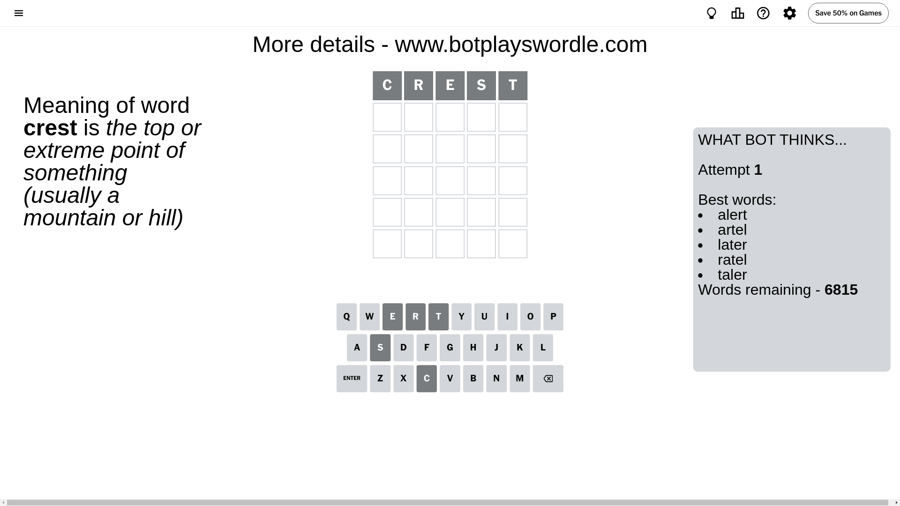
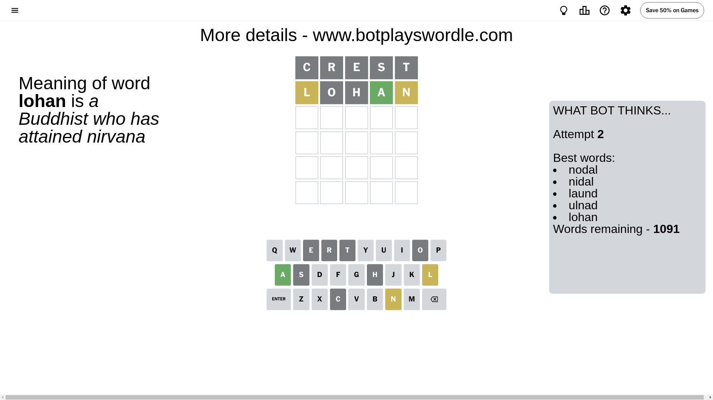
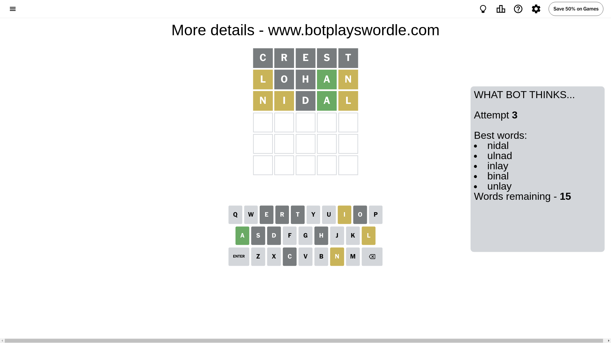
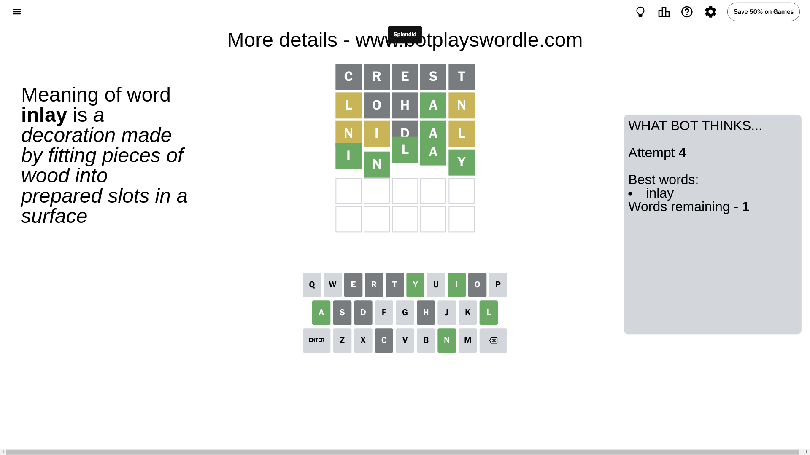

# Wordle for July 2, 2024 - \#1109

## Attempt 1

This is the first attempt and we'll choose a random word to start with.

Let's start with word `crest`

Attempt for `crest` gives us 0 correct letters, 0 present letters and 5 wrong letters.

If we look into details, we can see that:

Letter `c` is not present in the word and we will not use it any more

Letter `r` is not present in the word and we will not use it any more

Letter `e` is not present in the word and we will not use it any more

Letter `s` is not present in the word and we will not use it any more

Letter `t` is not present in the word and we will not use it any more

Some letters are missing (like `c`, `r`, `e`, `s`, `t`) but it's also important piece of information

So far we don't know any of the letters!

Not a bad guess in general

## Attempt 2

Right now we have 1091 words to choose from and best of them seem to be `[nodal nidal laund ulnad lohan]`

So far we know that possible letters are:

At position 1: `[a b d f g h i j k l m n o p q u v w x y z]`

At position 2: `[a b d f g h i j k l m n o p q u v w x y z]`

At position 3: `[a b d f g h i j k l m n o p q u v w x y z]`

At position 4: `[a b d f g h i j k l m n o p q u v w x y z]`

At position 5: `[a b d f g h i j k l m n o p q u v w x y z]`

Next guess is `lohan`, let's see what it gives us

Attempt for `lohan` gives us 1 correct letters, 2 present letters and 2 wrong letters.

If we look into details, we can see that:

Letter `l` is on a different spot - this means that it cannot be at position 1

Letter `o` is not present in the word and we will not use it any more

Letter `h` is not present in the word and we will not use it any more

Letter `a` should be at position 4

Letter `n` is on a different spot - this means that it cannot be at position 5

We got information about the correct letters and it should make next attempt easier

Some letters are missing (like `o`, `h`) but it's also important piece of information

Word should contain letters `[l a n]`

That was a great guess that limited number of remaining words

## Attempt 3

Right now we have 15 words to choose from and best of them seem to be `[nidal ulnad inlay binal unlay]`

So far we know that possible letters are:

At position 1: `[a b d f g i j k m n p q u v w x y z]`

At position 2: `[a b d f g i j k l m n p q u v w x y z]`

At position 3: `[a b d f g i j k l m n p q u v w x y z]`

At position 4: `[a]`

At position 5: `[a b d f g i j k l m p q u v w x y z]`

Next guess is `nidal`, let's see what it gives us

Attempt for `nidal` gives us 1 correct letters, 3 present letters and 1 wrong letters.

If we look into details, we can see that:

Letter `n` is on a different spot - this means that it cannot be at position 1

Letter `i` is on a different spot - this means that it cannot be at position 2

Letter `d` is not present in the word and we will not use it any more

Letter `l` is on a different spot - this means that it cannot be at position 5

Some letters are missing (like `d`) but it's also important piece of information

Word should contain letters `[l a n i]`

That was a great guess that limited number of remaining words

## Attempt 4

Right now we have 1 words to choose from and best of them seem to be `[inlay]`

So far we know that possible letters are:

At position 1: `[a b f g i j k m p q u v w x y z]`

At position 2: `[a b f g j k l m n p q u v w x y z]`

At position 3: `[a b f g i j k l m n p q u v w x y z]`

At position 4: `[a]`

At position 5: `[a b f g i j k m p q u v w x y z]`

It must be `inlay`

That's the correct answer! The word is `inlay`!

## Conclusion

Today's word is `inlay` and it took 4 attempts to guess it

