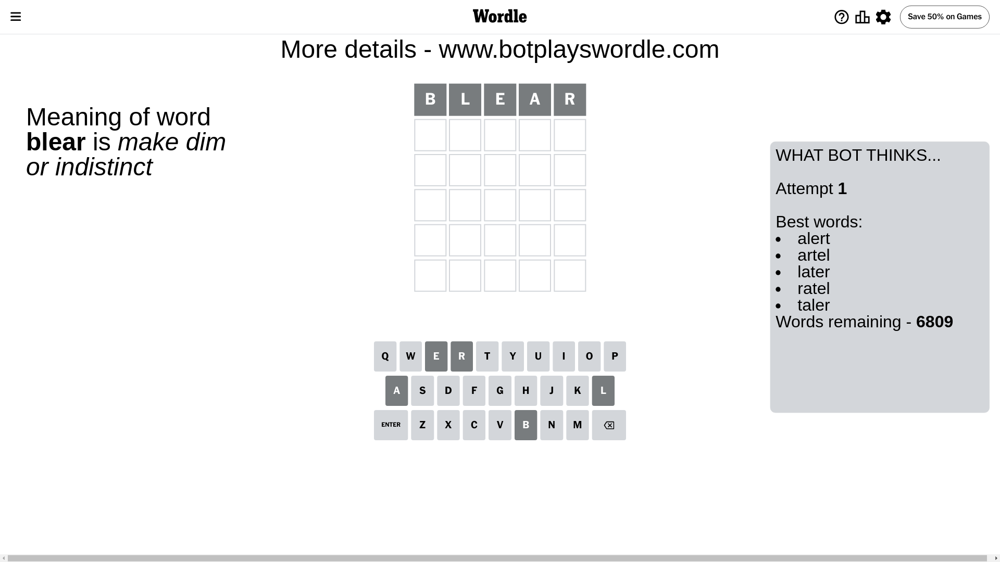
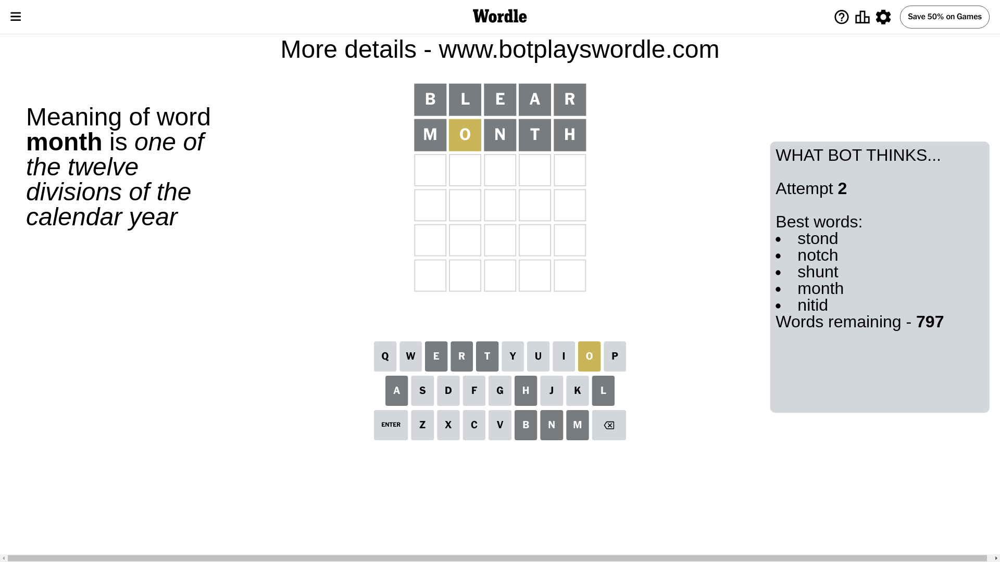
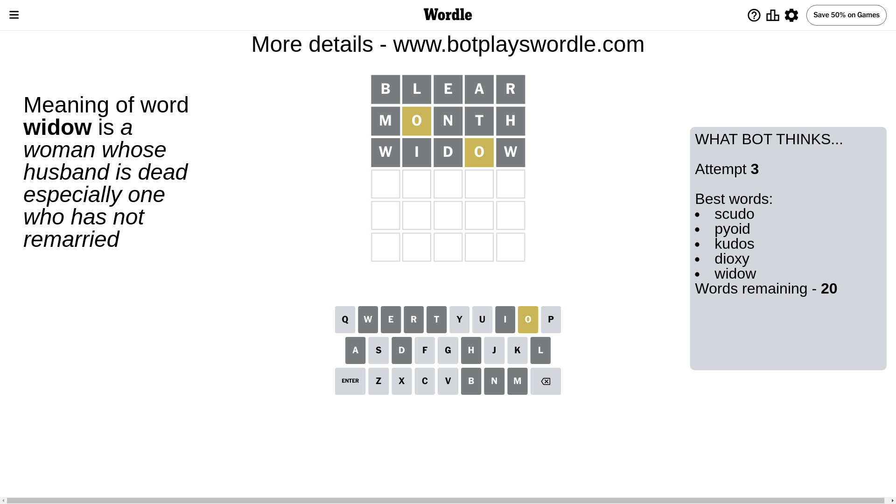
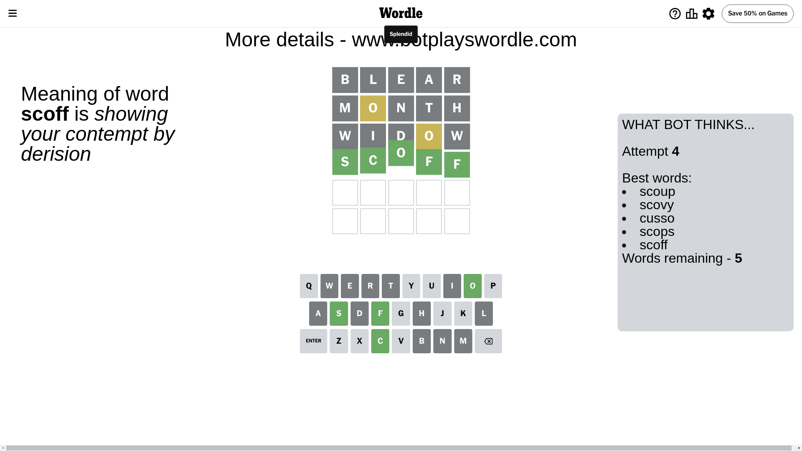

# Wordle for July 6, 2024 - \#1113

## Attempt 1

This is the first attempt and we'll choose a random word to start with.

Let's start with word `blear`

Attempt for `blear` gives us 0 correct letters, 0 present letters and 5 wrong letters.

If we look into details, we can see that:

Letter `b` is not present in the word and we will not use it any more

Letter `l` is not present in the word and we will not use it any more

Letter `e` is not present in the word and we will not use it any more

Letter `a` is not present in the word and we will not use it any more

Letter `r` is not present in the word and we will not use it any more

Some letters are missing (like `b`, `l`, `e`, `a`, `r`) but it's also important piece of information

So far we don't know any of the letters!

That was a great guess that limited number of remaining words

## Attempt 2

Right now we have 797 words to choose from and best of them seem to be `[stond notch shunt month nitid]`

So far we know that possible letters are:

At position 1: `[c d f g h i j k m n o p q s t u v w x y z]`

At position 2: `[c d f g h i j k m n o p q s t u v w x y z]`

At position 3: `[c d f g h i j k m n o p q s t u v w x y z]`

At position 4: `[c d f g h i j k m n o p q s t u v w x y z]`

At position 5: `[c d f g h i j k m n o p q s t u v w x y z]`

Next guess is `month`, let's see what it gives us

Attempt for `month` gives us 0 correct letters, 1 present letters and 4 wrong letters.

If we look into details, we can see that:

Letter `m` is not present in the word and we will not use it any more

Letter `o` is on a different spot - this means that it cannot be at position 2

Letter `n` is not present in the word and we will not use it any more

Letter `t` is not present in the word and we will not use it any more

Letter `h` is not present in the word and we will not use it any more

Some letters are missing (like `m`, `n`, `t`, `h`) but it's also important piece of information

Word should contain letters `[o]`

That was a great guess that limited number of remaining words

## Attempt 3

Right now we have 20 words to choose from and best of them seem to be `[scudo pyoid kudos dioxy widow]`

So far we know that possible letters are:

At position 1: `[c d f g i j k o p q s u v w x y z]`

At position 2: `[c d f g i j k p q s u v w x y z]`

At position 3: `[c d f g i j k o p q s u v w x y z]`

At position 4: `[c d f g i j k o p q s u v w x y z]`

At position 5: `[c d f g i j k o p q s u v w x y z]`

Next guess is `widow`, let's see what it gives us

Attempt for `widow` gives us 0 correct letters, 1 present letters and 4 wrong letters.

If we look into details, we can see that:

Letter `w` is not present in the word and we will not use it any more

Letter `i` is not present in the word and we will not use it any more

Letter `d` is not present in the word and we will not use it any more

Letter `o` is on a different spot - this means that it cannot be at position 4

Letter `w` is not present in the word and we will not use it any more

Some letters are missing (like `w`, `i`, `d`) but it's also important piece of information

Word should contain letters `[o]`

Could be a better guess

## Attempt 4

Right now we have 5 words to choose from and best of them seem to be `[scoup scovy cusso scops scoff]`

So far we know that possible letters are:

At position 1: `[c f g j k o p q s u v x y z]`

At position 2: `[c f g j k p q s u v x y z]`

At position 3: `[c f g j k o p q s u v x y z]`

At position 4: `[c f g j k p q s u v x y z]`

At position 5: `[c f g j k o p q s u v x y z]`

Next guess is `scoff`, let's see what it gives us

That's the correct answer! The word is `scoff`!

## Conclusion

Today's word is `scoff` and it took 4 attempts to guess it

