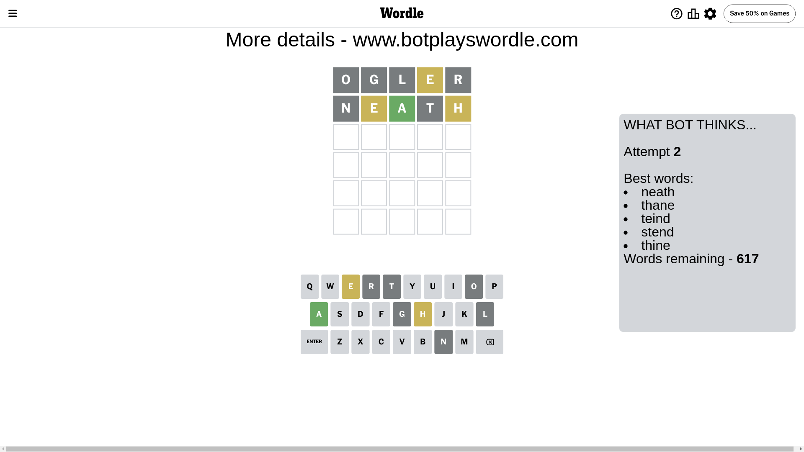

# Wordle for July 8, 2024 - \#1115

## Attempt 1

This is the first attempt and we'll choose a random word to start with.

Let's start with word `ogler`

Attempt for `ogler` gives us 0 correct letters, 1 present letters and 4 wrong letters.

If we look into details, we can see that:

Letter `o` is not present in the word and we will not use it any more

Letter `g` is not present in the word and we will not use it any more

Letter `l` is not present in the word and we will not use it any more

Letter `e` is on a different spot - this means that it cannot be at position 4

Letter `r` is not present in the word and we will not use it any more

Some letters are missing (like `o`, `g`, `l`, `r`) but it's also important piece of information

Word should contain letters `[e]`

That was a great guess that limited number of remaining words

## Attempt 2

Right now we have 617 words to choose from and best of them seem to be `[neath thane teind stend thine]`

So far we know that possible letters are:

At position 1: `[a b c d e f h i j k m n p q s t u v w x y z]`

At position 2: `[a b c d e f h i j k m n p q s t u v w x y z]`

At position 3: `[a b c d e f h i j k m n p q s t u v w x y z]`

At position 4: `[a b c d f h i j k m n p q s t u v w x y z]`

At position 5: `[a b c d e f h i j k m n p q s t u v w x y z]`

Next guess is `neath`, let's see what it gives us

Attempt for `neath` gives us 1 correct letters, 2 present letters and 2 wrong letters.

If we look into details, we can see that:

Letter `n` is not present in the word and we will not use it any more

Letter `e` is on a different spot - this means that it cannot be at position 2

Letter `a` should be at position 3

Letter `t` is not present in the word and we will not use it any more

Letter `h` is on a different spot - this means that it cannot be at position 5

We got information about the correct letters and it should make next attempt easier

Some letters are missing (like `n`, `t`) but it's also important piece of information

Word should contain letters `[e a h]`

That was a great guess that limited number of remaining words

## Attempt 3

Right now we have 8 words to choose from and best of them seem to be `[chase shame phase shape shake]`

So far we know that possible letters are:

At position 1: `[a b c d e f h i j k m p q s u v w x y z]`

At position 2: `[a b c d f h i j k m p q s u v w x y z]`

At position 3: `[a]`

At position 4: `[a b c d f h i j k m p q s u v w x y z]`

At position 5: `[a b c d e f i j k m p q s u v w x y z]`

Next guess is `shape`, let's see what it gives us

That's the correct answer! The word is `shape`!

## Conclusion

Today's word is `shape` and it took 3 attempts to guess it

