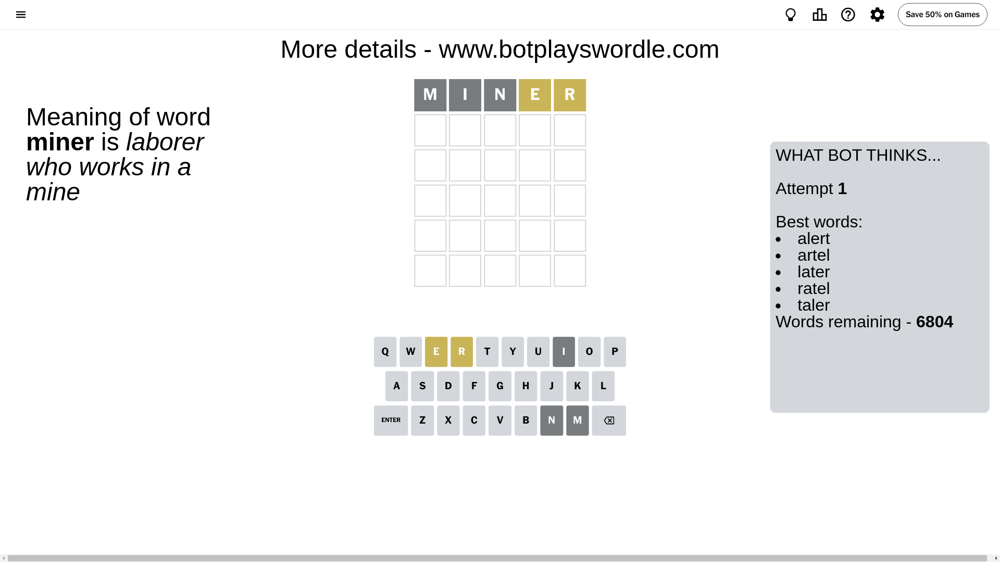
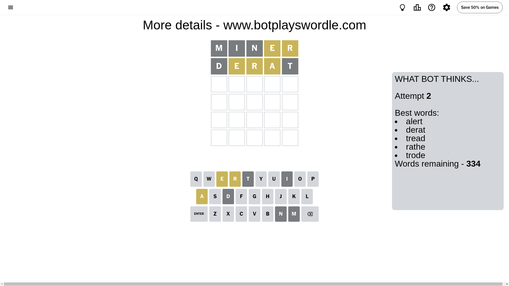
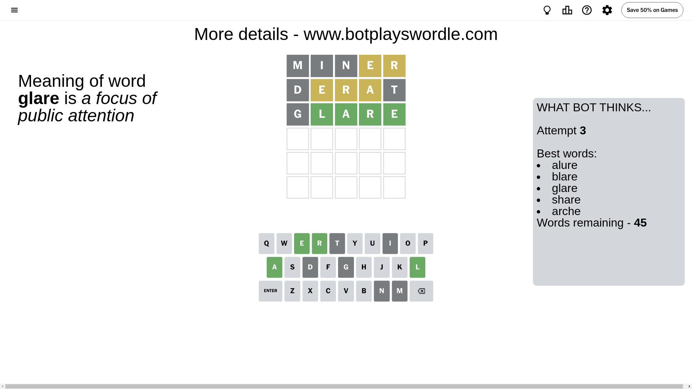
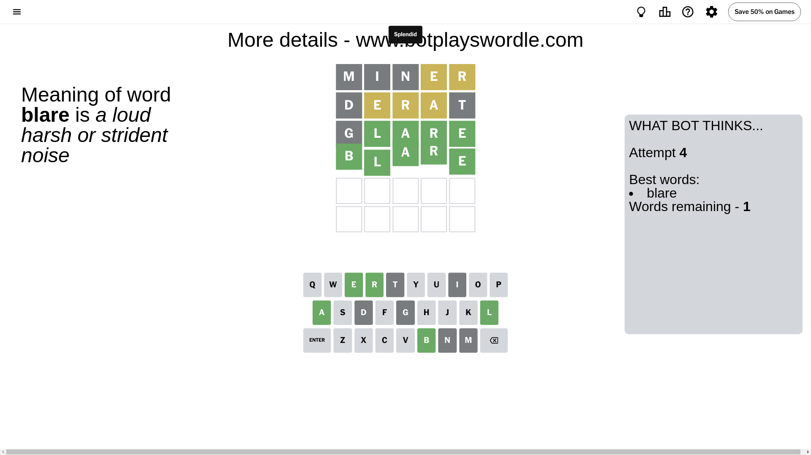

# Wordle for July 9, 2024 - \#1116

## Attempt 1

This is the first attempt and we'll choose a random word to start with.

Let's start with word `miner`

Attempt for `miner` gives us 0 correct letters, 2 present letters and 3 wrong letters.

If we look into details, we can see that:

Letter `m` is not present in the word and we will not use it any more

Letter `i` is not present in the word and we will not use it any more

Letter `n` is not present in the word and we will not use it any more

Letter `e` is on a different spot - this means that it cannot be at position 4

Letter `r` is on a different spot - this means that it cannot be at position 5

Some letters are missing (like `m`, `i`, `n`) but it's also important piece of information

Word should contain letters `[e r]`

That was a great guess that limited number of remaining words

## Attempt 2

Right now we have 334 words to choose from and best of them seem to be `[alert derat tread rathe trode]`

So far we know that possible letters are:

At position 1: `[a b c d e f g h j k l o p q r s t u v w x y z]`

At position 2: `[a b c d e f g h j k l o p q r s t u v w x y z]`

At position 3: `[a b c d e f g h j k l o p q r s t u v w x y z]`

At position 4: `[a b c d f g h j k l o p q r s t u v w x y z]`

At position 5: `[a b c d e f g h j k l o p q s t u v w x y z]`

Next guess is `derat`, let's see what it gives us

Attempt for `derat` gives us 0 correct letters, 3 present letters and 2 wrong letters.

If we look into details, we can see that:

Letter `d` is not present in the word and we will not use it any more

Letter `e` is on a different spot - this means that it cannot be at position 2

Letter `r` is on a different spot - this means that it cannot be at position 3

Letter `a` is on a different spot - this means that it cannot be at position 4

Letter `t` is not present in the word and we will not use it any more

Some letters are missing (like `d`, `t`) but it's also important piece of information

Word should contain letters `[e r a]`

Not a bad guess in general

## Attempt 3

Right now we have 45 words to choose from and best of them seem to be `[alure blare glare share arche]`

So far we know that possible letters are:

At position 1: `[a b c e f g h j k l o p q r s u v w x y z]`

At position 2: `[a b c f g h j k l o p q r s u v w x y z]`

At position 3: `[a b c e f g h j k l o p q s u v w x y z]`

At position 4: `[b c f g h j k l o p q r s u v w x y z]`

At position 5: `[a b c e f g h j k l o p q s u v w x y z]`

Next guess is `glare`, let's see what it gives us

Attempt for `glare` gives us 4 correct letters, 0 present letters and 1 wrong letters.

If we look into details, we can see that:

Letter `g` is not present in the word and we will not use it any more

Letter `l` should be at position 2

Letter `a` should be at position 3

Letter `r` should be at position 4

Letter `e` should be at position 5

We got information about the correct letters and it should make next attempt easier

Some letters are missing (like `g`) but it's also important piece of information

Word should contain letters `[e r a l]`

That was a great guess that limited number of remaining words

## Attempt 4

Right now we have 1 words to choose from and best of them seem to be `[blare]`

So far we know that possible letters are:

At position 1: `[a b c e f h j k l o p q r s u v w x y z]`

At position 2: `[l]`

At position 3: `[a]`

At position 4: `[r]`

At position 5: `[e]`

It must be `blare`

That's the correct answer! The word is `blare`!

## Conclusion

Today's word is `blare` and it took 4 attempts to guess it

