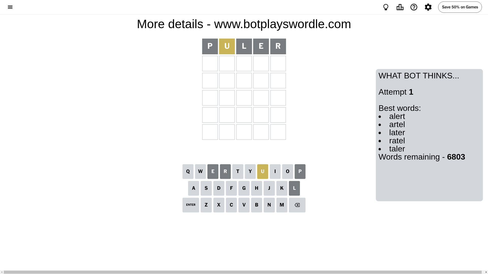
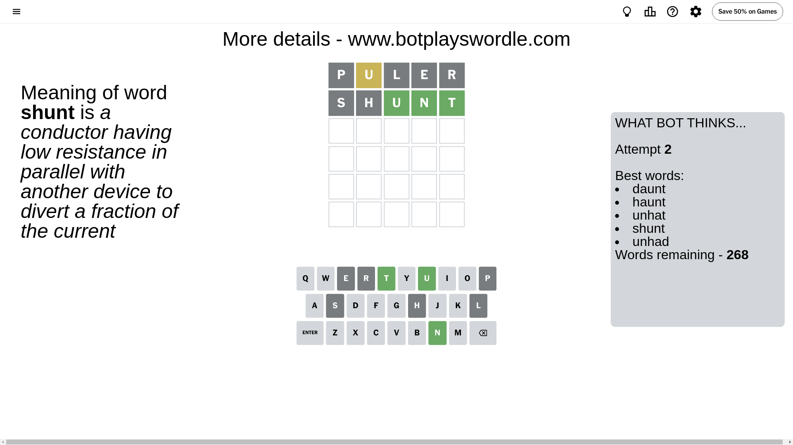
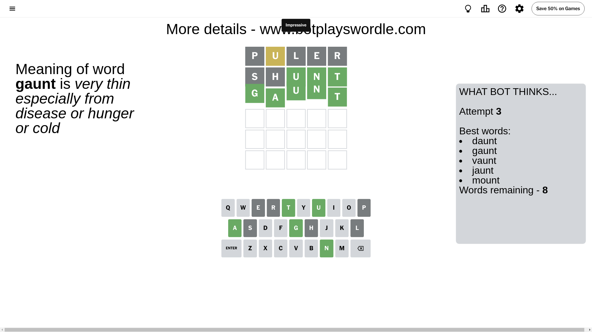

# Wordle for July 10, 2024 - \#1117

## Attempt 1

This is the first attempt and we'll choose a random word to start with.

Let's start with word `puler`

Attempt for `puler` gives us 0 correct letters, 1 present letters and 4 wrong letters.

If we look into details, we can see that:

Letter `p` is not present in the word and we will not use it any more

Letter `u` is on a different spot - this means that it cannot be at position 2

Letter `l` is not present in the word and we will not use it any more

Letter `e` is not present in the word and we will not use it any more

Letter `r` is not present in the word and we will not use it any more

Some letters are missing (like `p`, `l`, `e`, `r`) but it's also important piece of information

Word should contain letters `[u]`

That was a great guess that limited number of remaining words

## Attempt 2

Right now we have 268 words to choose from and best of them seem to be `[daunt haunt unhat shunt unhad]`

So far we know that possible letters are:

At position 1: `[a b c d f g h i j k m n o q s t u v w x y z]`

At position 2: `[a b c d f g h i j k m n o q s t v w x y z]`

At position 3: `[a b c d f g h i j k m n o q s t u v w x y z]`

At position 4: `[a b c d f g h i j k m n o q s t u v w x y z]`

At position 5: `[a b c d f g h i j k m n o q s t u v w x y z]`

Next guess is `shunt`, let's see what it gives us

Attempt for `shunt` gives us 3 correct letters, 0 present letters and 2 wrong letters.

If we look into details, we can see that:

Letter `s` is not present in the word and we will not use it any more

Letter `h` is not present in the word and we will not use it any more

Letter `u` should be at position 3

Letter `n` should be at position 4

Letter `t` should be at position 5

We got information about the correct letters and it should make next attempt easier

Some letters are missing (like `s`, `h`) but it's also important piece of information

Word should contain letters `[u n t]`

That was a great guess that limited number of remaining words

## Attempt 3

Right now we have 8 words to choose from and best of them seem to be `[daunt gaunt vaunt jaunt mount]`

So far we know that possible letters are:

At position 1: `[a b c d f g i j k m n o q t u v w x y z]`

At position 2: `[a b c d f g i j k m n o q t v w x y z]`

At position 3: `[u]`

At position 4: `[n]`

At position 5: `[t]`

Next guess is `gaunt`, let's see what it gives us

That's the correct answer! The word is `gaunt`!

## Conclusion

Today's word is `gaunt` and it took 3 attempts to guess it

