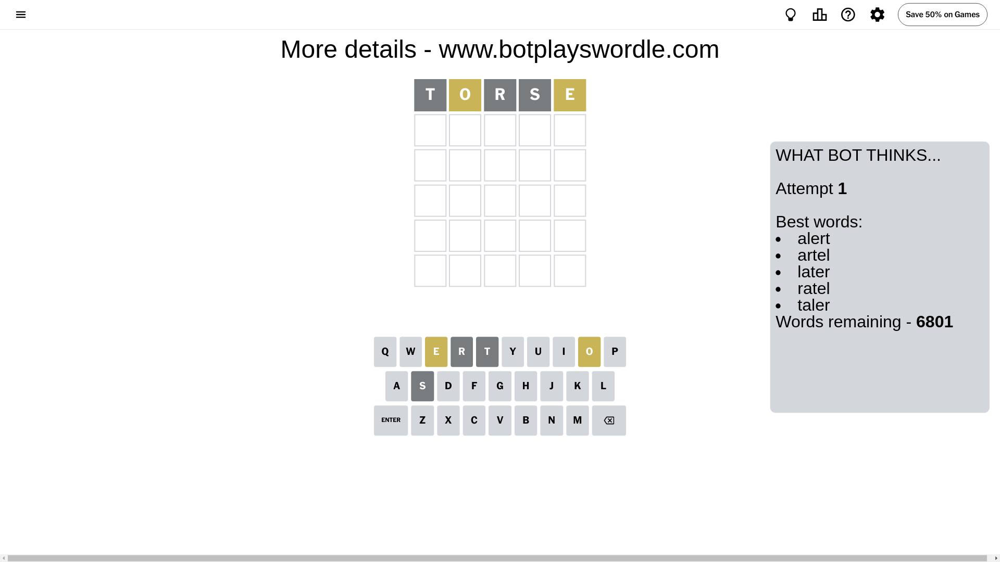
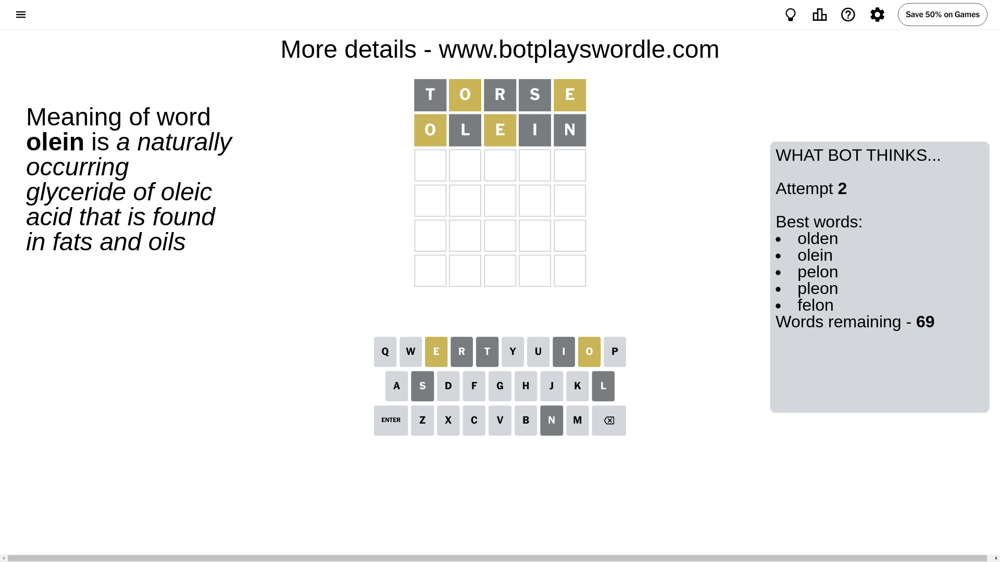
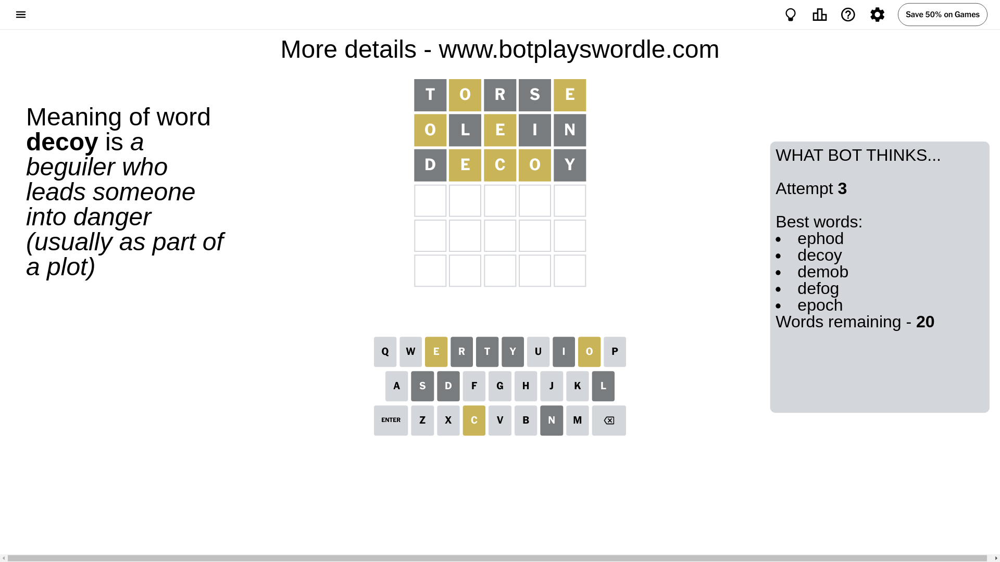
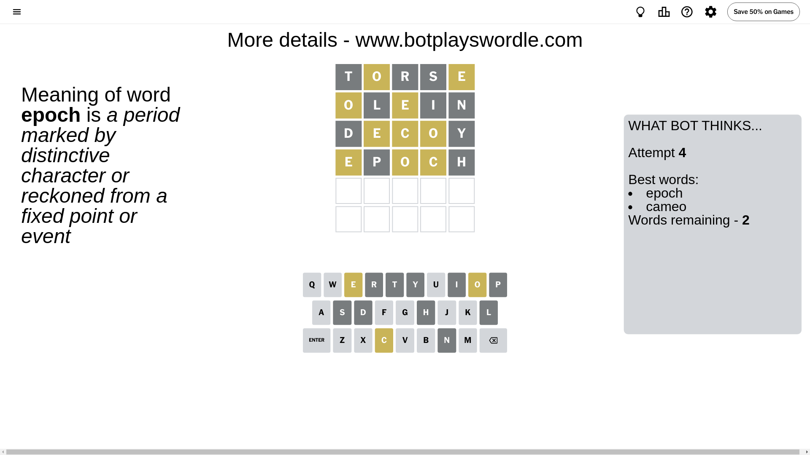
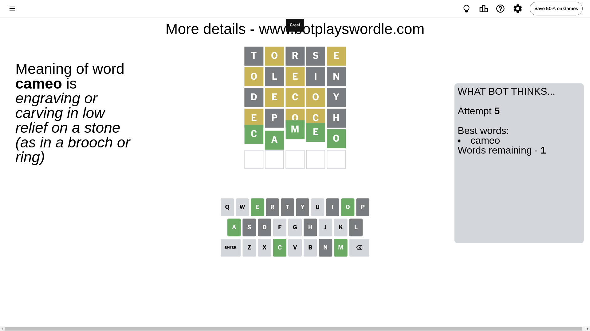

# Wordle for July 11, 2024 - \#1118

## Attempt 1

This is the first attempt and we'll choose a random word to start with.

Let's start with word `torse`

Attempt for `torse` gives us 0 correct letters, 2 present letters and 3 wrong letters.

If we look into details, we can see that:

Letter `t` is not present in the word and we will not use it any more

Letter `o` is on a different spot - this means that it cannot be at position 2

Letter `r` is not present in the word and we will not use it any more

Letter `s` is not present in the word and we will not use it any more

Letter `e` is on a different spot - this means that it cannot be at position 5

Some letters are missing (like `t`, `r`, `s`) but it's also important piece of information

Word should contain letters `[o e]`

That was a great guess that limited number of remaining words

## Attempt 2

Right now we have 69 words to choose from and best of them seem to be `[olden olein pelon pleon felon]`

So far we know that possible letters are:

At position 1: `[a b c d e f g h i j k l m n o p q u v w x y z]`

At position 2: `[a b c d e f g h i j k l m n p q u v w x y z]`

At position 3: `[a b c d e f g h i j k l m n o p q u v w x y z]`

At position 4: `[a b c d e f g h i j k l m n o p q u v w x y z]`

At position 5: `[a b c d f g h i j k l m n o p q u v w x y z]`

Next guess is `olein`, let's see what it gives us

Attempt for `olein` gives us 0 correct letters, 2 present letters and 3 wrong letters.

If we look into details, we can see that:

Letter `o` is on a different spot - this means that it cannot be at position 1

Letter `l` is not present in the word and we will not use it any more

Letter `e` is on a different spot - this means that it cannot be at position 3

Letter `i` is not present in the word and we will not use it any more

Letter `n` is not present in the word and we will not use it any more

Some letters are missing (like `l`, `i`, `n`) but it's also important piece of information

Word should contain letters `[o e]`

Could be a better guess

## Attempt 3

Right now we have 20 words to choose from and best of them seem to be `[ephod decoy demob defog epoch]`

So far we know that possible letters are:

At position 1: `[a b c d e f g h j k m p q u v w x y z]`

At position 2: `[a b c d e f g h j k m p q u v w x y z]`

At position 3: `[a b c d f g h j k m o p q u v w x y z]`

At position 4: `[a b c d e f g h j k m o p q u v w x y z]`

At position 5: `[a b c d f g h j k m o p q u v w x y z]`

Next guess is `decoy`, let's see what it gives us

Attempt for `decoy` gives us 0 correct letters, 3 present letters and 2 wrong letters.

If we look into details, we can see that:

Letter `d` is not present in the word and we will not use it any more

Letter `e` is on a different spot - this means that it cannot be at position 2

Letter `c` is on a different spot - this means that it cannot be at position 3

Letter `o` is on a different spot - this means that it cannot be at position 4

Letter `y` is not present in the word and we will not use it any more

Some letters are missing (like `d`, `y`) but it's also important piece of information

Word should contain letters `[o e c]`

That was a great guess that limited number of remaining words

## Attempt 4

Right now we have 2 words to choose from and best of them seem to be `[epoch cameo]`

So far we know that possible letters are:

At position 1: `[a b c e f g h j k m p q u v w x z]`

At position 2: `[a b c f g h j k m p q u v w x z]`

At position 3: `[a b f g h j k m o p q u v w x z]`

At position 4: `[a b c e f g h j k m p q u v w x z]`

At position 5: `[a b c f g h j k m o p q u v w x z]`

Next guess is `epoch`, let's see what it gives us

Attempt for `epoch` gives us 0 correct letters, 3 present letters and 2 wrong letters.

If we look into details, we can see that:

Letter `e` is on a different spot - this means that it cannot be at position 1

Letter `p` is not present in the word and we will not use it any more

Letter `o` is on a different spot - this means that it cannot be at position 3

Letter `c` is on a different spot - this means that it cannot be at position 4

Letter `h` is not present in the word and we will not use it any more

Some letters are missing (like `p`, `h`) but it's also important piece of information

Word should contain letters `[o e c]`

This was a waste, almost no valuable information...

## Attempt 5

Right now we have 1 words to choose from and best of them seem to be `[cameo]`

So far we know that possible letters are:

At position 1: `[a b c f g j k m q u v w x z]`

At position 2: `[a b c f g j k m q u v w x z]`

At position 3: `[a b f g j k m q u v w x z]`

At position 4: `[a b e f g j k m q u v w x z]`

At position 5: `[a b c f g j k m o q u v w x z]`

It must be `cameo`

That's the correct answer! The word is `cameo`!

## Conclusion

Today's word is `cameo` and it took 5 attempts to guess it

