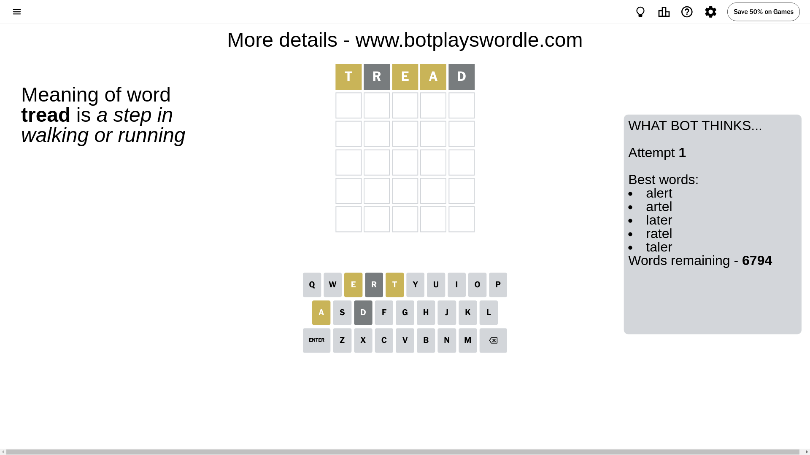
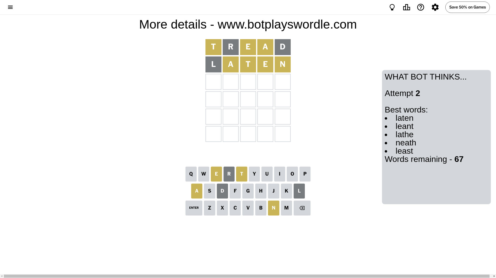
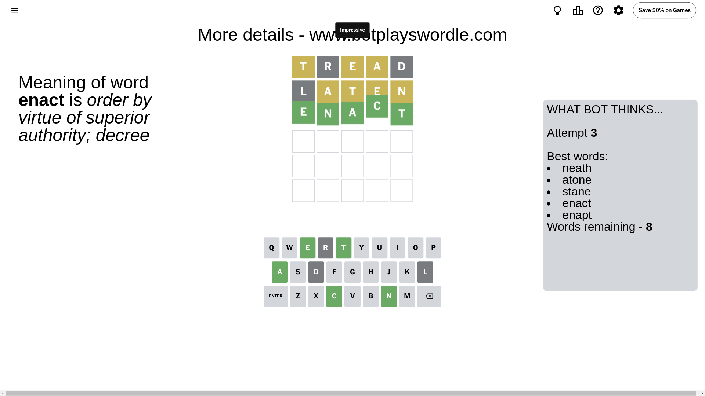

# Wordle for July 13, 2024 - \#1120

## Attempt 1

This is the first attempt and we'll choose a random word to start with.

Let's start with word `tread`

Attempt for `tread` gives us 0 correct letters, 3 present letters and 2 wrong letters.

If we look into details, we can see that:

Letter `t` is on a different spot - this means that it cannot be at position 1

Letter `r` is not present in the word and we will not use it any more

Letter `e` is on a different spot - this means that it cannot be at position 3

Letter `a` is on a different spot - this means that it cannot be at position 4

Letter `d` is not present in the word and we will not use it any more

Some letters are missing (like `r`, `d`) but it's also important piece of information

Word should contain letters `[t e a]`

That was a great guess that limited number of remaining words

## Attempt 2

Right now we have 67 words to choose from and best of them seem to be `[laten leant lathe neath least]`

So far we know that possible letters are:

At position 1: `[a b c e f g h i j k l m n o p q s u v w x y z]`

At position 2: `[a b c e f g h i j k l m n o p q s t u v w x y z]`

At position 3: `[a b c f g h i j k l m n o p q s t u v w x y z]`

At position 4: `[b c e f g h i j k l m n o p q s t u v w x y z]`

At position 5: `[a b c e f g h i j k l m n o p q s t u v w x y z]`

Next guess is `laten`, let's see what it gives us

Attempt for `laten` gives us 0 correct letters, 4 present letters and 1 wrong letters.

If we look into details, we can see that:

Letter `l` is not present in the word and we will not use it any more

Letter `a` is on a different spot - this means that it cannot be at position 2

Letter `t` is on a different spot - this means that it cannot be at position 3

Letter `e` is on a different spot - this means that it cannot be at position 4

Letter `n` is on a different spot - this means that it cannot be at position 5

Some letters are missing (like `l`) but it's also important piece of information

Word should contain letters `[t e a n]`

That was a great guess that limited number of remaining words

## Attempt 3

Right now we have 8 words to choose from and best of them seem to be `[neath atone stane enact enapt]`

So far we know that possible letters are:

At position 1: `[a b c e f g h i j k m n o p q s u v w x y z]`

At position 2: `[b c e f g h i j k m n o p q s t u v w x y z]`

At position 3: `[a b c f g h i j k m n o p q s u v w x y z]`

At position 4: `[b c f g h i j k m n o p q s t u v w x y z]`

At position 5: `[a b c e f g h i j k m o p q s t u v w x y z]`

Next guess is `enact`, let's see what it gives us

That's the correct answer! The word is `enact`!

## Conclusion

Today's word is `enact` and it took 3 attempts to guess it

