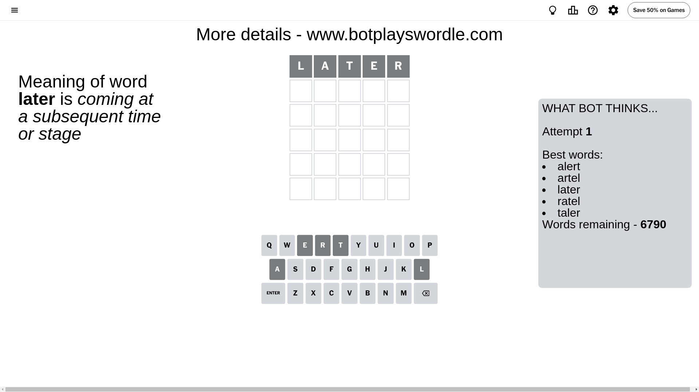
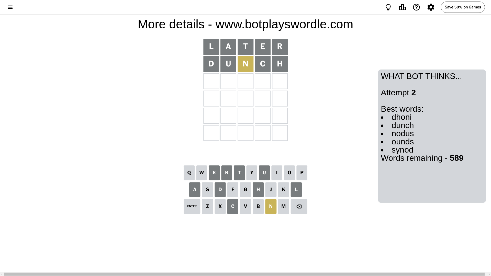
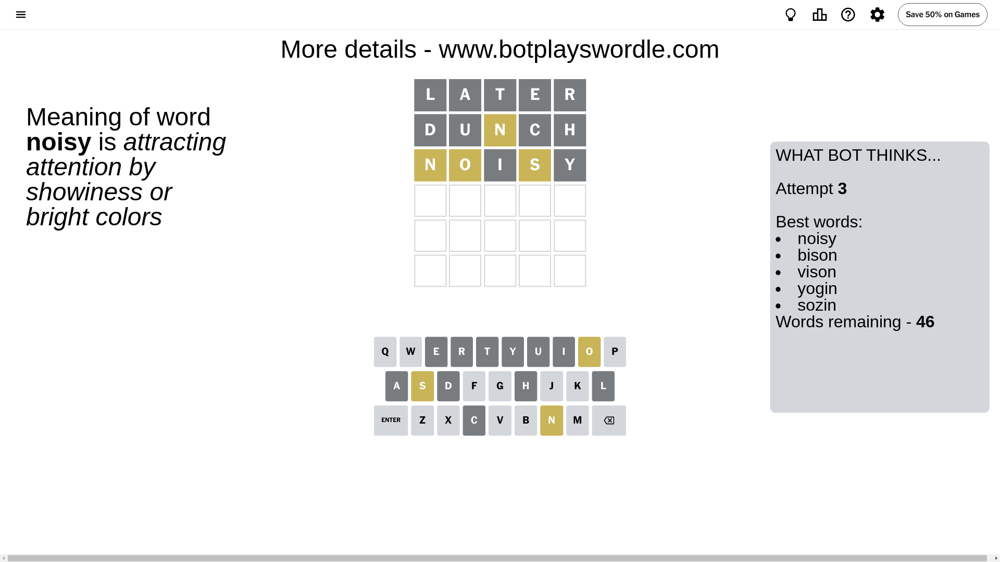
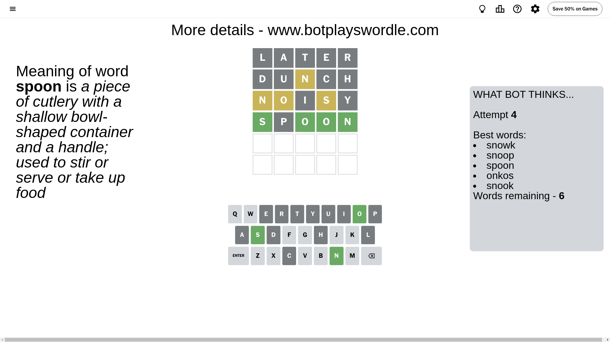
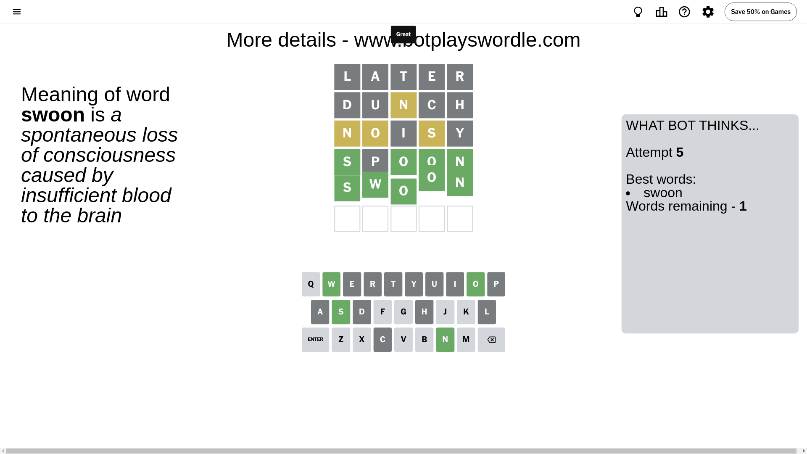

# Wordle for July 15, 2024 - \#1122

## Attempt 1

This is the first attempt and we'll choose a random word to start with.

Let's start with word `later`

Attempt for `later` gives us 0 correct letters, 0 present letters and 5 wrong letters.

If we look into details, we can see that:

Letter `l` is not present in the word and we will not use it any more

Letter `a` is not present in the word and we will not use it any more

Letter `t` is not present in the word and we will not use it any more

Letter `e` is not present in the word and we will not use it any more

Letter `r` is not present in the word and we will not use it any more

Some letters are missing (like `l`, `a`, `t`, `e`, `r`) but it's also important piece of information

So far we don't know any of the letters!

That was a great guess that limited number of remaining words

## Attempt 2

Right now we have 589 words to choose from and best of them seem to be `[dhoni dunch nodus ounds synod]`

So far we know that possible letters are:

At position 1: `[b c d f g h i j k m n o p q s u v w x y z]`

At position 2: `[b c d f g h i j k m n o p q s u v w x y z]`

At position 3: `[b c d f g h i j k m n o p q s u v w x y z]`

At position 4: `[b c d f g h i j k m n o p q s u v w x y z]`

At position 5: `[b c d f g h i j k m n o p q s u v w x y z]`

Next guess is `dunch`, let's see what it gives us

Attempt for `dunch` gives us 0 correct letters, 1 present letters and 4 wrong letters.

If we look into details, we can see that:

Letter `d` is not present in the word and we will not use it any more

Letter `u` is not present in the word and we will not use it any more

Letter `n` is on a different spot - this means that it cannot be at position 3

Letter `c` is not present in the word and we will not use it any more

Letter `h` is not present in the word and we will not use it any more

Some letters are missing (like `d`, `u`, `c`, `h`) but it's also important piece of information

Word should contain letters `[n]`

That was a great guess that limited number of remaining words

## Attempt 3

Right now we have 46 words to choose from and best of them seem to be `[noisy bison vison yogin sozin]`

So far we know that possible letters are:

At position 1: `[b f g i j k m n o p q s v w x y z]`

At position 2: `[b f g i j k m n o p q s v w x y z]`

At position 3: `[b f g i j k m o p q s v w x y z]`

At position 4: `[b f g i j k m n o p q s v w x y z]`

At position 5: `[b f g i j k m n o p q s v w x y z]`

Next guess is `noisy`, let's see what it gives us

Attempt for `noisy` gives us 0 correct letters, 3 present letters and 2 wrong letters.

If we look into details, we can see that:

Letter `n` is on a different spot - this means that it cannot be at position 1

Letter `o` is on a different spot - this means that it cannot be at position 2

Letter `i` is not present in the word and we will not use it any more

Letter `s` is on a different spot - this means that it cannot be at position 4

Letter `y` is not present in the word and we will not use it any more

Some letters are missing (like `i`, `y`) but it's also important piece of information

Word should contain letters `[n o s]`

Not a bad guess in general

## Attempt 4

Right now we have 6 words to choose from and best of them seem to be `[snowk snoop spoon onkos snook]`

So far we know that possible letters are:

At position 1: `[b f g j k m o p q s v w x z]`

At position 2: `[b f g j k m n p q s v w x z]`

At position 3: `[b f g j k m o p q s v w x z]`

At position 4: `[b f g j k m n o p q v w x z]`

At position 5: `[b f g j k m n o p q s v w x z]`

Next guess is `spoon`, let's see what it gives us

Attempt for `spoon` gives us 4 correct letters, 0 present letters and 1 wrong letters.

If we look into details, we can see that:

Letter `s` should be at position 1

Letter `p` is not present in the word and we will not use it any more

Letter `o` should be at position 3

Letter `o` should be at position 4

Letter `n` should be at position 5

We got information about the correct letters and it should make next attempt easier

Some letters are missing (like `p`) but it's also important piece of information

Word should contain letters `[n o s]`

Not a bad guess in general

## Attempt 5

Right now we have 1 words to choose from and best of them seem to be `[swoon]`

So far we know that possible letters are:

At position 1: `[s]`

At position 2: `[b f g j k m n q s v w x z]`

At position 3: `[o]`

At position 4: `[o]`

At position 5: `[n]`

It must be `swoon`

That's the correct answer! The word is `swoon`!

## Conclusion

Today's word is `swoon` and it took 5 attempts to guess it

