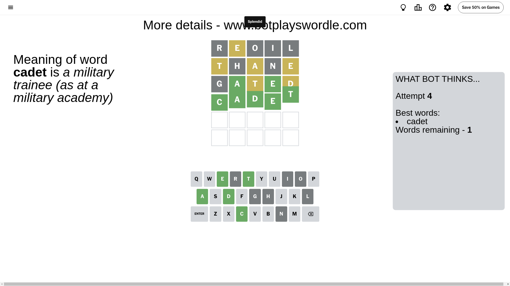

# Wordle for July 22, 2024 - \#1129

## Attempt 1

This is the first attempt and we'll choose a random word to start with.

Let's start with word `reoil`

Attempt for `reoil` gives us 0 correct letters, 1 present letters and 4 wrong letters.

If we look into details, we can see that:

Letter `r` is not present in the word and we will not use it any more

Letter `e` is on a different spot - this means that it cannot be at position 2

Letter `o` is not present in the word and we will not use it any more

Letter `i` is not present in the word and we will not use it any more

Letter `l` is not present in the word and we will not use it any more

Some letters are missing (like `r`, `o`, `i`, `l`) but it's also important piece of information

Word should contain letters `[e]`

That was a great guess that limited number of remaining words

## Attempt 2

Right now we have 414 words to choose from and best of them seem to be `[thane stend tuned thegn antes]`

So far we know that possible letters are:

At position 1: `[a b c d e f g h j k m n p q s t u v w x y z]`

At position 2: `[a b c d f g h j k m n p q s t u v w x y z]`

At position 3: `[a b c d e f g h j k m n p q s t u v w x y z]`

At position 4: `[a b c d e f g h j k m n p q s t u v w x y z]`

At position 5: `[a b c d e f g h j k m n p q s t u v w x y z]`

Next guess is `thane`, let's see what it gives us

Attempt for `thane` gives us 0 correct letters, 3 present letters and 2 wrong letters.

If we look into details, we can see that:

Letter `t` is on a different spot - this means that it cannot be at position 1

Letter `h` is not present in the word and we will not use it any more

Letter `a` is on a different spot - this means that it cannot be at position 3

Letter `n` is not present in the word and we will not use it any more

Letter `e` is on a different spot - this means that it cannot be at position 5

Some letters are missing (like `h`, `n`) but it's also important piece of information

Word should contain letters `[e t a]`

That was a great guess that limited number of remaining words

## Attempt 3

Right now we have 15 words to choose from and best of them seem to be `[stead cadet adept bated gated]`

So far we know that possible letters are:

At position 1: `[a b c d e f g j k m p q s u v w x y z]`

At position 2: `[a b c d f g j k m p q s t u v w x y z]`

At position 3: `[b c d e f g j k m p q s t u v w x y z]`

At position 4: `[a b c d e f g j k m p q s t u v w x y z]`

At position 5: `[a b c d f g j k m p q s t u v w x y z]`

Next guess is `gated`, let's see what it gives us

Attempt for `gated` gives us 2 correct letters, 2 present letters and 1 wrong letters.

If we look into details, we can see that:

Letter `g` is not present in the word and we will not use it any more

Letter `a` should be at position 2

Letter `t` is on a different spot - this means that it cannot be at position 3

Letter `e` should be at position 4

Letter `d` is on a different spot - this means that it cannot be at position 5

We got information about the correct letters and it should make next attempt easier

Some letters are missing (like `g`) but it's also important piece of information

Word should contain letters `[e t a d]`

That was a great guess that limited number of remaining words

## Attempt 4

Right now we have 1 words to choose from and best of them seem to be `[cadet]`

So far we know that possible letters are:

At position 1: `[a b c d e f j k m p q s u v w x y z]`

At position 2: `[a]`

At position 3: `[b c d e f j k m p q s u v w x y z]`

At position 4: `[e]`

At position 5: `[a b c f j k m p q s t u v w x y z]`

It must be `cadet`

That's the correct answer! The word is `cadet`!

## Conclusion

Today's word is `cadet` and it took 4 attempts to guess it

