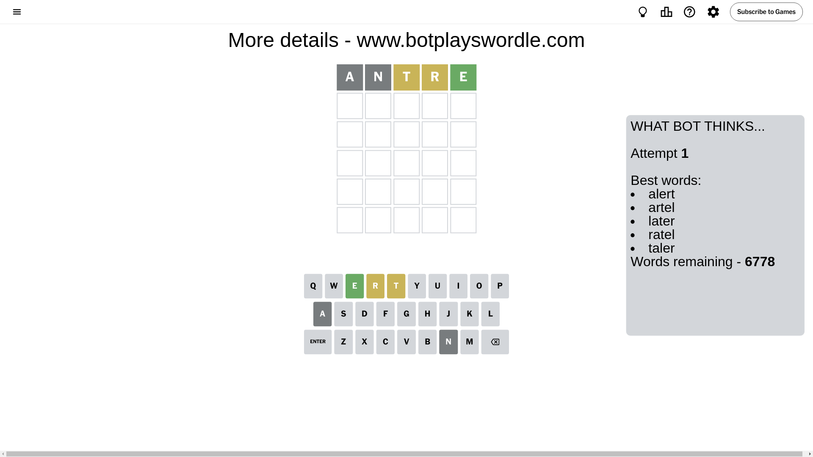
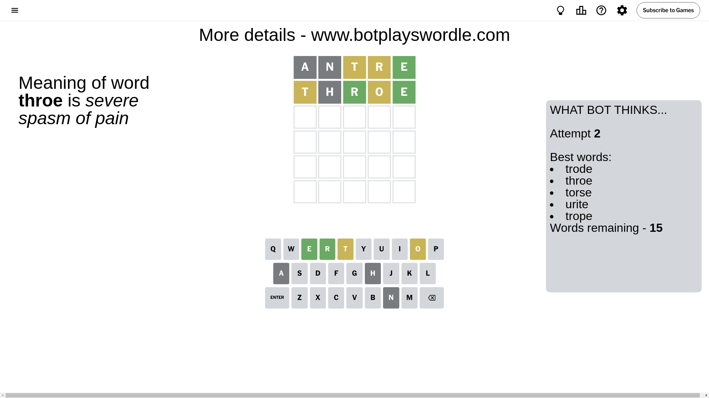
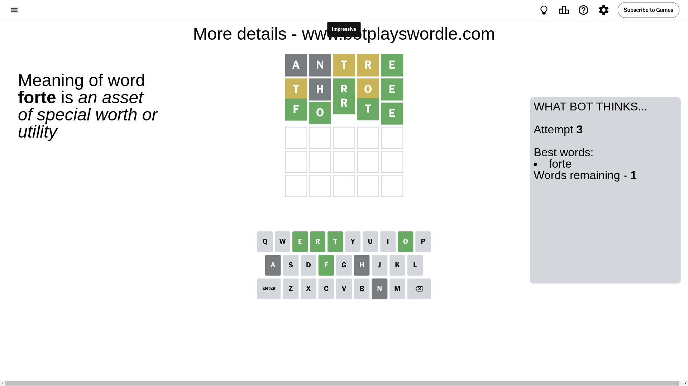

# Wordle for July 24, 2024 - \#1131

## Attempt 1

This is the first attempt and we'll choose a random word to start with.

Let's start with word `antre`

Attempt for `antre` gives us 1 correct letters, 2 present letters and 2 wrong letters.

If we look into details, we can see that:

Letter `a` is not present in the word and we will not use it any more

Letter `n` is not present in the word and we will not use it any more

Letter `t` is on a different spot - this means that it cannot be at position 3

Letter `r` is on a different spot - this means that it cannot be at position 4

Letter `e` should be at position 5

We got information about the correct letters and it should make next attempt easier

Some letters are missing (like `a`, `n`) but it's also important piece of information

Word should contain letters `[t r e]`

That was a great guess that limited number of remaining words

## Attempt 2

Right now we have 15 words to choose from and best of them seem to be `[trode throe torse urite trope]`

So far we know that possible letters are:

At position 1: `[b c d e f g h i j k l m o p q r s t u v w x y z]`

At position 2: `[b c d e f g h i j k l m o p q r s t u v w x y z]`

At position 3: `[b c d e f g h i j k l m o p q r s u v w x y z]`

At position 4: `[b c d e f g h i j k l m o p q s t u v w x y z]`

At position 5: `[e]`

Next guess is `throe`, let's see what it gives us

Attempt for `throe` gives us 2 correct letters, 2 present letters and 1 wrong letters.

If we look into details, we can see that:

Letter `t` is on a different spot - this means that it cannot be at position 1

Letter `h` is not present in the word and we will not use it any more

Letter `r` should be at position 3

Letter `o` is on a different spot - this means that it cannot be at position 4

We got information about the correct letters and it should make next attempt easier

Some letters are missing (like `h`) but it's also important piece of information

Word should contain letters `[t r e o]`

That was a great guess that limited number of remaining words

## Attempt 3

Right now we have 1 words to choose from and best of them seem to be `[forte]`

So far we know that possible letters are:

At position 1: `[b c d e f g i j k l m o p q r s u v w x y z]`

At position 2: `[b c d e f g i j k l m o p q r s t u v w x y z]`

At position 3: `[r]`

At position 4: `[b c d e f g i j k l m p q s t u v w x y z]`

At position 5: `[e]`

It must be `forte`

That's the correct answer! The word is `forte`!

## Conclusion

Today's word is `forte` and it took 3 attempts to guess it

