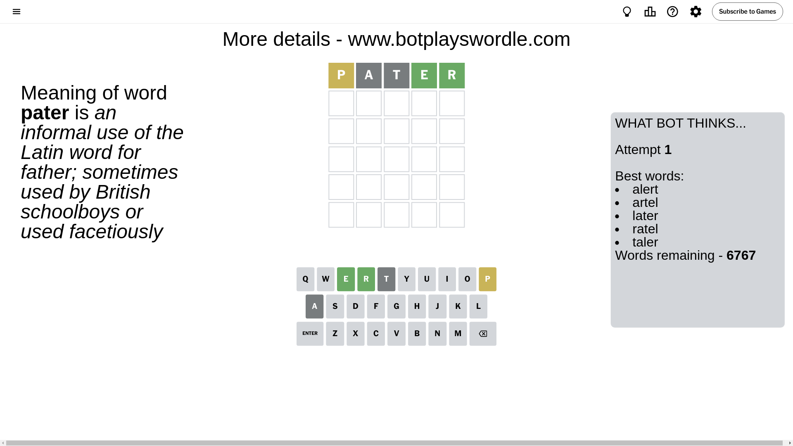
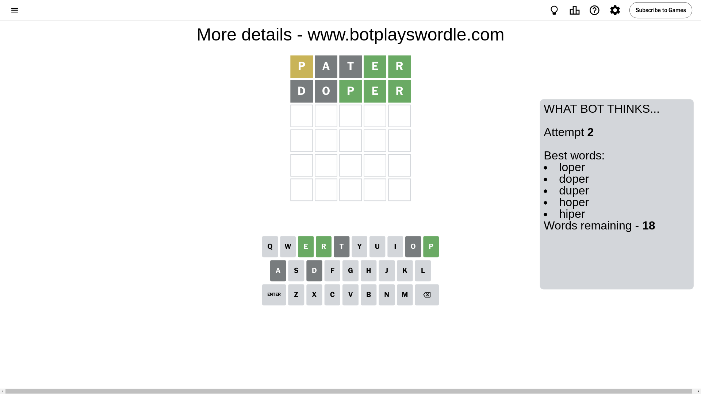
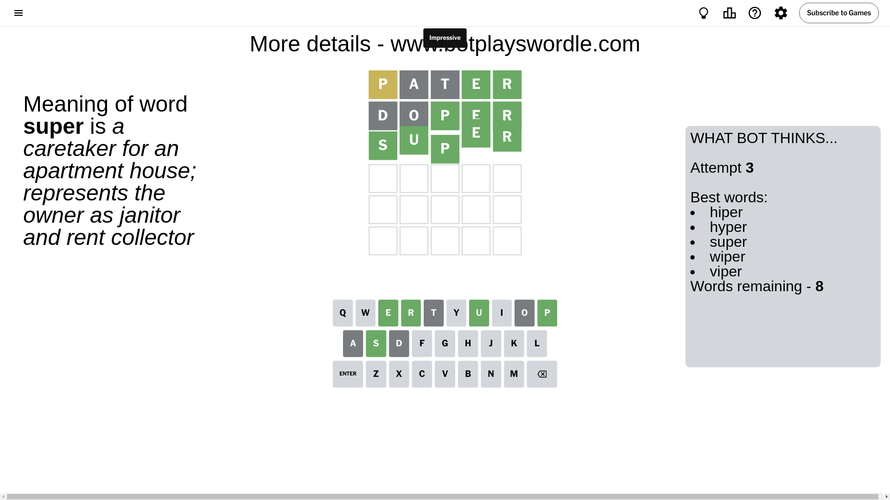

# Wordle for July 29, 2024 - \#1136

## Attempt 1

This is the first attempt and we'll choose a random word to start with.

Let's start with word `pater`

Attempt for `pater` gives us 2 correct letters, 1 present letters and 2 wrong letters.

If we look into details, we can see that:

Letter `p` is on a different spot - this means that it cannot be at position 1

Letter `a` is not present in the word and we will not use it any more

Letter `t` is not present in the word and we will not use it any more

Letter `e` should be at position 4

Letter `r` should be at position 5

We got information about the correct letters and it should make next attempt easier

Some letters are missing (like `a`, `t`) but it's also important piece of information

Word should contain letters `[p e r]`

That was a great guess that limited number of remaining words

## Attempt 2

Right now we have 18 words to choose from and best of them seem to be `[loper doper duper hoper hiper]`

So far we know that possible letters are:

At position 1: `[b c d e f g h i j k l m n o q r s u v w x y z]`

At position 2: `[b c d e f g h i j k l m n o p q r s u v w x y z]`

At position 3: `[b c d e f g h i j k l m n o p q r s u v w x y z]`

At position 4: `[e]`

At position 5: `[r]`

Next guess is `doper`, let's see what it gives us

Attempt for `doper` gives us 3 correct letters, 0 present letters and 2 wrong letters.

If we look into details, we can see that:

Letter `d` is not present in the word and we will not use it any more

Letter `o` is not present in the word and we will not use it any more

Letter `p` should be at position 3

We got information about the correct letters and it should make next attempt easier

Some letters are missing (like `d`, `o`) but it's also important piece of information

Word should contain letters `[p e r]`

Could be a better guess

## Attempt 3

Right now we have 8 words to choose from and best of them seem to be `[hiper hyper super wiper viper]`

So far we know that possible letters are:

At position 1: `[b c e f g h i j k l m n q r s u v w x y z]`

At position 2: `[b c e f g h i j k l m n p q r s u v w x y z]`

At position 3: `[p]`

At position 4: `[e]`

At position 5: `[r]`

Next guess is `super`, let's see what it gives us

That's the correct answer! The word is `super`!

## Conclusion

Today's word is `super` and it took 3 attempts to guess it

