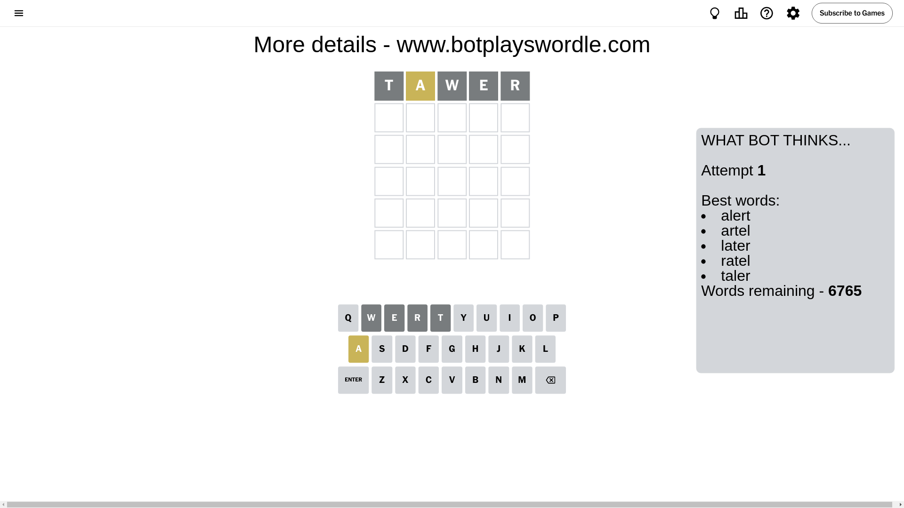
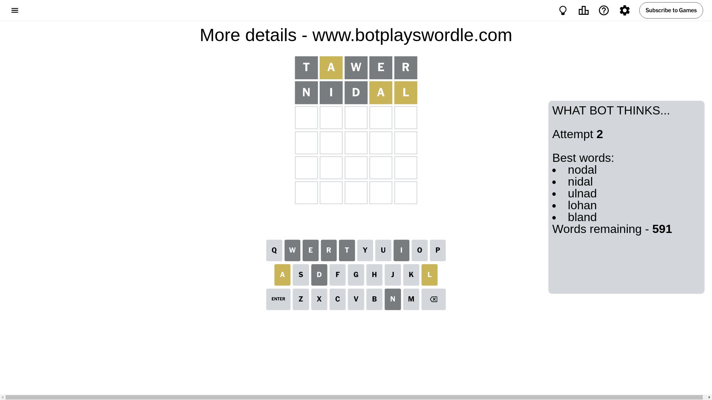
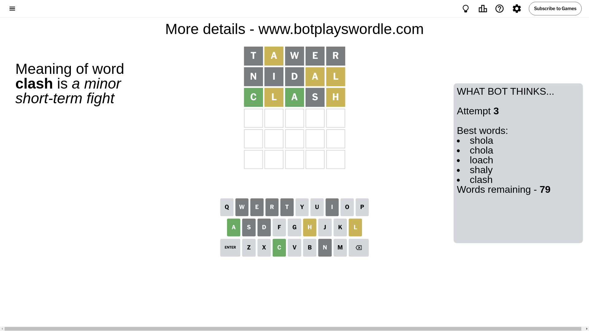
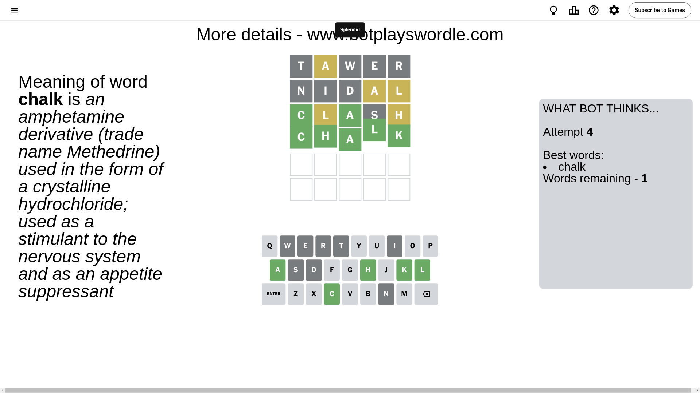

# Wordle for August 1, 2024 - \#1139

## Attempt 1

This is the first attempt and we'll choose a random word to start with.

Let's start with word `tawer`

Attempt for `tawer` gives us 0 correct letters, 1 present letters and 4 wrong letters.

If we look into details, we can see that:

Letter `t` is not present in the word and we will not use it any more

Letter `a` is on a different spot - this means that it cannot be at position 2

Letter `w` is not present in the word and we will not use it any more

Letter `e` is not present in the word and we will not use it any more

Letter `r` is not present in the word and we will not use it any more

Some letters are missing (like `t`, `w`, `e`, `r`) but it's also important piece of information

Word should contain letters `[a]`

That was a great guess that limited number of remaining words

## Attempt 2

Right now we have 591 words to choose from and best of them seem to be `[nodal nidal ulnad lohan bland]`

So far we know that possible letters are:

At position 1: `[a b c d f g h i j k l m n o p q s u v x y z]`

At position 2: `[b c d f g h i j k l m n o p q s u v x y z]`

At position 3: `[a b c d f g h i j k l m n o p q s u v x y z]`

At position 4: `[a b c d f g h i j k l m n o p q s u v x y z]`

At position 5: `[a b c d f g h i j k l m n o p q s u v x y z]`

Next guess is `nidal`, let's see what it gives us

Attempt for `nidal` gives us 0 correct letters, 2 present letters and 3 wrong letters.

If we look into details, we can see that:

Letter `n` is not present in the word and we will not use it any more

Letter `i` is not present in the word and we will not use it any more

Letter `d` is not present in the word and we will not use it any more

Letter `a` is on a different spot - this means that it cannot be at position 4

Letter `l` is on a different spot - this means that it cannot be at position 5

Some letters are missing (like `n`, `i`, `d`) but it's also important piece of information

Word should contain letters `[a l]`

Not a bad guess in general

## Attempt 3

Right now we have 79 words to choose from and best of them seem to be `[shola chola loach shaly clash]`

So far we know that possible letters are:

At position 1: `[a b c f g h j k l m o p q s u v x y z]`

At position 2: `[b c f g h j k l m o p q s u v x y z]`

At position 3: `[a b c f g h j k l m o p q s u v x y z]`

At position 4: `[b c f g h j k l m o p q s u v x y z]`

At position 5: `[a b c f g h j k m o p q s u v x y z]`

Next guess is `clash`, let's see what it gives us

Attempt for `clash` gives us 2 correct letters, 2 present letters and 1 wrong letters.

If we look into details, we can see that:

Letter `c` should be at position 1

Letter `l` is on a different spot - this means that it cannot be at position 2

Letter `a` should be at position 3

Letter `s` is not present in the word and we will not use it any more

Letter `h` is on a different spot - this means that it cannot be at position 5

We got information about the correct letters and it should make next attempt easier

Some letters are missing (like `s`) but it's also important piece of information

Word should contain letters `[a l c h]`

That was a great guess that limited number of remaining words

## Attempt 4

Right now we have 1 words to choose from and best of them seem to be `[chalk]`

So far we know that possible letters are:

At position 1: `[c]`

At position 2: `[b c f g h j k m o p q u v x y z]`

At position 3: `[a]`

At position 4: `[b c f g h j k l m o p q u v x y z]`

At position 5: `[a b c f g j k m o p q u v x y z]`

It must be `chalk`

That's the correct answer! The word is `chalk`!

## Conclusion

Today's word is `chalk` and it took 4 attempts to guess it

