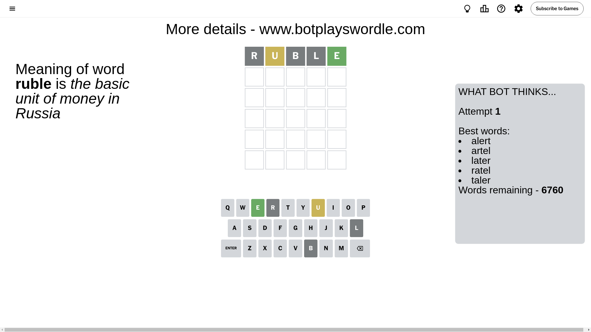

# Wordle for August 5, 2024 - \#1143

## Attempt 1

This is the first attempt and we'll choose a random word to start with.

Let's start with word `ruble`

Attempt for `ruble` gives us 1 correct letters, 1 present letters and 3 wrong letters.

If we look into details, we can see that:

Letter `r` is not present in the word and we will not use it any more

Letter `u` is on a different spot - this means that it cannot be at position 2

Letter `b` is not present in the word and we will not use it any more

Letter `l` is not present in the word and we will not use it any more

Letter `e` should be at position 5

We got information about the correct letters and it should make next attempt easier

Some letters are missing (like `r`, `b`, `l`) but it's also important piece of information

Word should contain letters `[u e]`

That was a great guess that limited number of remaining words

## Attempt 2

Right now we have 58 words to choose from and best of them seem to be `[stude unode indue saute acute]`

So far we know that possible letters are:

At position 1: `[a c d e f g h i j k m n o p q s t u v w x y z]`

At position 2: `[a c d e f g h i j k m n o p q s t v w x y z]`

At position 3: `[a c d e f g h i j k m n o p q s t u v w x y z]`

At position 4: `[a c d e f g h i j k m n o p q s t u v w x y z]`

At position 5: `[e]`

Next guess is `indue`, let's see what it gives us

Attempt for `indue` gives us 3 correct letters, 0 present letters and 2 wrong letters.

If we look into details, we can see that:

Letter `i` is not present in the word and we will not use it any more

Letter `n` should be at position 2

Letter `d` is not present in the word and we will not use it any more

Letter `u` should be at position 4

We got information about the correct letters and it should make next attempt easier

Some letters are missing (like `i`, `d`) but it's also important piece of information

Word should contain letters `[u e n]`

That was a great guess that limited number of remaining words

## Attempt 3

Right now we have 1 words to choose from and best of them seem to be `[ensue]`

So far we know that possible letters are:

At position 1: `[a c e f g h j k m n o p q s t u v w x y z]`

At position 2: `[n]`

At position 3: `[a c e f g h j k m n o p q s t u v w x y z]`

At position 4: `[u]`

At position 5: `[e]`

It must be `ensue`

That's the correct answer! The word is `ensue`!

## Conclusion

Today's word is `ensue` and it took 3 attempts to guess it

