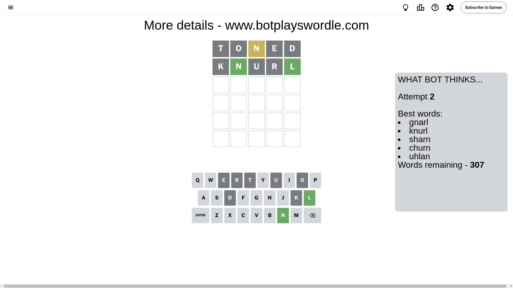
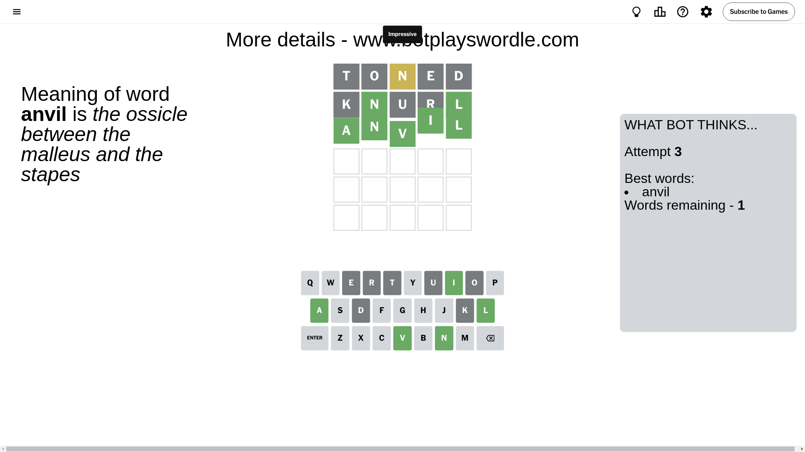

# Wordle for August 6, 2024 - \#1144

## Attempt 1

This is the first attempt and we'll choose a random word to start with.

Let's start with word `toned`

Attempt for `toned` gives us 0 correct letters, 1 present letters and 4 wrong letters.

If we look into details, we can see that:

Letter `t` is not present in the word and we will not use it any more

Letter `o` is not present in the word and we will not use it any more

Letter `n` is on a different spot - this means that it cannot be at position 3

Letter `e` is not present in the word and we will not use it any more

Letter `d` is not present in the word and we will not use it any more

Some letters are missing (like `t`, `o`, `e`, `d`) but it's also important piece of information

Word should contain letters `[n]`

That was a great guess that limited number of remaining words

## Attempt 2

Right now we have 307 words to choose from and best of them seem to be `[gnarl knurl sharn churn uhlan]`

So far we know that possible letters are:

At position 1: `[a b c f g h i j k l m n p q r s u v w x y z]`

At position 2: `[a b c f g h i j k l m n p q r s u v w x y z]`

At position 3: `[a b c f g h i j k l m p q r s u v w x y z]`

At position 4: `[a b c f g h i j k l m n p q r s u v w x y z]`

At position 5: `[a b c f g h i j k l m n p q r s u v w x y z]`

Next guess is `knurl`, let's see what it gives us

Attempt for `knurl` gives us 2 correct letters, 0 present letters and 3 wrong letters.

If we look into details, we can see that:

Letter `k` is not present in the word and we will not use it any more

Letter `n` should be at position 2

Letter `u` is not present in the word and we will not use it any more

Letter `r` is not present in the word and we will not use it any more

Letter `l` should be at position 5

We got information about the correct letters and it should make next attempt easier

Some letters are missing (like `k`, `u`, `r`) but it's also important piece of information

Word should contain letters `[n l]`

That was a great guess that limited number of remaining words

## Attempt 3

Right now we have 1 words to choose from and best of them seem to be `[anvil]`

So far we know that possible letters are:

At position 1: `[a b c f g h i j l m n p q s v w x y z]`

At position 2: `[n]`

At position 3: `[a b c f g h i j l m p q s v w x y z]`

At position 4: `[a b c f g h i j l m n p q s v w x y z]`

At position 5: `[l]`

It must be `anvil`

That's the correct answer! The word is `anvil`!

## Conclusion

Today's word is `anvil` and it took 3 attempts to guess it

