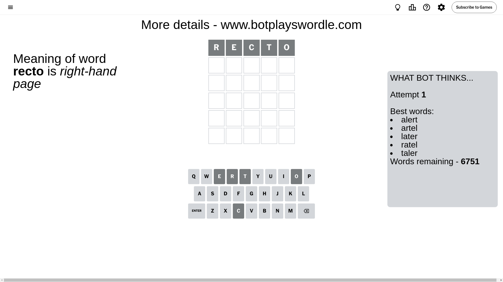
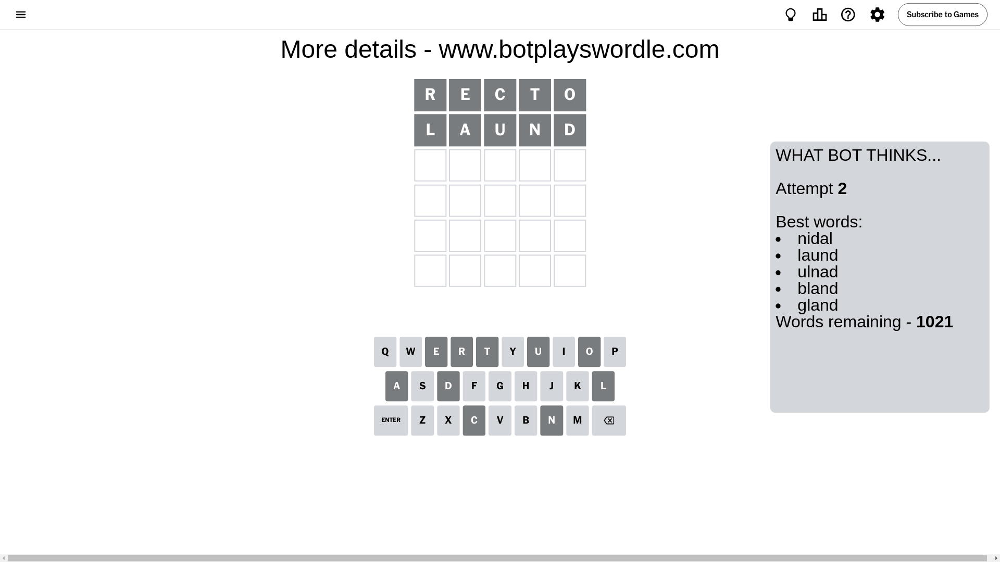
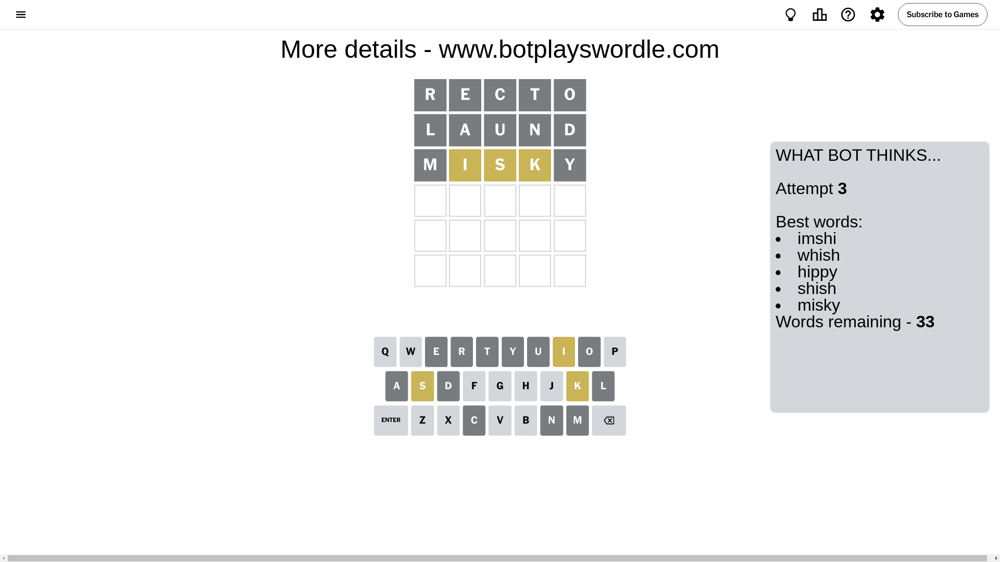
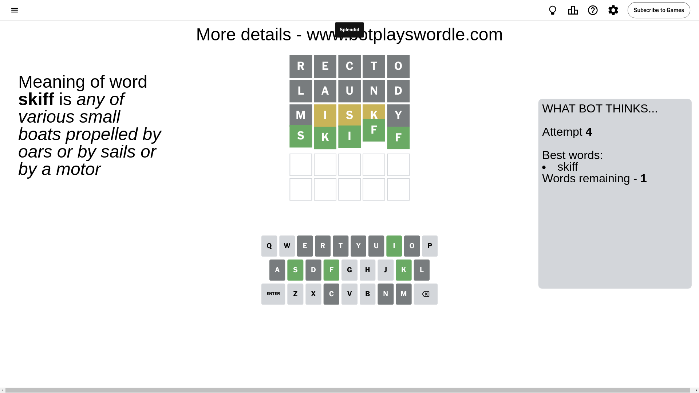

# Wordle for August 12, 2024 - \#1150

## Attempt 1

This is the first attempt and we'll choose a random word to start with.

Let's start with word `recto`

Attempt for `recto` gives us 0 correct letters, 0 present letters and 5 wrong letters.

If we look into details, we can see that:

Letter `r` is not present in the word and we will not use it any more

Letter `e` is not present in the word and we will not use it any more

Letter `c` is not present in the word and we will not use it any more

Letter `t` is not present in the word and we will not use it any more

Letter `o` is not present in the word and we will not use it any more

Some letters are missing (like `r`, `e`, `c`, `t`, `o`) but it's also important piece of information

So far we don't know any of the letters!

Not a bad guess in general

## Attempt 2

Right now we have 1021 words to choose from and best of them seem to be `[nidal laund ulnad bland gland]`

So far we know that possible letters are:

At position 1: `[a b d f g h i j k l m n p q s u v w x y z]`

At position 2: `[a b d f g h i j k l m n p q s u v w x y z]`

At position 3: `[a b d f g h i j k l m n p q s u v w x y z]`

At position 4: `[a b d f g h i j k l m n p q s u v w x y z]`

At position 5: `[a b d f g h i j k l m n p q s u v w x y z]`

Next guess is `laund`, let's see what it gives us

Attempt for `laund` gives us 0 correct letters, 0 present letters and 5 wrong letters.

If we look into details, we can see that:

Letter `l` is not present in the word and we will not use it any more

Letter `a` is not present in the word and we will not use it any more

Letter `u` is not present in the word and we will not use it any more

Letter `n` is not present in the word and we will not use it any more

Letter `d` is not present in the word and we will not use it any more

Some letters are missing (like `l`, `a`, `u`, `n`, `d`) but it's also important piece of information

So far we don't know any of the letters!

That was a great guess that limited number of remaining words

## Attempt 3

Right now we have 33 words to choose from and best of them seem to be `[imshi whish hippy shish misky]`

So far we know that possible letters are:

At position 1: `[b f g h i j k m p q s v w x y z]`

At position 2: `[b f g h i j k m p q s v w x y z]`

At position 3: `[b f g h i j k m p q s v w x y z]`

At position 4: `[b f g h i j k m p q s v w x y z]`

At position 5: `[b f g h i j k m p q s v w x y z]`

Next guess is `misky`, let's see what it gives us

Attempt for `misky` gives us 0 correct letters, 3 present letters and 2 wrong letters.

If we look into details, we can see that:

Letter `m` is not present in the word and we will not use it any more

Letter `i` is on a different spot - this means that it cannot be at position 2

Letter `s` is on a different spot - this means that it cannot be at position 3

Letter `k` is on a different spot - this means that it cannot be at position 4

Letter `y` is not present in the word and we will not use it any more

Some letters are missing (like `m`, `y`) but it's also important piece of information

Word should contain letters `[i s k]`

That was a great guess that limited number of remaining words

## Attempt 4

Right now we have 1 words to choose from and best of them seem to be `[skiff]`

So far we know that possible letters are:

At position 1: `[b f g h i j k p q s v w x z]`

At position 2: `[b f g h j k p q s v w x z]`

At position 3: `[b f g h i j k p q v w x z]`

At position 4: `[b f g h i j p q s v w x z]`

At position 5: `[b f g h i j k p q s v w x z]`

It must be `skiff`

That's the correct answer! The word is `skiff`!

## Conclusion

Today's word is `skiff` and it took 4 attempts to guess it

