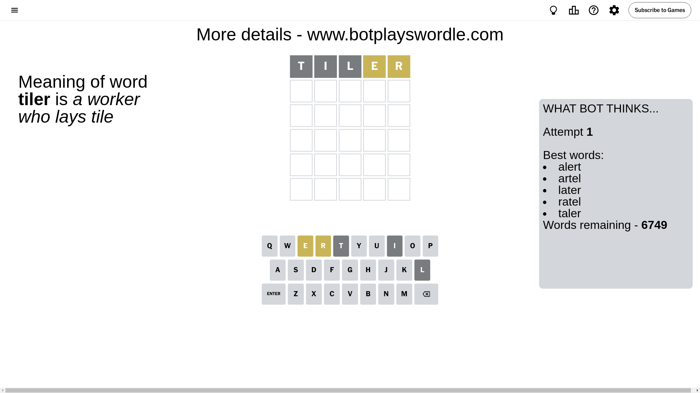
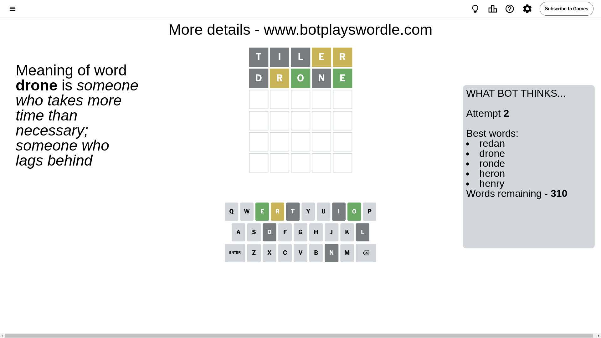
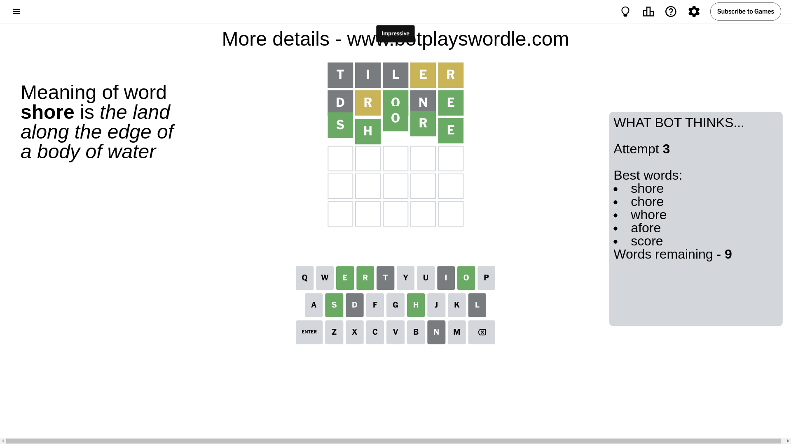

# Wordle for August 14, 2024 - \#1152

## Attempt 1

This is the first attempt and we'll choose a random word to start with.

Let's start with word `tiler`

Attempt for `tiler` gives us 0 correct letters, 2 present letters and 3 wrong letters.

If we look into details, we can see that:

Letter `t` is not present in the word and we will not use it any more

Letter `i` is not present in the word and we will not use it any more

Letter `l` is not present in the word and we will not use it any more

Letter `e` is on a different spot - this means that it cannot be at position 4

Letter `r` is on a different spot - this means that it cannot be at position 5

Some letters are missing (like `t`, `i`, `l`) but it's also important piece of information

Word should contain letters `[e r]`

That was a great guess that limited number of remaining words

## Attempt 2

Right now we have 310 words to choose from and best of them seem to be `[redan drone ronde heron henry]`

So far we know that possible letters are:

At position 1: `[a b c d e f g h j k m n o p q r s u v w x y z]`

At position 2: `[a b c d e f g h j k m n o p q r s u v w x y z]`

At position 3: `[a b c d e f g h j k m n o p q r s u v w x y z]`

At position 4: `[a b c d f g h j k m n o p q r s u v w x y z]`

At position 5: `[a b c d e f g h j k m n o p q s u v w x y z]`

Next guess is `drone`, let's see what it gives us

Attempt for `drone` gives us 2 correct letters, 1 present letters and 2 wrong letters.

If we look into details, we can see that:

Letter `d` is not present in the word and we will not use it any more

Letter `r` is on a different spot - this means that it cannot be at position 2

Letter `o` should be at position 3

Letter `n` is not present in the word and we will not use it any more

Letter `e` should be at position 5

We got information about the correct letters and it should make next attempt easier

Some letters are missing (like `d`, `n`) but it's also important piece of information

Word should contain letters `[e r o]`

That was a great guess that limited number of remaining words

## Attempt 3

Right now we have 9 words to choose from and best of them seem to be `[shore chore whore afore score]`

So far we know that possible letters are:

At position 1: `[a b c e f g h j k m o p q r s u v w x y z]`

At position 2: `[a b c e f g h j k m o p q s u v w x y z]`

At position 3: `[o]`

At position 4: `[a b c f g h j k m o p q r s u v w x y z]`

At position 5: `[e]`

Next guess is `shore`, let's see what it gives us

That's the correct answer! The word is `shore`!

## Conclusion

Today's word is `shore` and it took 3 attempts to guess it

