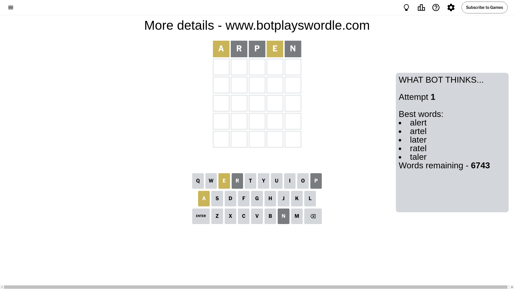
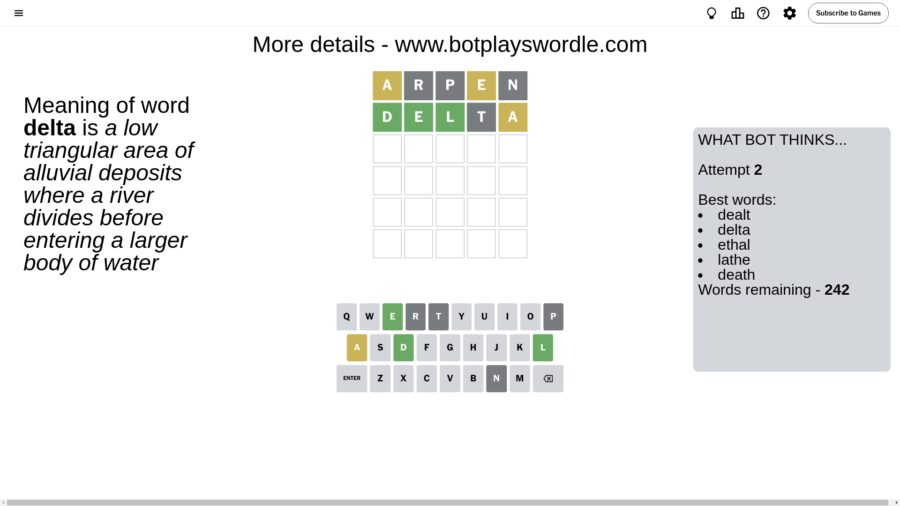
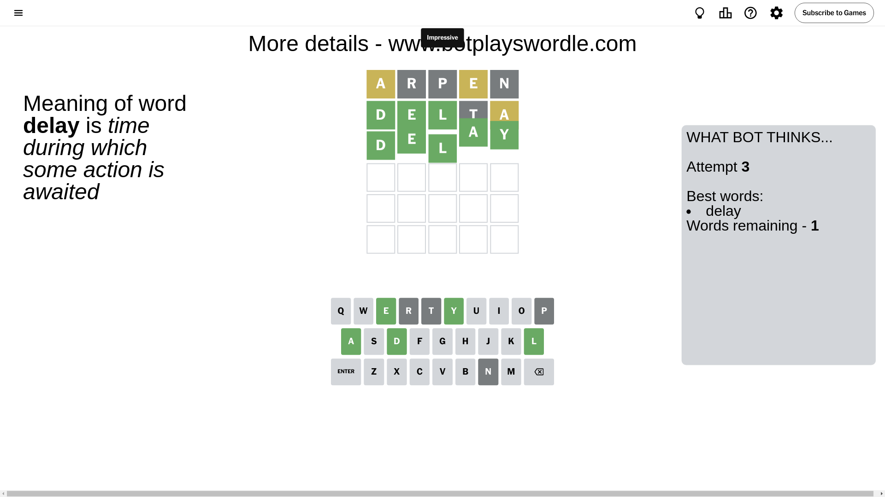

# Wordle for August 20, 2024 - \#1158

## Attempt 1

This is the first attempt and we'll choose a random word to start with.

Let's start with word `arpen`

Attempt for `arpen` gives us 0 correct letters, 2 present letters and 3 wrong letters.

If we look into details, we can see that:

Letter `a` is on a different spot - this means that it cannot be at position 1

Letter `r` is not present in the word and we will not use it any more

Letter `p` is not present in the word and we will not use it any more

Letter `e` is on a different spot - this means that it cannot be at position 4

Letter `n` is not present in the word and we will not use it any more

Some letters are missing (like `r`, `p`, `n`) but it's also important piece of information

Word should contain letters `[a e]`

That was a great guess that limited number of remaining words

## Attempt 2

Right now we have 242 words to choose from and best of them seem to be `[dealt delta ethal lathe death]`

So far we know that possible letters are:

At position 1: `[b c d e f g h i j k l m o q s t u v w x y z]`

At position 2: `[a b c d e f g h i j k l m o q s t u v w x y z]`

At position 3: `[a b c d e f g h i j k l m o q s t u v w x y z]`

At position 4: `[a b c d f g h i j k l m o q s t u v w x y z]`

At position 5: `[a b c d e f g h i j k l m o q s t u v w x y z]`

Next guess is `delta`, let's see what it gives us

Attempt for `delta` gives us 3 correct letters, 1 present letters and 1 wrong letters.

If we look into details, we can see that:

Letter `d` should be at position 1

Letter `e` should be at position 2

Letter `l` should be at position 3

Letter `t` is not present in the word and we will not use it any more

Letter `a` is on a different spot - this means that it cannot be at position 5

We got information about the correct letters and it should make next attempt easier

Some letters are missing (like `t`) but it's also important piece of information

Word should contain letters `[a e d l]`

That was a great guess that limited number of remaining words

## Attempt 3

Right now we have 1 words to choose from and best of them seem to be `[delay]`

So far we know that possible letters are:

At position 1: `[d]`

At position 2: `[e]`

At position 3: `[l]`

At position 4: `[a b c d f g h i j k l m o q s u v w x y z]`

At position 5: `[b c d e f g h i j k l m o q s u v w x y z]`

It must be `delay`

That's the correct answer! The word is `delay`!

## Conclusion

Today's word is `delay` and it took 3 attempts to guess it

