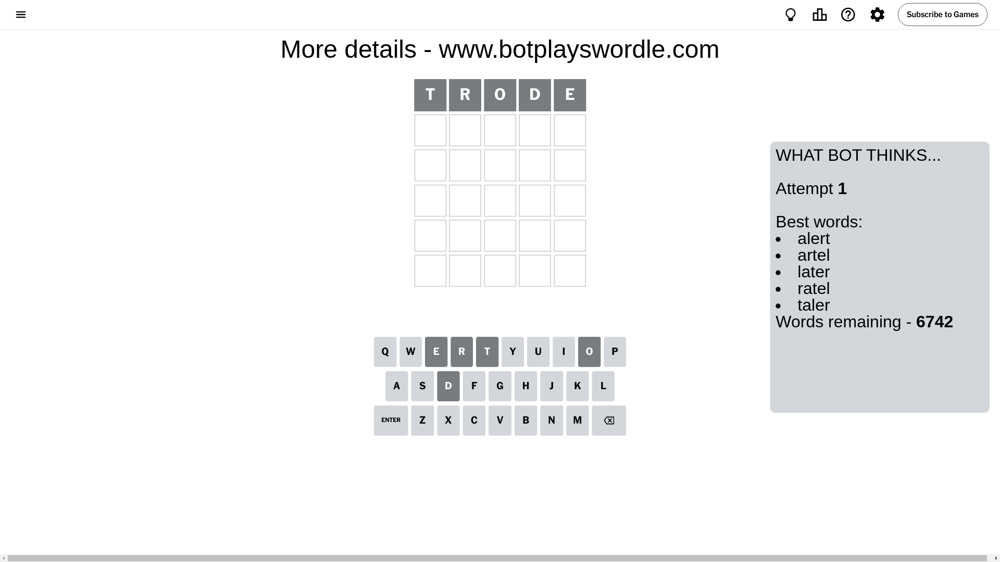
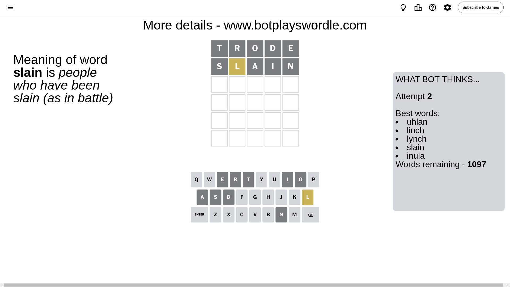
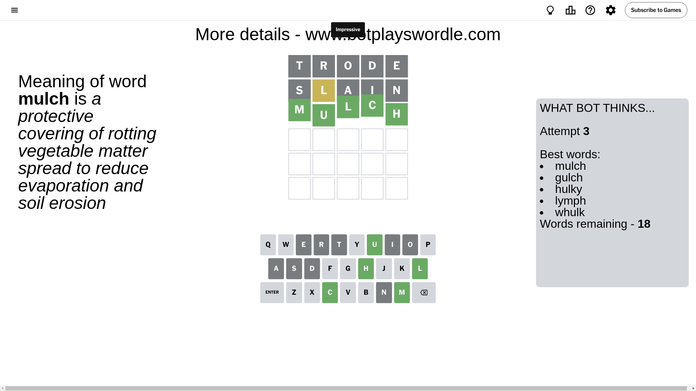

# Wordle for August 21, 2024 - \#1159

## Attempt 1

This is the first attempt and we'll choose a random word to start with.

Let's start with word `trode`

Attempt for `trode` gives us 0 correct letters, 0 present letters and 5 wrong letters.

If we look into details, we can see that:

Letter `t` is not present in the word and we will not use it any more

Letter `r` is not present in the word and we will not use it any more

Letter `o` is not present in the word and we will not use it any more

Letter `d` is not present in the word and we will not use it any more

Letter `e` is not present in the word and we will not use it any more

Some letters are missing (like `t`, `r`, `o`, `d`, `e`) but it's also important piece of information

So far we don't know any of the letters!

Not a bad guess in general

## Attempt 2

Right now we have 1097 words to choose from and best of them seem to be `[uhlan linch lynch slain inula]`

So far we know that possible letters are:

At position 1: `[a b c f g h i j k l m n p q s u v w x y z]`

At position 2: `[a b c f g h i j k l m n p q s u v w x y z]`

At position 3: `[a b c f g h i j k l m n p q s u v w x y z]`

At position 4: `[a b c f g h i j k l m n p q s u v w x y z]`

At position 5: `[a b c f g h i j k l m n p q s u v w x y z]`

Next guess is `slain`, let's see what it gives us

Attempt for `slain` gives us 0 correct letters, 1 present letters and 4 wrong letters.

If we look into details, we can see that:

Letter `s` is not present in the word and we will not use it any more

Letter `l` is on a different spot - this means that it cannot be at position 2

Letter `a` is not present in the word and we will not use it any more

Letter `i` is not present in the word and we will not use it any more

Letter `n` is not present in the word and we will not use it any more

Some letters are missing (like `s`, `a`, `i`, `n`) but it's also important piece of information

Word should contain letters `[l]`

That was a great guess that limited number of remaining words

## Attempt 3

Right now we have 18 words to choose from and best of them seem to be `[mulch gulch hulky lymph whulk]`

So far we know that possible letters are:

At position 1: `[b c f g h j k l m p q u v w x y z]`

At position 2: `[b c f g h j k m p q u v w x y z]`

At position 3: `[b c f g h j k l m p q u v w x y z]`

At position 4: `[b c f g h j k l m p q u v w x y z]`

At position 5: `[b c f g h j k l m p q u v w x y z]`

Next guess is `mulch`, let's see what it gives us

That's the correct answer! The word is `mulch`!

To be honest that was a pretty lucky guess, but it worked out well.

## Conclusion

Today's word is `mulch` and it took 3 attempts to guess it

