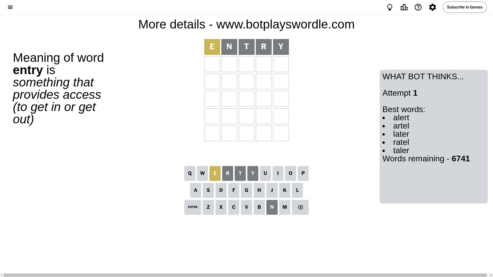
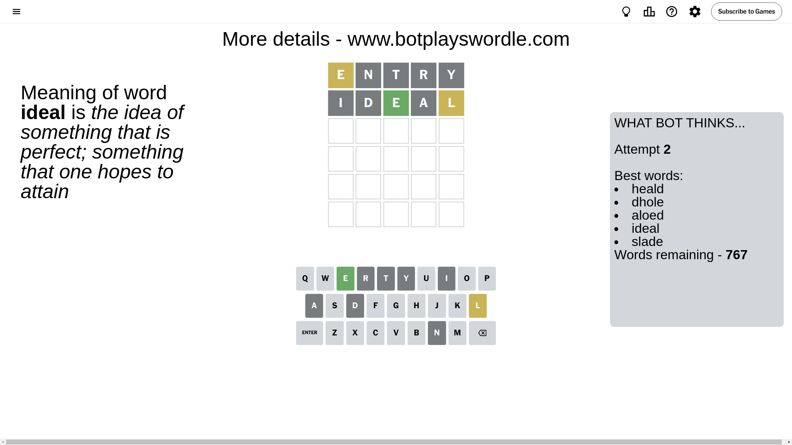
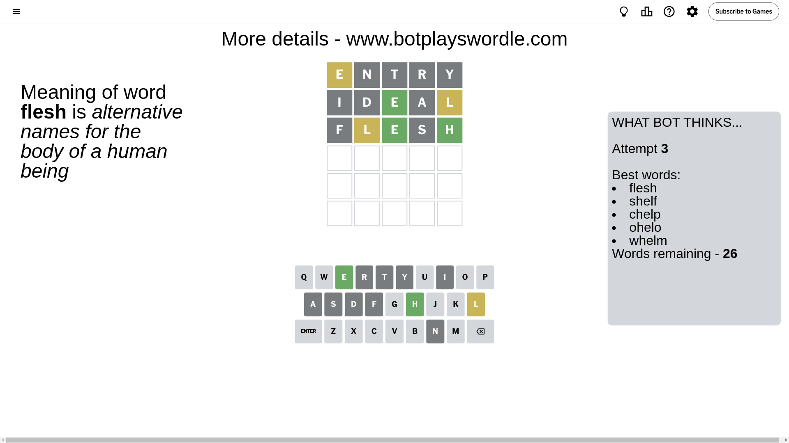
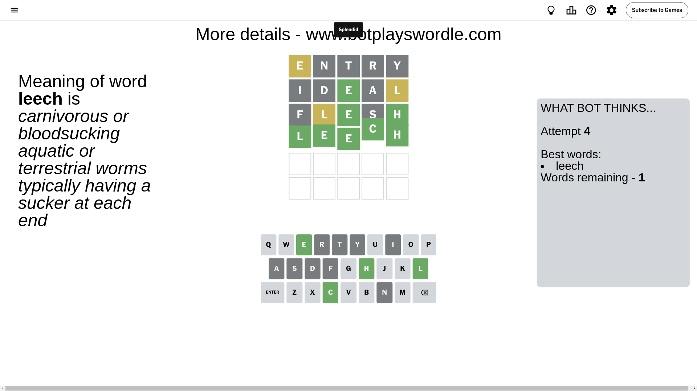

# Wordle for August 23, 2024 - \#1161

## Attempt 1

This is the first attempt and we'll choose a random word to start with.

Let's start with word `entry`

Attempt for `entry` gives us 0 correct letters, 1 present letters and 4 wrong letters.

If we look into details, we can see that:

Letter `e` is on a different spot - this means that it cannot be at position 1

Letter `n` is not present in the word and we will not use it any more

Letter `t` is not present in the word and we will not use it any more

Letter `r` is not present in the word and we will not use it any more

Letter `y` is not present in the word and we will not use it any more

Some letters are missing (like `n`, `t`, `r`, `y`) but it's also important piece of information

Word should contain letters `[e]`

That was a great guess that limited number of remaining words

## Attempt 2

Right now we have 767 words to choose from and best of them seem to be `[heald dhole aloed ideal slade]`

So far we know that possible letters are:

At position 1: `[a b c d f g h i j k l m o p q s u v w x z]`

At position 2: `[a b c d e f g h i j k l m o p q s u v w x z]`

At position 3: `[a b c d e f g h i j k l m o p q s u v w x z]`

At position 4: `[a b c d e f g h i j k l m o p q s u v w x z]`

At position 5: `[a b c d e f g h i j k l m o p q s u v w x z]`

Next guess is `ideal`, let's see what it gives us

Attempt for `ideal` gives us 1 correct letters, 1 present letters and 3 wrong letters.

If we look into details, we can see that:

Letter `i` is not present in the word and we will not use it any more

Letter `d` is not present in the word and we will not use it any more

Letter `e` should be at position 3

Letter `a` is not present in the word and we will not use it any more

Letter `l` is on a different spot - this means that it cannot be at position 5

We got information about the correct letters and it should make next attempt easier

Some letters are missing (like `i`, `d`, `a`) but it's also important piece of information

Word should contain letters `[e l]`

That was a great guess that limited number of remaining words

## Attempt 3

Right now we have 26 words to choose from and best of them seem to be `[flesh shelf chelp ohelo whelm]`

So far we know that possible letters are:

At position 1: `[b c f g h j k l m o p q s u v w x z]`

At position 2: `[b c e f g h j k l m o p q s u v w x z]`

At position 3: `[e]`

At position 4: `[b c e f g h j k l m o p q s u v w x z]`

At position 5: `[b c e f g h j k m o p q s u v w x z]`

Next guess is `flesh`, let's see what it gives us

Attempt for `flesh` gives us 2 correct letters, 1 present letters and 2 wrong letters.

If we look into details, we can see that:

Letter `f` is not present in the word and we will not use it any more

Letter `l` is on a different spot - this means that it cannot be at position 2

Letter `s` is not present in the word and we will not use it any more

Letter `h` should be at position 5

We got information about the correct letters and it should make next attempt easier

Some letters are missing (like `f`, `s`) but it's also important piece of information

Word should contain letters `[e l h]`

That was a great guess that limited number of remaining words

## Attempt 4

Right now we have 1 words to choose from and best of them seem to be `[leech]`

So far we know that possible letters are:

At position 1: `[b c g h j k l m o p q u v w x z]`

At position 2: `[b c e g h j k m o p q u v w x z]`

At position 3: `[e]`

At position 4: `[b c e g h j k l m o p q u v w x z]`

At position 5: `[h]`

It must be `leech`

That's the correct answer! The word is `leech`!

## Conclusion

Today's word is `leech` and it took 4 attempts to guess it

