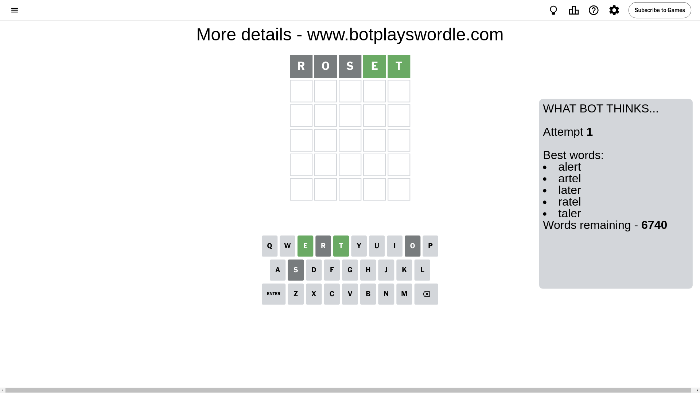
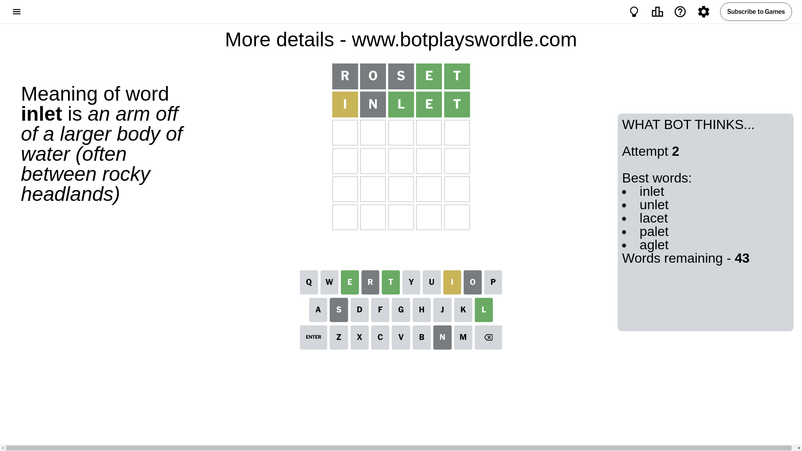
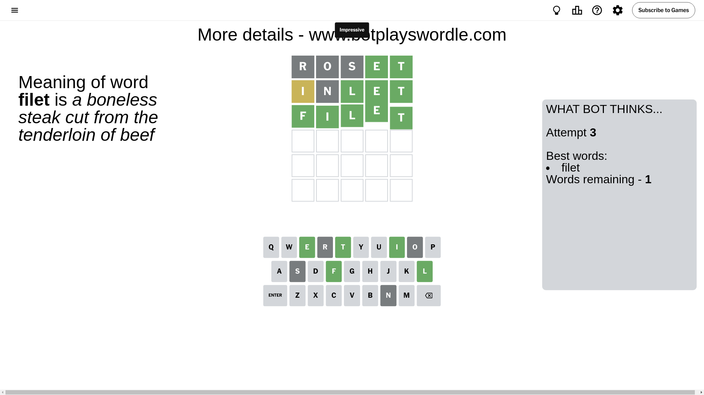

# Wordle for August 24, 2024 - \#1162

## Attempt 1

This is the first attempt and we'll choose a random word to start with.

Let's start with word `roset`

Attempt for `roset` gives us 2 correct letters, 0 present letters and 3 wrong letters.

If we look into details, we can see that:

Letter `r` is not present in the word and we will not use it any more

Letter `o` is not present in the word and we will not use it any more

Letter `s` is not present in the word and we will not use it any more

Letter `e` should be at position 4

Letter `t` should be at position 5

We got information about the correct letters and it should make next attempt easier

Some letters are missing (like `r`, `o`, `s`) but it's also important piece of information

Word should contain letters `[e t]`

That was a great guess that limited number of remaining words

## Attempt 2

Right now we have 43 words to choose from and best of them seem to be `[inlet unlet lacet palet aglet]`

So far we know that possible letters are:

At position 1: `[a b c d e f g h i j k l m n p q t u v w x y z]`

At position 2: `[a b c d e f g h i j k l m n p q t u v w x y z]`

At position 3: `[a b c d e f g h i j k l m n p q t u v w x y z]`

At position 4: `[e]`

At position 5: `[t]`

Next guess is `inlet`, let's see what it gives us

Attempt for `inlet` gives us 3 correct letters, 1 present letters and 1 wrong letters.

If we look into details, we can see that:

Letter `i` is on a different spot - this means that it cannot be at position 1

Letter `n` is not present in the word and we will not use it any more

Letter `l` should be at position 3

We got information about the correct letters and it should make next attempt easier

Some letters are missing (like `n`) but it's also important piece of information

Word should contain letters `[e t i l]`

That was a great guess that limited number of remaining words

## Attempt 3

Right now we have 1 words to choose from and best of them seem to be `[filet]`

So far we know that possible letters are:

At position 1: `[a b c d e f g h j k l m p q t u v w x y z]`

At position 2: `[a b c d e f g h i j k l m p q t u v w x y z]`

At position 3: `[l]`

At position 4: `[e]`

At position 5: `[t]`

It must be `filet`

That's the correct answer! The word is `filet`!

## Conclusion

Today's word is `filet` and it took 3 attempts to guess it

