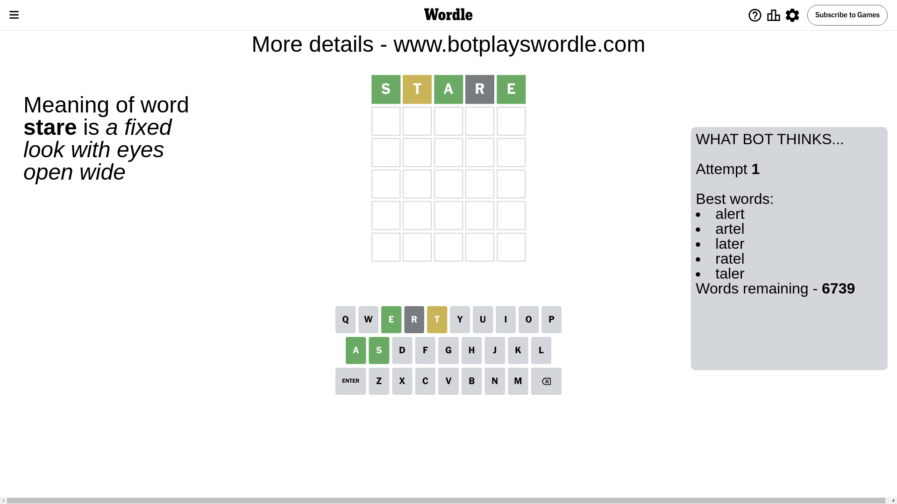
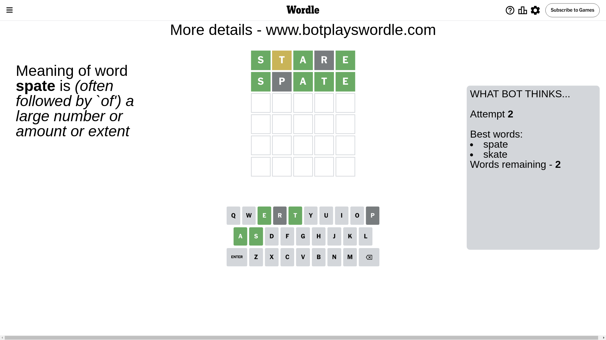

# Wordle for August 25, 2024 - \#1163

## Attempt 1

This is the first attempt and we'll choose a random word to start with.

Let's start with word `stare`

Attempt for `stare` gives us 3 correct letters, 1 present letters and 1 wrong letters.

If we look into details, we can see that:

Letter `s` should be at position 1

Letter `t` is on a different spot - this means that it cannot be at position 2

Letter `a` should be at position 3

Letter `r` is not present in the word and we will not use it any more

Letter `e` should be at position 5

We got information about the correct letters and it should make next attempt easier

Some letters are missing (like `r`) but it's also important piece of information

Word should contain letters `[s t a e]`

That was a great guess that limited number of remaining words

## Attempt 2

Right now we have 2 words to choose from and best of them seem to be `[spate skate]`

So far we know that possible letters are:

At position 1: `[s]`

At position 2: `[a b c d e f g h i j k l m n o p q s u v w x y z]`

At position 3: `[a]`

At position 4: `[a b c d e f g h i j k l m n o p q s t u v w x y z]`

At position 5: `[e]`

Next guess is `spate`, let's see what it gives us

Attempt for `spate` gives us 4 correct letters, 0 present letters and 1 wrong letters.

If we look into details, we can see that:

Letter `p` is not present in the word and we will not use it any more

Letter `t` should be at position 4

We got information about the correct letters and it should make next attempt easier

Some letters are missing (like `p`) but it's also important piece of information

Word should contain letters `[s t a e]`

This was a waste, almost no valuable information...

## Attempt 3

Right now we have 1 words to choose from and best of them seem to be `[skate]`

So far we know that possible letters are:

At position 1: `[s]`

At position 2: `[a b c d e f g h i j k l m n o q s u v w x y z]`

At position 3: `[a]`

At position 4: `[t]`

At position 5: `[e]`

It must be `skate`

That's the correct answer! The word is `skate`!

## Conclusion

Today's word is `skate` and it took 3 attempts to guess it

