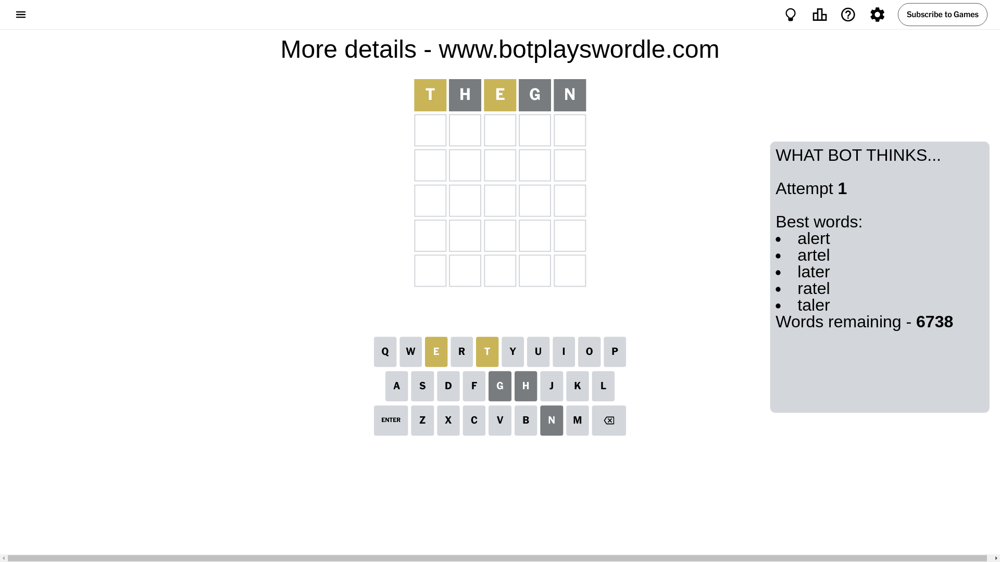
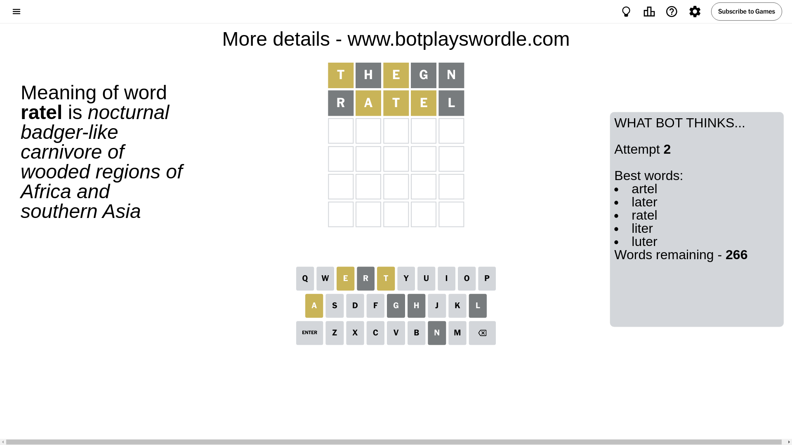
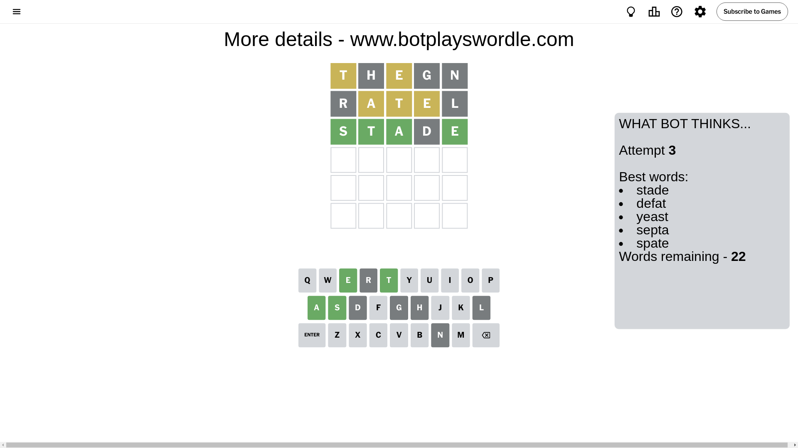
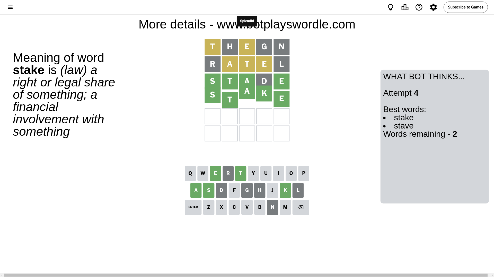

# Wordle for August 26, 2024 - \#1164

## Attempt 1

This is the first attempt and we'll choose a random word to start with.

Let's start with word `thegn`

Attempt for `thegn` gives us 0 correct letters, 2 present letters and 3 wrong letters.

If we look into details, we can see that:

Letter `t` is on a different spot - this means that it cannot be at position 1

Letter `h` is not present in the word and we will not use it any more

Letter `e` is on a different spot - this means that it cannot be at position 3

Letter `g` is not present in the word and we will not use it any more

Letter `n` is not present in the word and we will not use it any more

Some letters are missing (like `h`, `g`, `n`) but it's also important piece of information

Word should contain letters `[t e]`

That was a great guess that limited number of remaining words

## Attempt 2

Right now we have 266 words to choose from and best of them seem to be `[artel later ratel liter luter]`

So far we know that possible letters are:

At position 1: `[a b c d e f i j k l m o p q r s u v w x y z]`

At position 2: `[a b c d e f i j k l m o p q r s t u v w x y z]`

At position 3: `[a b c d f i j k l m o p q r s t u v w x y z]`

At position 4: `[a b c d e f i j k l m o p q r s t u v w x y z]`

At position 5: `[a b c d e f i j k l m o p q r s t u v w x y z]`

Next guess is `ratel`, let's see what it gives us

Attempt for `ratel` gives us 0 correct letters, 3 present letters and 2 wrong letters.

If we look into details, we can see that:

Letter `r` is not present in the word and we will not use it any more

Letter `a` is on a different spot - this means that it cannot be at position 2

Letter `t` is on a different spot - this means that it cannot be at position 3

Letter `e` is on a different spot - this means that it cannot be at position 4

Letter `l` is not present in the word and we will not use it any more

Some letters are missing (like `r`, `l`) but it's also important piece of information

Word should contain letters `[t e a]`

That was a great guess that limited number of remaining words

## Attempt 3

Right now we have 22 words to choose from and best of them seem to be `[stade defat yeast septa spate]`

So far we know that possible letters are:

At position 1: `[a b c d e f i j k m o p q s u v w x y z]`

At position 2: `[b c d e f i j k m o p q s t u v w x y z]`

At position 3: `[a b c d f i j k m o p q s u v w x y z]`

At position 4: `[a b c d f i j k m o p q s t u v w x y z]`

At position 5: `[a b c d e f i j k m o p q s t u v w x y z]`

Next guess is `stade`, let's see what it gives us

Attempt for `stade` gives us 4 correct letters, 0 present letters and 1 wrong letters.

If we look into details, we can see that:

Letter `s` should be at position 1

Letter `t` should be at position 2

Letter `a` should be at position 3

Letter `d` is not present in the word and we will not use it any more

Letter `e` should be at position 5

We got information about the correct letters and it should make next attempt easier

Some letters are missing (like `d`) but it's also important piece of information

Word should contain letters `[t e a s]`

That was a great guess that limited number of remaining words

## Attempt 4

Right now we have 2 words to choose from and best of them seem to be `[stake stave]`

So far we know that possible letters are:

At position 1: `[s]`

At position 2: `[t]`

At position 3: `[a]`

At position 4: `[a b c f i j k m o p q s t u v w x y z]`

At position 5: `[e]`

Next guess is `stake`, let's see what it gives us

That's the correct answer! The word is `stake`!

## Conclusion

Today's word is `stake` and it took 4 attempts to guess it

