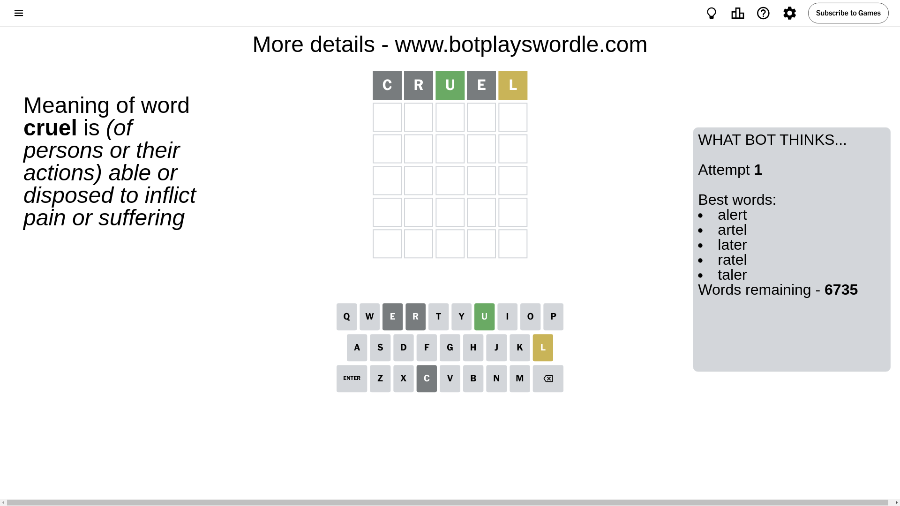

# Wordle for August 29, 2024 - \#1167

## Attempt 1

This is the first attempt and we'll choose a random word to start with.

Let's start with word `cruel`

Attempt for `cruel` gives us 1 correct letters, 1 present letters and 3 wrong letters.

If we look into details, we can see that:

Letter `c` is not present in the word and we will not use it any more

Letter `r` is not present in the word and we will not use it any more

Letter `u` should be at position 3

Letter `e` is not present in the word and we will not use it any more

Letter `l` is on a different spot - this means that it cannot be at position 5

We got information about the correct letters and it should make next attempt easier

Some letters are missing (like `c`, `r`, `e`) but it's also important piece of information

Word should contain letters `[u l]`

That was a great guess that limited number of remaining words

## Attempt 2

Right now we have 56 words to choose from and best of them seem to be `[blunt laund hauld sault inula]`

So far we know that possible letters are:

At position 1: `[a b d f g h i j k l m n o p q s t u v w x y z]`

At position 2: `[a b d f g h i j k l m n o p q s t u v w x y z]`

At position 3: `[u]`

At position 4: `[a b d f g h i j k l m n o p q s t u v w x y z]`

At position 5: `[a b d f g h i j k m n o p q s t u v w x y z]`

Next guess is `sault`, let's see what it gives us

Attempt for `sault` gives us 1 correct letters, 1 present letters and 3 wrong letters.

If we look into details, we can see that:

Letter `s` is not present in the word and we will not use it any more

Letter `a` is not present in the word and we will not use it any more

Letter `l` is on a different spot - this means that it cannot be at position 4

Letter `t` is not present in the word and we will not use it any more

Some letters are missing (like `s`, `a`, `t`) but it's also important piece of information

Word should contain letters `[u l]`

Could be a better guess

## Attempt 3

Right now we have 15 words to choose from and best of them seem to be `[blunk flung flunk fluid lough]`

So far we know that possible letters are:

At position 1: `[b d f g h i j k l m n o p q u v w x y z]`

At position 2: `[b d f g h i j k l m n o p q u v w x y z]`

At position 3: `[u]`

At position 4: `[b d f g h i j k m n o p q u v w x y z]`

At position 5: `[b d f g h i j k m n o p q u v w x y z]`

Next guess is `blunk`, let's see what it gives us

Attempt for `blunk` gives us 4 correct letters, 0 present letters and 1 wrong letters.

If we look into details, we can see that:

Letter `b` is not present in the word and we will not use it any more

Letter `l` should be at position 2

Letter `n` should be at position 4

Letter `k` should be at position 5

We got information about the correct letters and it should make next attempt easier

Some letters are missing (like `b`) but it's also important piece of information

Word should contain letters `[u l n k]`

That was a great guess that limited number of remaining words

## Attempt 4

Right now we have 1 words to choose from and best of them seem to be `[flunk]`

So far we know that possible letters are:

At position 1: `[d f g h i j k l m n o p q u v w x y z]`

At position 2: `[l]`

At position 3: `[u]`

At position 4: `[n]`

At position 5: `[k]`

It must be `flunk`

That's the correct answer! The word is `flunk`!

## Conclusion

Today's word is `flunk` and it took 4 attempts to guess it

