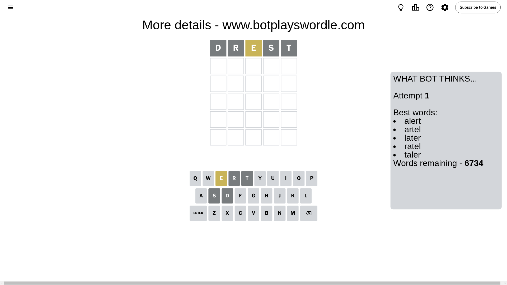
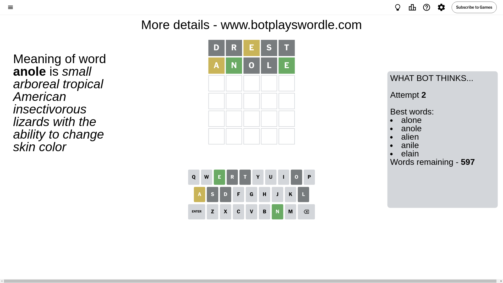
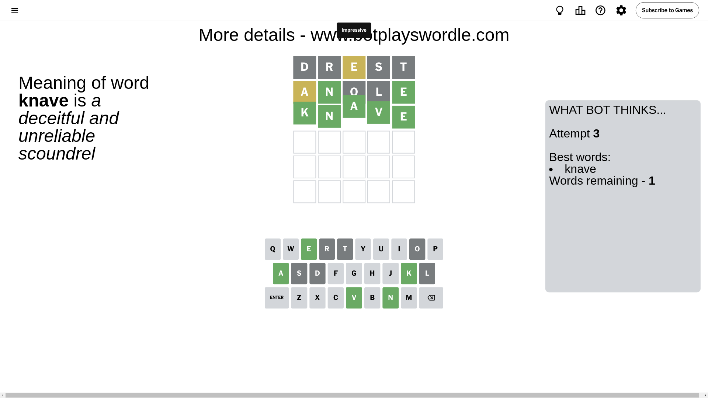

# Wordle for August 30, 2024 - \#1168

## Attempt 1

This is the first attempt and we'll choose a random word to start with.

Let's start with word `drest`

Attempt for `drest` gives us 0 correct letters, 1 present letters and 4 wrong letters.

If we look into details, we can see that:

Letter `d` is not present in the word and we will not use it any more

Letter `r` is not present in the word and we will not use it any more

Letter `e` is on a different spot - this means that it cannot be at position 3

Letter `s` is not present in the word and we will not use it any more

Letter `t` is not present in the word and we will not use it any more

Some letters are missing (like `d`, `r`, `s`, `t`) but it's also important piece of information

Word should contain letters `[e]`

That was a great guess that limited number of remaining words

## Attempt 2

Right now we have 597 words to choose from and best of them seem to be `[alone anole alien anile elain]`

So far we know that possible letters are:

At position 1: `[a b c e f g h i j k l m n o p q u v w x y z]`

At position 2: `[a b c e f g h i j k l m n o p q u v w x y z]`

At position 3: `[a b c f g h i j k l m n o p q u v w x y z]`

At position 4: `[a b c e f g h i j k l m n o p q u v w x y z]`

At position 5: `[a b c e f g h i j k l m n o p q u v w x y z]`

Next guess is `anole`, let's see what it gives us

Attempt for `anole` gives us 2 correct letters, 1 present letters and 2 wrong letters.

If we look into details, we can see that:

Letter `a` is on a different spot - this means that it cannot be at position 1

Letter `n` should be at position 2

Letter `o` is not present in the word and we will not use it any more

Letter `l` is not present in the word and we will not use it any more

Letter `e` should be at position 5

We got information about the correct letters and it should make next attempt easier

Some letters are missing (like `o`, `l`) but it's also important piece of information

Word should contain letters `[e a n]`

That was a great guess that limited number of remaining words

## Attempt 3

Right now we have 1 words to choose from and best of them seem to be `[knave]`

So far we know that possible letters are:

At position 1: `[b c e f g h i j k m n p q u v w x y z]`

At position 2: `[n]`

At position 3: `[a b c f g h i j k m n p q u v w x y z]`

At position 4: `[a b c e f g h i j k m n p q u v w x y z]`

At position 5: `[e]`

It must be `knave`

That's the correct answer! The word is `knave`!

## Conclusion

Today's word is `knave` and it took 3 attempts to guess it

