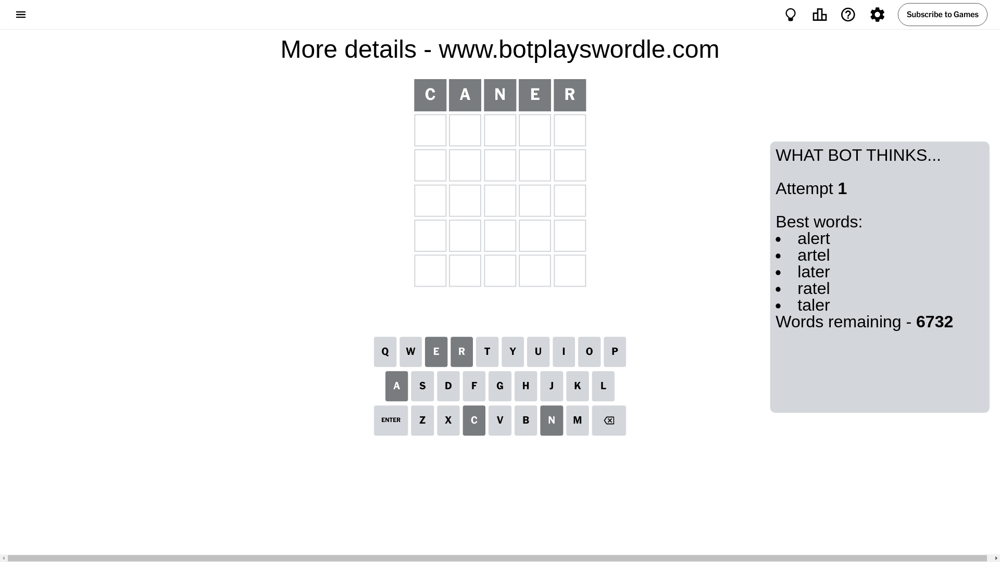
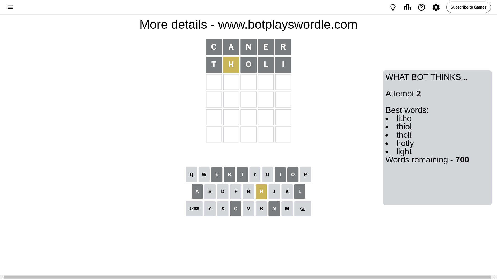
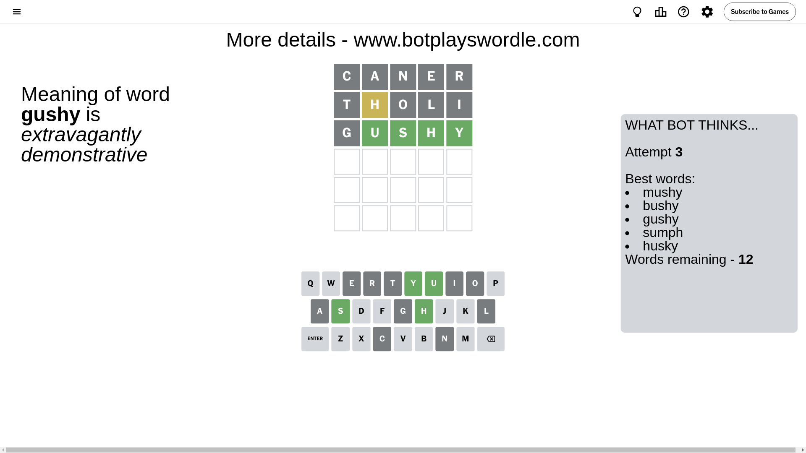
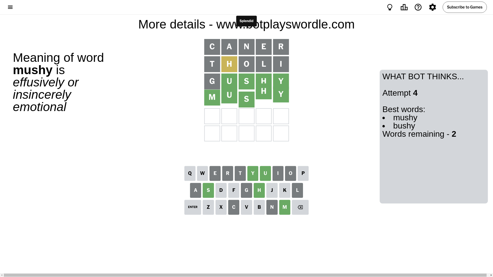

# Wordle for September 1, 2024 - \#1170

## Attempt 1

This is the first attempt and we'll choose a random word to start with.

Let's start with word `caner`

Attempt for `caner` gives us 0 correct letters, 0 present letters and 5 wrong letters.

If we look into details, we can see that:

Letter `c` is not present in the word and we will not use it any more

Letter `a` is not present in the word and we will not use it any more

Letter `n` is not present in the word and we will not use it any more

Letter `e` is not present in the word and we will not use it any more

Letter `r` is not present in the word and we will not use it any more

Some letters are missing (like `c`, `a`, `n`, `e`, `r`) but it's also important piece of information

So far we don't know any of the letters!

That was a great guess that limited number of remaining words

## Attempt 2

Right now we have 700 words to choose from and best of them seem to be `[litho thiol tholi hotly light]`

So far we know that possible letters are:

At position 1: `[b d f g h i j k l m o p q s t u v w x y z]`

At position 2: `[b d f g h i j k l m o p q s t u v w x y z]`

At position 3: `[b d f g h i j k l m o p q s t u v w x y z]`

At position 4: `[b d f g h i j k l m o p q s t u v w x y z]`

At position 5: `[b d f g h i j k l m o p q s t u v w x y z]`

Next guess is `tholi`, let's see what it gives us

Attempt for `tholi` gives us 0 correct letters, 1 present letters and 4 wrong letters.

If we look into details, we can see that:

Letter `t` is not present in the word and we will not use it any more

Letter `h` is on a different spot - this means that it cannot be at position 2

Letter `o` is not present in the word and we will not use it any more

Letter `l` is not present in the word and we will not use it any more

Letter `i` is not present in the word and we will not use it any more

Some letters are missing (like `t`, `o`, `l`, `i`) but it's also important piece of information

Word should contain letters `[h]`

That was a great guess that limited number of remaining words

## Attempt 3

Right now we have 12 words to choose from and best of them seem to be `[mushy bushy gushy sumph husky]`

So far we know that possible letters are:

At position 1: `[b d f g h j k m p q s u v w x y z]`

At position 2: `[b d f g j k m p q s u v w x y z]`

At position 3: `[b d f g h j k m p q s u v w x y z]`

At position 4: `[b d f g h j k m p q s u v w x y z]`

At position 5: `[b d f g h j k m p q s u v w x y z]`

Next guess is `gushy`, let's see what it gives us

Attempt for `gushy` gives us 4 correct letters, 0 present letters and 1 wrong letters.

If we look into details, we can see that:

Letter `g` is not present in the word and we will not use it any more

Letter `u` should be at position 2

Letter `s` should be at position 3

Letter `h` should be at position 4

Letter `y` should be at position 5

We got information about the correct letters and it should make next attempt easier

Some letters are missing (like `g`) but it's also important piece of information

Word should contain letters `[h u s y]`

Not a bad guess in general

## Attempt 4

Right now we have 2 words to choose from and best of them seem to be `[mushy bushy]`

So far we know that possible letters are:

At position 1: `[b d f h j k m p q s u v w x y z]`

At position 2: `[u]`

At position 3: `[s]`

At position 4: `[h]`

At position 5: `[y]`

Next guess is `mushy`, let's see what it gives us

That's the correct answer! The word is `mushy`!

## Conclusion

Today's word is `mushy` and it took 4 attempts to guess it

