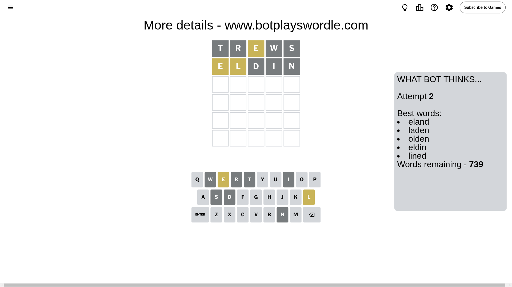

# Wordle for September 2, 2024 - \#1171

## Attempt 1

This is the first attempt and we'll choose a random word to start with.

Let's start with word `trews`

Attempt for `trews` gives us 0 correct letters, 1 present letters and 4 wrong letters.

If we look into details, we can see that:

Letter `t` is not present in the word and we will not use it any more

Letter `r` is not present in the word and we will not use it any more

Letter `e` is on a different spot - this means that it cannot be at position 3

Letter `w` is not present in the word and we will not use it any more

Letter `s` is not present in the word and we will not use it any more

Some letters are missing (like `t`, `r`, `w`, `s`) but it's also important piece of information

Word should contain letters `[e]`

That was a great guess that limited number of remaining words

## Attempt 2

Right now we have 739 words to choose from and best of them seem to be `[eland laden olden eldin lined]`

So far we know that possible letters are:

At position 1: `[a b c d e f g h i j k l m n o p q u v x y z]`

At position 2: `[a b c d e f g h i j k l m n o p q u v x y z]`

At position 3: `[a b c d f g h i j k l m n o p q u v x y z]`

At position 4: `[a b c d e f g h i j k l m n o p q u v x y z]`

At position 5: `[a b c d e f g h i j k l m n o p q u v x y z]`

Next guess is `eldin`, let's see what it gives us

Attempt for `eldin` gives us 0 correct letters, 2 present letters and 3 wrong letters.

If we look into details, we can see that:

Letter `e` is on a different spot - this means that it cannot be at position 1

Letter `l` is on a different spot - this means that it cannot be at position 2

Letter `d` is not present in the word and we will not use it any more

Letter `i` is not present in the word and we will not use it any more

Letter `n` is not present in the word and we will not use it any more

Some letters are missing (like `d`, `i`, `n`) but it's also important piece of information

Word should contain letters `[e l]`

Not a bad guess in general

## Attempt 3

Right now we have 119 words to choose from and best of them seem to be `[haole lehua leach hamel hemal]`

So far we know that possible letters are:

At position 1: `[a b c f g h j k l m o p q u v x y z]`

At position 2: `[a b c e f g h j k m o p q u v x y z]`

At position 3: `[a b c f g h j k l m o p q u v x y z]`

At position 4: `[a b c e f g h j k l m o p q u v x y z]`

At position 5: `[a b c e f g h j k l m o p q u v x y z]`

Next guess is `hemal`, let's see what it gives us

Attempt for `hemal` gives us 2 correct letters, 2 present letters and 1 wrong letters.

If we look into details, we can see that:

Letter `h` is not present in the word and we will not use it any more

Letter `e` is on a different spot - this means that it cannot be at position 2

Letter `m` should be at position 3

Letter `a` is on a different spot - this means that it cannot be at position 4

Letter `l` should be at position 5

We got information about the correct letters and it should make next attempt easier

Some letters are missing (like `h`) but it's also important piece of information

Word should contain letters `[e l m a]`

That was a great guess that limited number of remaining words

## Attempt 4

Right now we have 1 words to choose from and best of them seem to be `[camel]`

So far we know that possible letters are:

At position 1: `[a b c f g j k l m o p q u v x y z]`

At position 2: `[a b c f g j k m o p q u v x y z]`

At position 3: `[m]`

At position 4: `[b c e f g j k l m o p q u v x y z]`

At position 5: `[l]`

It must be `camel`

That's the correct answer! The word is `camel`!

## Conclusion

Today's word is `camel` and it took 4 attempts to guess it

