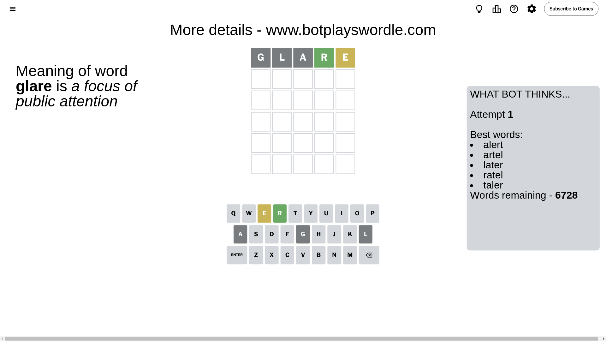
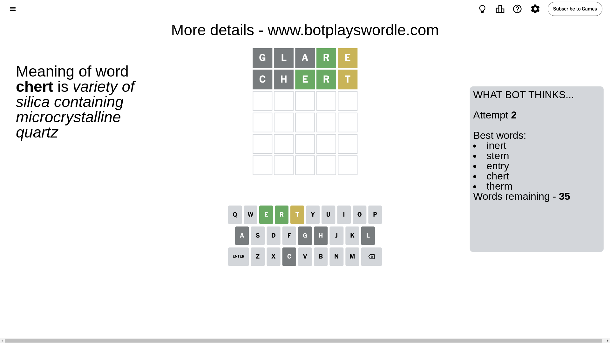
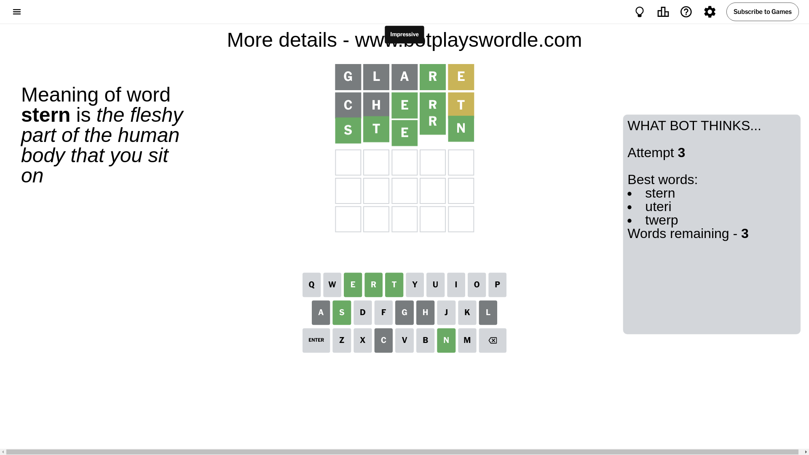

# Wordle for September 4, 2024 - \#1173

## Attempt 1

This is the first attempt and we'll choose a random word to start with.

Let's start with word `glare`

Attempt for `glare` gives us 1 correct letters, 1 present letters and 3 wrong letters.

If we look into details, we can see that:

Letter `g` is not present in the word and we will not use it any more

Letter `l` is not present in the word and we will not use it any more

Letter `a` is not present in the word and we will not use it any more

Letter `r` should be at position 4

Letter `e` is on a different spot - this means that it cannot be at position 5

We got information about the correct letters and it should make next attempt easier

Some letters are missing (like `g`, `l`, `a`) but it's also important piece of information

Word should contain letters `[r e]`

That was a great guess that limited number of remaining words

## Attempt 2

Right now we have 35 words to choose from and best of them seem to be `[inert stern entry chert therm]`

So far we know that possible letters are:

At position 1: `[b c d e f h i j k m n o p q r s t u v w x y z]`

At position 2: `[b c d e f h i j k m n o p q r s t u v w x y z]`

At position 3: `[b c d e f h i j k m n o p q r s t u v w x y z]`

At position 4: `[r]`

At position 5: `[b c d f h i j k m n o p q r s t u v w x y z]`

Next guess is `chert`, let's see what it gives us

Attempt for `chert` gives us 2 correct letters, 1 present letters and 2 wrong letters.

If we look into details, we can see that:

Letter `c` is not present in the word and we will not use it any more

Letter `h` is not present in the word and we will not use it any more

Letter `e` should be at position 3

Letter `t` is on a different spot - this means that it cannot be at position 5

We got information about the correct letters and it should make next attempt easier

Some letters are missing (like `c`, `h`) but it's also important piece of information

Word should contain letters `[r e t]`

That was a great guess that limited number of remaining words

## Attempt 3

Right now we have 3 words to choose from and best of them seem to be `[stern uteri twerp]`

So far we know that possible letters are:

At position 1: `[b d e f i j k m n o p q r s t u v w x y z]`

At position 2: `[b d e f i j k m n o p q r s t u v w x y z]`

At position 3: `[e]`

At position 4: `[r]`

At position 5: `[b d f i j k m n o p q r s u v w x y z]`

Next guess is `stern`, let's see what it gives us

That's the correct answer! The word is `stern`!

## Conclusion

Today's word is `stern` and it took 3 attempts to guess it

