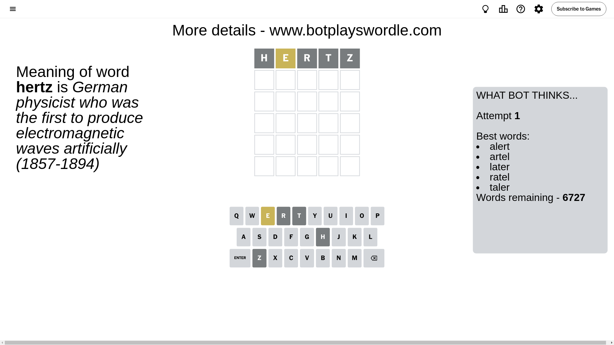
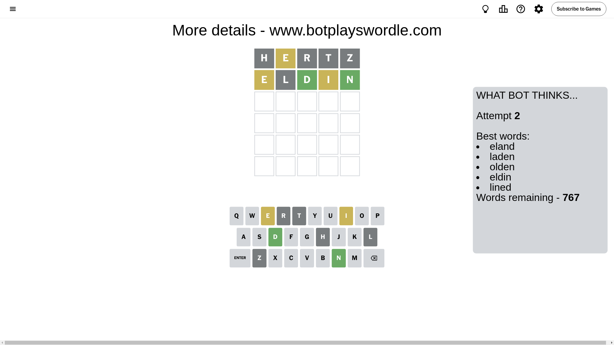
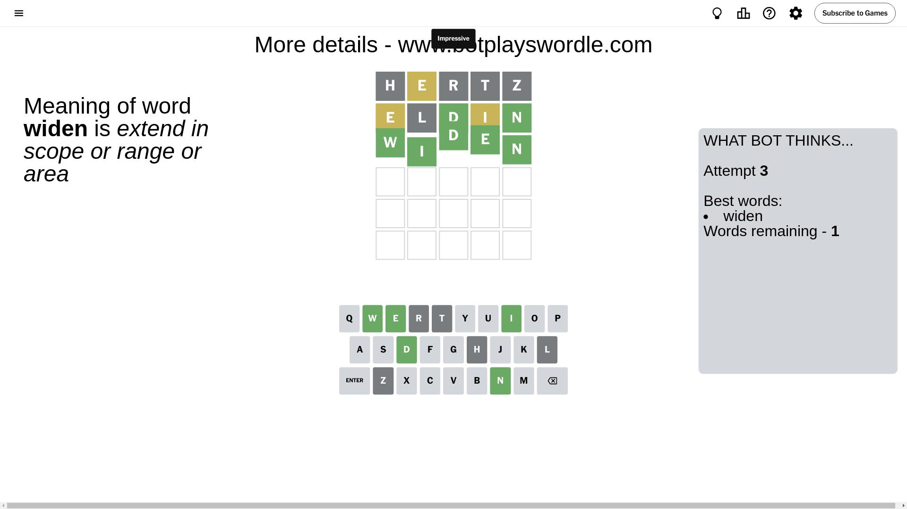

# Wordle for September 5, 2024 - \#1174

## Attempt 1

This is the first attempt and we'll choose a random word to start with.

Let's start with word `hertz`

Attempt for `hertz` gives us 0 correct letters, 1 present letters and 4 wrong letters.

If we look into details, we can see that:

Letter `h` is not present in the word and we will not use it any more

Letter `e` is on a different spot - this means that it cannot be at position 2

Letter `r` is not present in the word and we will not use it any more

Letter `t` is not present in the word and we will not use it any more

Letter `z` is not present in the word and we will not use it any more

Some letters are missing (like `h`, `r`, `t`, `z`) but it's also important piece of information

Word should contain letters `[e]`

That was a great guess that limited number of remaining words

## Attempt 2

Right now we have 767 words to choose from and best of them seem to be `[eland laden olden eldin lined]`

So far we know that possible letters are:

At position 1: `[a b c d e f g i j k l m n o p q s u v w x y]`

At position 2: `[a b c d f g i j k l m n o p q s u v w x y]`

At position 3: `[a b c d e f g i j k l m n o p q s u v w x y]`

At position 4: `[a b c d e f g i j k l m n o p q s u v w x y]`

At position 5: `[a b c d e f g i j k l m n o p q s u v w x y]`

Next guess is `eldin`, let's see what it gives us

Attempt for `eldin` gives us 2 correct letters, 2 present letters and 1 wrong letters.

If we look into details, we can see that:

Letter `e` is on a different spot - this means that it cannot be at position 1

Letter `l` is not present in the word and we will not use it any more

Letter `d` should be at position 3

Letter `i` is on a different spot - this means that it cannot be at position 4

Letter `n` should be at position 5

We got information about the correct letters and it should make next attempt easier

Some letters are missing (like `l`) but it's also important piece of information

Word should contain letters `[e d i n]`

That was a great guess that limited number of remaining words

## Attempt 3

Right now we have 1 words to choose from and best of them seem to be `[widen]`

So far we know that possible letters are:

At position 1: `[a b c d f g i j k m n o p q s u v w x y]`

At position 2: `[a b c d f g i j k m n o p q s u v w x y]`

At position 3: `[d]`

At position 4: `[a b c d e f g j k m n o p q s u v w x y]`

At position 5: `[n]`

It must be `widen`

That's the correct answer! The word is `widen`!

## Conclusion

Today's word is `widen` and it took 3 attempts to guess it

