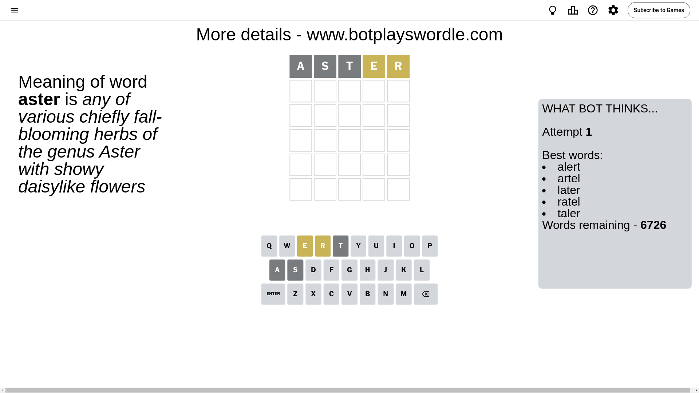

# Wordle for September 6, 2024 - \#1175

## Attempt 1

This is the first attempt and we'll choose a random word to start with.

Let's start with word `aster`

Attempt for `aster` gives us 0 correct letters, 2 present letters and 3 wrong letters.

If we look into details, we can see that:

Letter `a` is not present in the word and we will not use it any more

Letter `s` is not present in the word and we will not use it any more

Letter `t` is not present in the word and we will not use it any more

Letter `e` is on a different spot - this means that it cannot be at position 4

Letter `r` is on a different spot - this means that it cannot be at position 5

Some letters are missing (like `a`, `s`, `t`) but it's also important piece of information

Word should contain letters `[e r]`

That was a great guess that limited number of remaining words

## Attempt 2

Right now we have 209 words to choose from and best of them seem to be `[enrol drone ronde redly heron]`

So far we know that possible letters are:

At position 1: `[b c d e f g h i j k l m n o p q r u v w x y z]`

At position 2: `[b c d e f g h i j k l m n o p q r u v w x y z]`

At position 3: `[b c d e f g h i j k l m n o p q r u v w x y z]`

At position 4: `[b c d f g h i j k l m n o p q r u v w x y z]`

At position 5: `[b c d e f g h i j k l m n o p q u v w x y z]`

Next guess is `ronde`, let's see what it gives us

Attempt for `ronde` gives us 1 correct letters, 2 present letters and 2 wrong letters.

If we look into details, we can see that:

Letter `r` should be at position 1

Letter `o` is not present in the word and we will not use it any more

Letter `n` is on a different spot - this means that it cannot be at position 3

Letter `d` is not present in the word and we will not use it any more

Letter `e` is on a different spot - this means that it cannot be at position 5

We got information about the correct letters and it should make next attempt easier

Some letters are missing (like `o`, `d`) but it's also important piece of information

Word should contain letters `[e r n]`

That was a great guess that limited number of remaining words

## Attempt 3

Right now we have 4 words to choose from and best of them seem to be `[repin reign rewin rerun]`

So far we know that possible letters are:

At position 1: `[r]`

At position 2: `[b c e f g h i j k l m n p q r u v w x y z]`

At position 3: `[b c e f g h i j k l m p q r u v w x y z]`

At position 4: `[b c f g h i j k l m n p q r u v w x y z]`

At position 5: `[b c f g h i j k l m n p q u v w x y z]`

Next guess is `repin`, let's see what it gives us

Attempt for `repin` gives us 3 correct letters, 0 present letters and 2 wrong letters.

If we look into details, we can see that:

Letter `e` should be at position 2

Letter `p` is not present in the word and we will not use it any more

Letter `i` is not present in the word and we will not use it any more

Letter `n` should be at position 5

We got information about the correct letters and it should make next attempt easier

Some letters are missing (like `p`, `i`) but it's also important piece of information

Word should contain letters `[e r n]`

Could be a better guess

## Attempt 4

Right now we have 1 words to choose from and best of them seem to be `[rerun]`

So far we know that possible letters are:

At position 1: `[r]`

At position 2: `[e]`

At position 3: `[b c e f g h j k l m q r u v w x y z]`

At position 4: `[b c f g h j k l m n q r u v w x y z]`

At position 5: `[n]`

It must be `rerun`

That's the correct answer! The word is `rerun`!

## Conclusion

Today's word is `rerun` and it took 4 attempts to guess it

