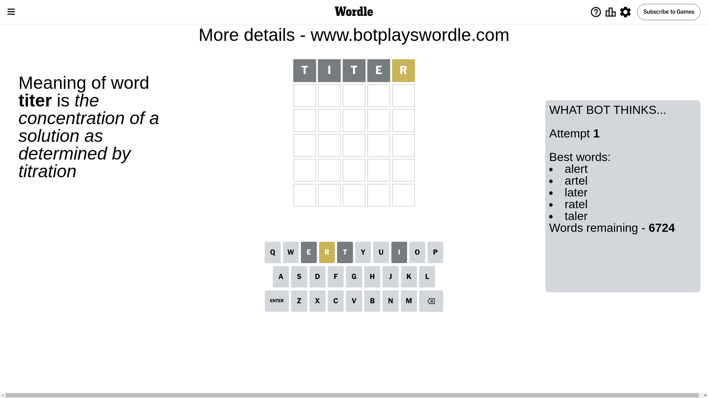
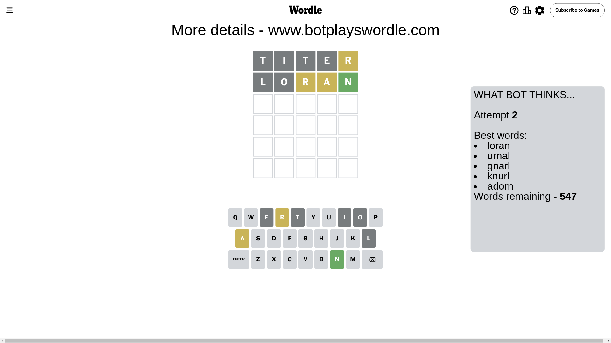
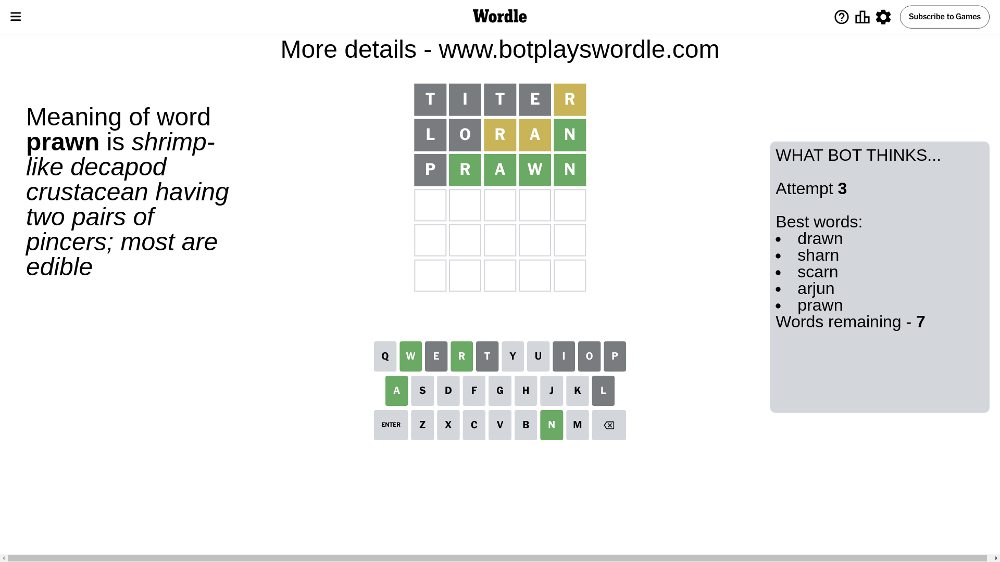
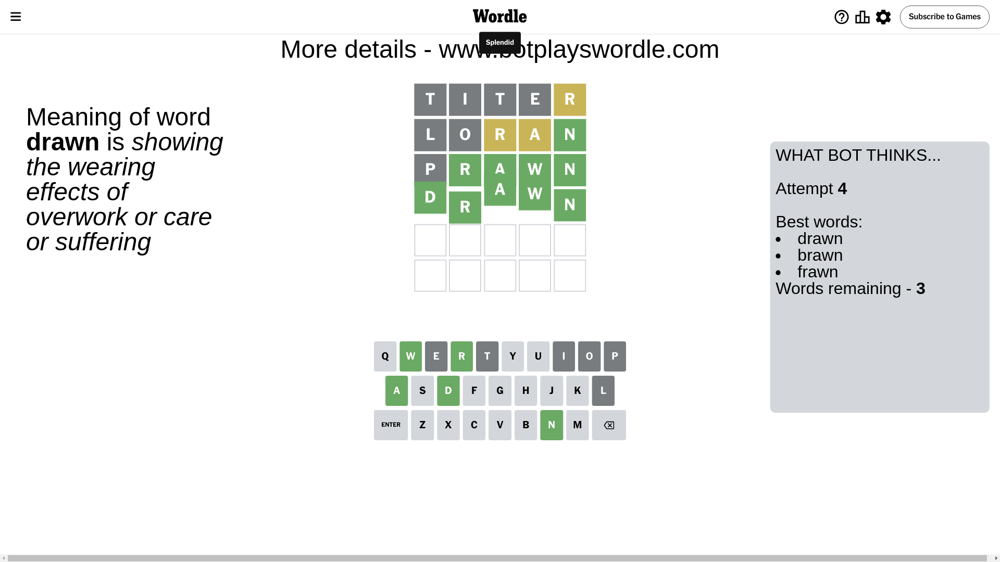

# Wordle for September 8, 2024 - \#1177

## Attempt 1

This is the first attempt and we'll choose a random word to start with.

Let's start with word `titer`

Attempt for `titer` gives us 0 correct letters, 1 present letters and 4 wrong letters.

If we look into details, we can see that:

Letter `t` is not present in the word and we will not use it any more

Letter `i` is not present in the word and we will not use it any more

Letter `t` is not present in the word and we will not use it any more

Letter `e` is not present in the word and we will not use it any more

Letter `r` is on a different spot - this means that it cannot be at position 5

Some letters are missing (like `t`, `i`, `e`) but it's also important piece of information

Word should contain letters `[r]`

That was a great guess that limited number of remaining words

## Attempt 2

Right now we have 547 words to choose from and best of them seem to be `[loran urnal gnarl knurl adorn]`

So far we know that possible letters are:

At position 1: `[a b c d f g h j k l m n o p q r s u v w x y z]`

At position 2: `[a b c d f g h j k l m n o p q r s u v w x y z]`

At position 3: `[a b c d f g h j k l m n o p q r s u v w x y z]`

At position 4: `[a b c d f g h j k l m n o p q r s u v w x y z]`

At position 5: `[a b c d f g h j k l m n o p q s u v w x y z]`

Next guess is `loran`, let's see what it gives us

Attempt for `loran` gives us 1 correct letters, 2 present letters and 2 wrong letters.

If we look into details, we can see that:

Letter `l` is not present in the word and we will not use it any more

Letter `o` is not present in the word and we will not use it any more

Letter `r` is on a different spot - this means that it cannot be at position 3

Letter `a` is on a different spot - this means that it cannot be at position 4

Letter `n` should be at position 5

We got information about the correct letters and it should make next attempt easier

Some letters are missing (like `l`, `o`) but it's also important piece of information

Word should contain letters `[r a n]`

That was a great guess that limited number of remaining words

## Attempt 3

Right now we have 7 words to choose from and best of them seem to be `[drawn sharn scarn arjun prawn]`

So far we know that possible letters are:

At position 1: `[a b c d f g h j k m n p q r s u v w x y z]`

At position 2: `[a b c d f g h j k m n p q r s u v w x y z]`

At position 3: `[a b c d f g h j k m n p q s u v w x y z]`

At position 4: `[b c d f g h j k m n p q r s u v w x y z]`

At position 5: `[n]`

Next guess is `prawn`, let's see what it gives us

Attempt for `prawn` gives us 4 correct letters, 0 present letters and 1 wrong letters.

If we look into details, we can see that:

Letter `p` is not present in the word and we will not use it any more

Letter `r` should be at position 2

Letter `a` should be at position 3

Letter `w` should be at position 4

We got information about the correct letters and it should make next attempt easier

Some letters are missing (like `p`) but it's also important piece of information

Word should contain letters `[r a n w]`

Could be a better guess

## Attempt 4

Right now we have 3 words to choose from and best of them seem to be `[drawn brawn frawn]`

So far we know that possible letters are:

At position 1: `[a b c d f g h j k m n q r s u v w x y z]`

At position 2: `[r]`

At position 3: `[a]`

At position 4: `[w]`

At position 5: `[n]`

Next guess is `drawn`, let's see what it gives us

That's the correct answer! The word is `drawn`!

## Conclusion

Today's word is `drawn` and it took 4 attempts to guess it

