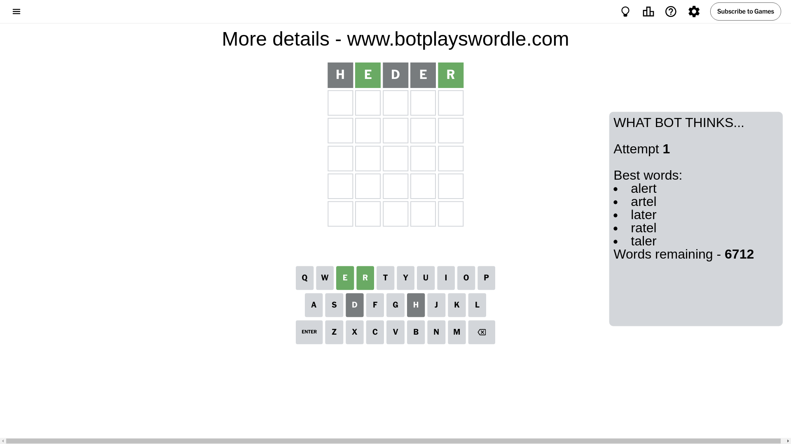
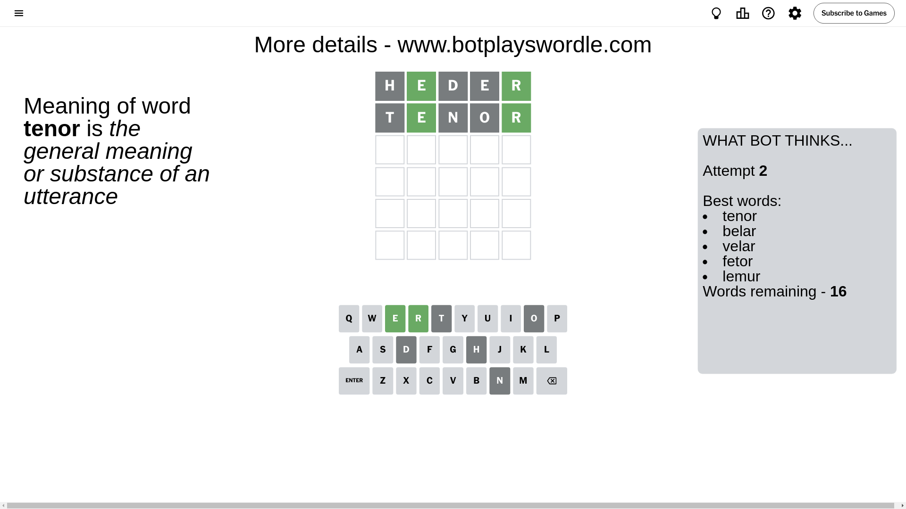
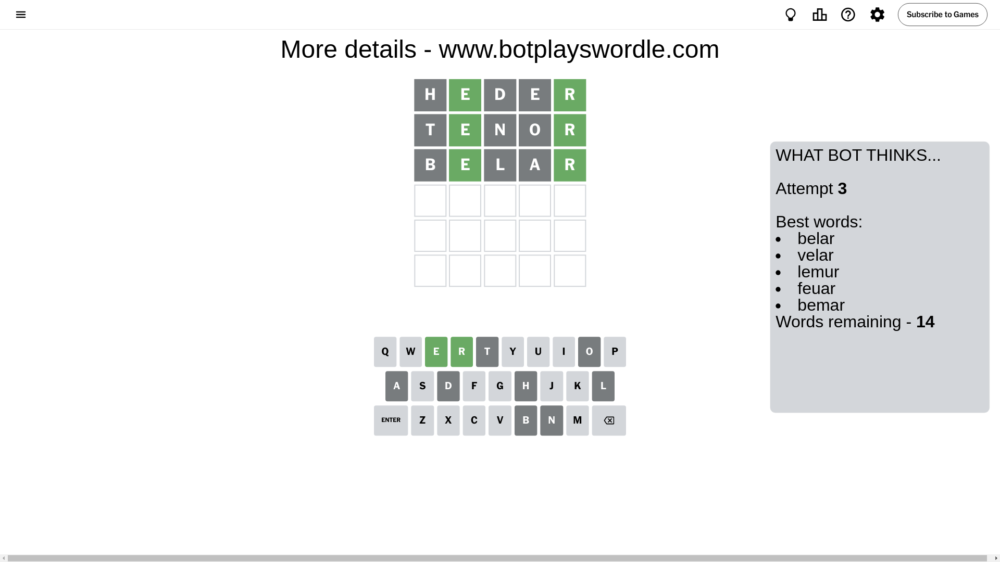
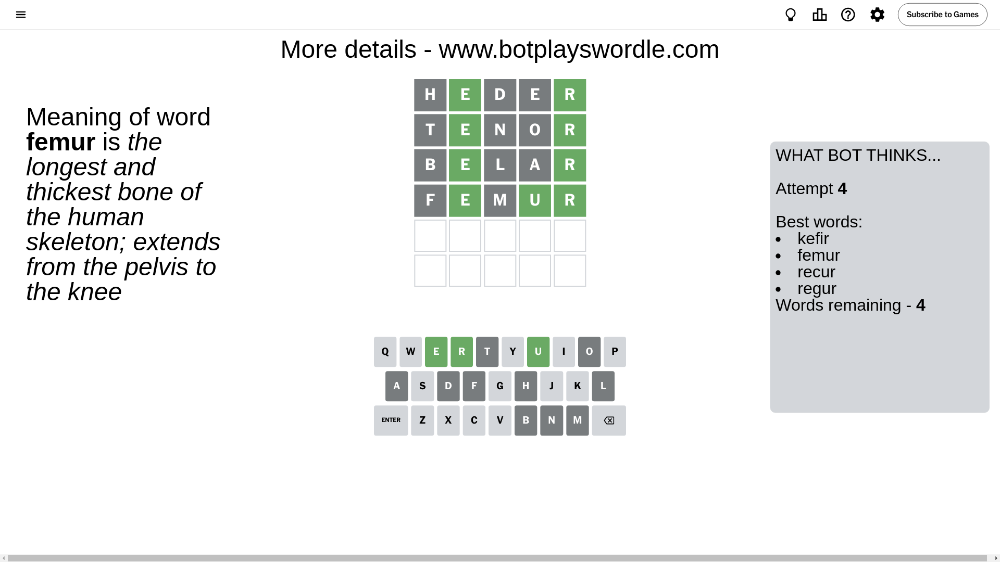
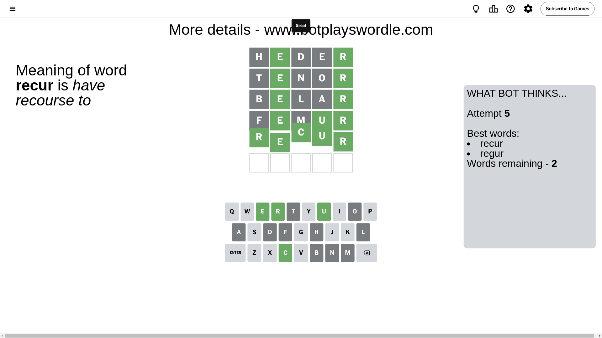

# Wordle for September 15, 2024 - \#1184

## Attempt 1

This is the first attempt and we'll choose a random word to start with.

Let's start with word `heder`

Attempt for `heder` gives us 2 correct letters, 0 present letters and 3 wrong letters.

If we look into details, we can see that:

Letter `h` is not present in the word and we will not use it any more

Letter `e` should be at position 2

Letter `d` is not present in the word and we will not use it any more

Letter `e` is not present in the word and we will not use it any more

Letter `r` should be at position 5

We got information about the correct letters and it should make next attempt easier

Some letters are missing (like `h`, `d`, `e`) but it's also important piece of information

Word should contain letters `[e r]`

That was a great guess that limited number of remaining words

## Attempt 2

Right now we have 16 words to choose from and best of them seem to be `[tenor belar velar fetor lemur]`

So far we know that possible letters are:

At position 1: `[a b c f g i j k l m n o p q r s t u v w x y z]`

At position 2: `[e]`

At position 3: `[a b c f g i j k l m n o p q r s t u v w x y z]`

At position 4: `[a b c f g i j k l m n o p q r s t u v w x y z]`

At position 5: `[r]`

Next guess is `tenor`, let's see what it gives us

Attempt for `tenor` gives us 2 correct letters, 0 present letters and 3 wrong letters.

If we look into details, we can see that:

Letter `t` is not present in the word and we will not use it any more

Letter `n` is not present in the word and we will not use it any more

Letter `o` is not present in the word and we will not use it any more

Some letters are missing (like `t`, `n`, `o`) but it's also important piece of information

Word should contain letters `[e r]`

This was a waste, almost no valuable information...

## Attempt 3

Right now we have 14 words to choose from and best of them seem to be `[belar velar lemur feuar bemar]`

So far we know that possible letters are:

At position 1: `[a b c f g i j k l m p q r s u v w x y z]`

At position 2: `[e]`

At position 3: `[a b c f g i j k l m p q r s u v w x y z]`

At position 4: `[a b c f g i j k l m p q r s u v w x y z]`

At position 5: `[r]`

Next guess is `belar`, let's see what it gives us

Attempt for `belar` gives us 2 correct letters, 0 present letters and 3 wrong letters.

If we look into details, we can see that:

Letter `b` is not present in the word and we will not use it any more

Letter `l` is not present in the word and we will not use it any more

Letter `a` is not present in the word and we will not use it any more

Some letters are missing (like `b`, `l`, `a`) but it's also important piece of information

Word should contain letters `[e r]`

Could be a better guess

## Attempt 4

Right now we have 4 words to choose from and best of them seem to be `[kefir femur recur regur]`

So far we know that possible letters are:

At position 1: `[c f g i j k m p q r s u v w x y z]`

At position 2: `[e]`

At position 3: `[c f g i j k m p q r s u v w x y z]`

At position 4: `[c f g i j k m p q r s u v w x y z]`

At position 5: `[r]`

Next guess is `femur`, let's see what it gives us

Attempt for `femur` gives us 3 correct letters, 0 present letters and 2 wrong letters.

If we look into details, we can see that:

Letter `f` is not present in the word and we will not use it any more

Letter `m` is not present in the word and we will not use it any more

Letter `u` should be at position 4

We got information about the correct letters and it should make next attempt easier

Some letters are missing (like `f`, `m`) but it's also important piece of information

Word should contain letters `[e r u]`

This was a waste, almost no valuable information...

## Attempt 5

Right now we have 2 words to choose from and best of them seem to be `[recur regur]`

So far we know that possible letters are:

At position 1: `[c g i j k p q r s u v w x y z]`

At position 2: `[e]`

At position 3: `[c g i j k p q r s u v w x y z]`

At position 4: `[u]`

At position 5: `[r]`

Next guess is `recur`, let's see what it gives us

That's the correct answer! The word is `recur`!

## Conclusion

Today's word is `recur` and it took 5 attempts to guess it

