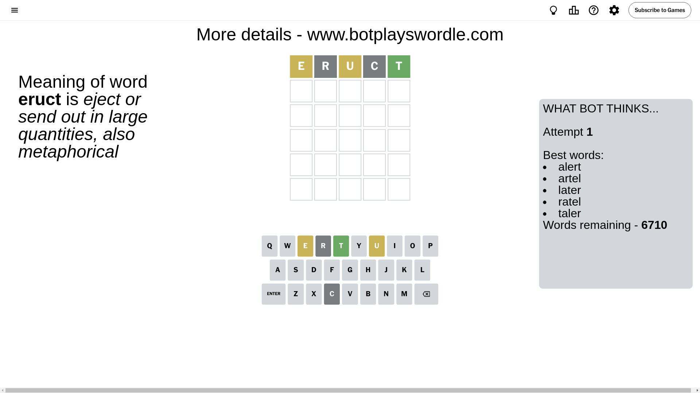
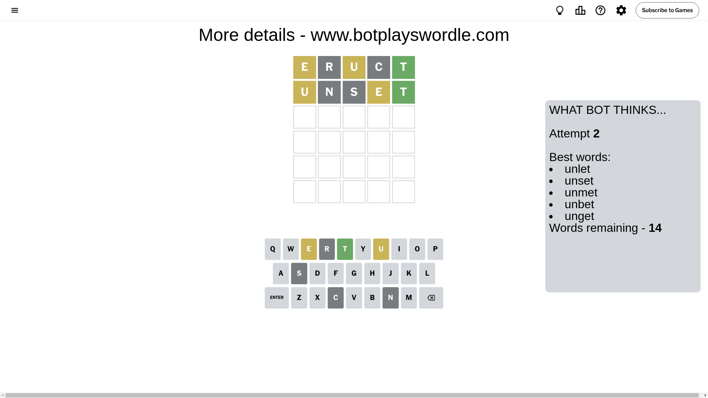
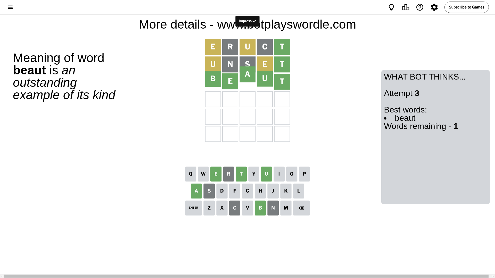

# Wordle for September 17, 2024 - \#1186

## Attempt 1

This is the first attempt and we'll choose a random word to start with.

Let's start with word `eruct`

Attempt for `eruct` gives us 1 correct letters, 2 present letters and 2 wrong letters.

If we look into details, we can see that:

Letter `e` is on a different spot - this means that it cannot be at position 1

Letter `r` is not present in the word and we will not use it any more

Letter `u` is on a different spot - this means that it cannot be at position 3

Letter `c` is not present in the word and we will not use it any more

Letter `t` should be at position 5

We got information about the correct letters and it should make next attempt easier

Some letters are missing (like `r`, `c`) but it's also important piece of information

Word should contain letters `[e u t]`

That was a great guess that limited number of remaining words

## Attempt 2

Right now we have 14 words to choose from and best of them seem to be `[unlet unset unmet unbet unget]`

So far we know that possible letters are:

At position 1: `[a b d f g h i j k l m n o p q s t u v w x y z]`

At position 2: `[a b d e f g h i j k l m n o p q s t u v w x y z]`

At position 3: `[a b d e f g h i j k l m n o p q s t v w x y z]`

At position 4: `[a b d e f g h i j k l m n o p q s t u v w x y z]`

At position 5: `[t]`

Next guess is `unset`, let's see what it gives us

Attempt for `unset` gives us 1 correct letters, 2 present letters and 2 wrong letters.

If we look into details, we can see that:

Letter `u` is on a different spot - this means that it cannot be at position 1

Letter `n` is not present in the word and we will not use it any more

Letter `s` is not present in the word and we will not use it any more

Letter `e` is on a different spot - this means that it cannot be at position 4

Some letters are missing (like `n`, `s`) but it's also important piece of information

Word should contain letters `[e u t]`

That was a great guess that limited number of remaining words

## Attempt 3

Right now we have 1 words to choose from and best of them seem to be `[beaut]`

So far we know that possible letters are:

At position 1: `[a b d f g h i j k l m o p q t v w x y z]`

At position 2: `[a b d e f g h i j k l m o p q t u v w x y z]`

At position 3: `[a b d e f g h i j k l m o p q t v w x y z]`

At position 4: `[a b d f g h i j k l m o p q t u v w x y z]`

At position 5: `[t]`

It must be `beaut`

That's the correct answer! The word is `beaut`!

## Conclusion

Today's word is `beaut` and it took 3 attempts to guess it

