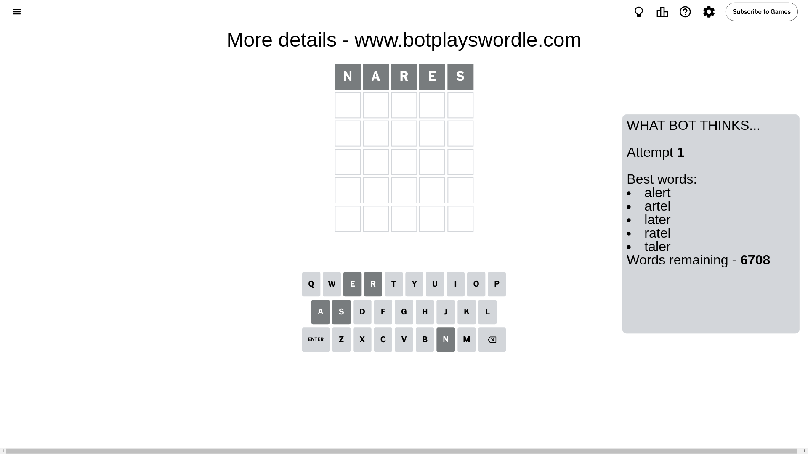
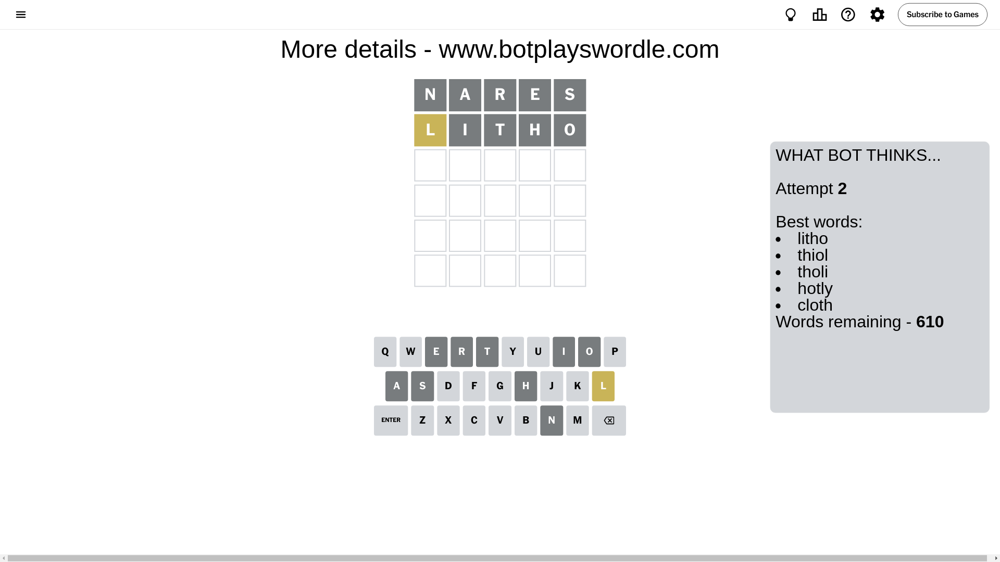
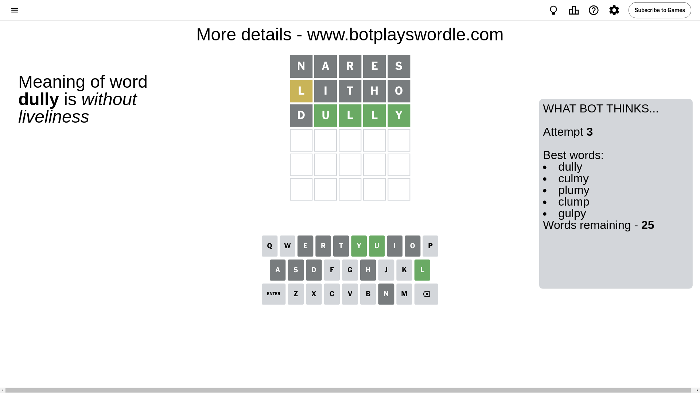
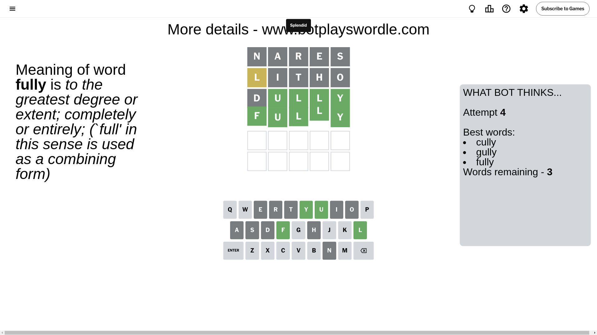

# Wordle for September 18, 2024 - \#1187

## Attempt 1

This is the first attempt and we'll choose a random word to start with.

Let's start with word `nares`

Attempt for `nares` gives us 0 correct letters, 0 present letters and 5 wrong letters.

If we look into details, we can see that:

Letter `n` is not present in the word and we will not use it any more

Letter `a` is not present in the word and we will not use it any more

Letter `r` is not present in the word and we will not use it any more

Letter `e` is not present in the word and we will not use it any more

Letter `s` is not present in the word and we will not use it any more

Some letters are missing (like `n`, `a`, `r`, `e`, `s`) but it's also important piece of information

So far we don't know any of the letters!

That was a great guess that limited number of remaining words

## Attempt 2

Right now we have 610 words to choose from and best of them seem to be `[litho thiol tholi hotly cloth]`

So far we know that possible letters are:

At position 1: `[b c d f g h i j k l m o p q t u v w x y z]`

At position 2: `[b c d f g h i j k l m o p q t u v w x y z]`

At position 3: `[b c d f g h i j k l m o p q t u v w x y z]`

At position 4: `[b c d f g h i j k l m o p q t u v w x y z]`

At position 5: `[b c d f g h i j k l m o p q t u v w x y z]`

Next guess is `litho`, let's see what it gives us

Attempt for `litho` gives us 0 correct letters, 1 present letters and 4 wrong letters.

If we look into details, we can see that:

Letter `l` is on a different spot - this means that it cannot be at position 1

Letter `i` is not present in the word and we will not use it any more

Letter `t` is not present in the word and we will not use it any more

Letter `h` is not present in the word and we will not use it any more

Letter `o` is not present in the word and we will not use it any more

Some letters are missing (like `i`, `t`, `h`, `o`) but it's also important piece of information

Word should contain letters `[l]`

That was a great guess that limited number of remaining words

## Attempt 3

Right now we have 25 words to choose from and best of them seem to be `[dully culmy plumy clump gulpy]`

So far we know that possible letters are:

At position 1: `[b c d f g j k m p q u v w x y z]`

At position 2: `[b c d f g j k l m p q u v w x y z]`

At position 3: `[b c d f g j k l m p q u v w x y z]`

At position 4: `[b c d f g j k l m p q u v w x y z]`

At position 5: `[b c d f g j k l m p q u v w x y z]`

Next guess is `dully`, let's see what it gives us

Attempt for `dully` gives us 4 correct letters, 0 present letters and 1 wrong letters.

If we look into details, we can see that:

Letter `d` is not present in the word and we will not use it any more

Letter `u` should be at position 2

Letter `l` should be at position 3

Letter `l` should be at position 4

Letter `y` should be at position 5

We got information about the correct letters and it should make next attempt easier

Some letters are missing (like `d`) but it's also important piece of information

Word should contain letters `[l u y]`

That was a great guess that limited number of remaining words

## Attempt 4

Right now we have 3 words to choose from and best of them seem to be `[cully gully fully]`

So far we know that possible letters are:

At position 1: `[b c f g j k m p q u v w x y z]`

At position 2: `[u]`

At position 3: `[l]`

At position 4: `[l]`

At position 5: `[y]`

Next guess is `fully`, let's see what it gives us

That's the correct answer! The word is `fully`!

## Conclusion

Today's word is `fully` and it took 4 attempts to guess it

