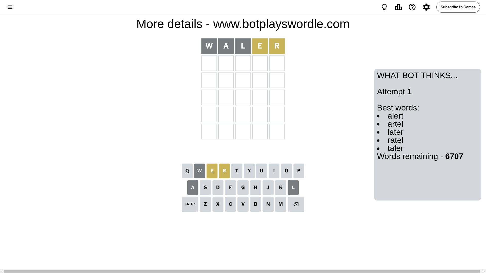

# Wordle for September 19, 2024 - \#1188

## Attempt 1

This is the first attempt and we'll choose a random word to start with.

Let's start with word `waler`

Attempt for `waler` gives us 0 correct letters, 2 present letters and 3 wrong letters.

If we look into details, we can see that:

Letter `w` is not present in the word and we will not use it any more

Letter `a` is not present in the word and we will not use it any more

Letter `l` is not present in the word and we will not use it any more

Letter `e` is on a different spot - this means that it cannot be at position 4

Letter `r` is on a different spot - this means that it cannot be at position 5

Some letters are missing (like `w`, `a`, `l`) but it's also important piece of information

Word should contain letters `[e r]`

That was a great guess that limited number of remaining words

## Attempt 2

Right now we have 299 words to choose from and best of them seem to be `[trone inert retin trine urent]`

So far we know that possible letters are:

At position 1: `[b c d e f g h i j k m n o p q r s t u v x y z]`

At position 2: `[b c d e f g h i j k m n o p q r s t u v x y z]`

At position 3: `[b c d e f g h i j k m n o p q r s t u v x y z]`

At position 4: `[b c d f g h i j k m n o p q r s t u v x y z]`

At position 5: `[b c d e f g h i j k m n o p q s t u v x y z]`

Next guess is `trone`, let's see what it gives us

Attempt for `trone` gives us 1 correct letters, 1 present letters and 3 wrong letters.

If we look into details, we can see that:

Letter `t` is not present in the word and we will not use it any more

Letter `r` should be at position 2

Letter `o` is not present in the word and we will not use it any more

Letter `n` is not present in the word and we will not use it any more

Letter `e` is on a different spot - this means that it cannot be at position 5

We got information about the correct letters and it should make next attempt easier

Some letters are missing (like `t`, `o`, `n`) but it's also important piece of information

Word should contain letters `[e r]`

That was a great guess that limited number of remaining words

## Attempt 3

Right now we have 14 words to choose from and best of them seem to be `[ureid dregs dress fremd fresh]`

So far we know that possible letters are:

At position 1: `[b c d e f g h i j k m p q r s u v x y z]`

At position 2: `[r]`

At position 3: `[b c d e f g h i j k m p q r s u v x y z]`

At position 4: `[b c d f g h i j k m p q r s u v x y z]`

At position 5: `[b c d f g h i j k m p q s u v x y z]`

Next guess is `dress`, let's see what it gives us

Attempt for `dress` gives us 4 correct letters, 0 present letters and 1 wrong letters.

If we look into details, we can see that:

Letter `d` is not present in the word and we will not use it any more

Letter `e` should be at position 3

Letter `s` should be at position 4

Letter `s` should be at position 5

We got information about the correct letters and it should make next attempt easier

Some letters are missing (like `d`) but it's also important piece of information

Word should contain letters `[e r s]`

Not a bad guess in general

## Attempt 4

Right now we have 2 words to choose from and best of them seem to be `[cress press]`

So far we know that possible letters are:

At position 1: `[b c e f g h i j k m p q r s u v x y z]`

At position 2: `[r]`

At position 3: `[e]`

At position 4: `[s]`

At position 5: `[s]`

Next guess is `press`, let's see what it gives us

That's the correct answer! The word is `press`!

## Conclusion

Today's word is `press` and it took 4 attempts to guess it

