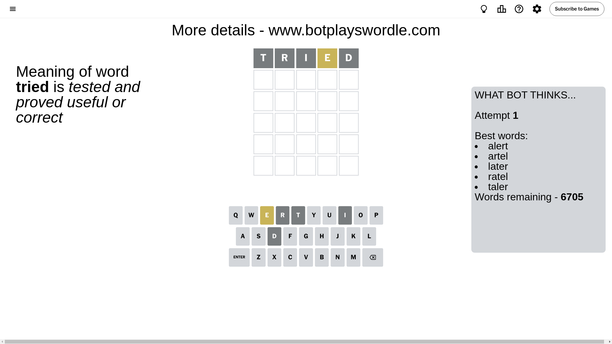
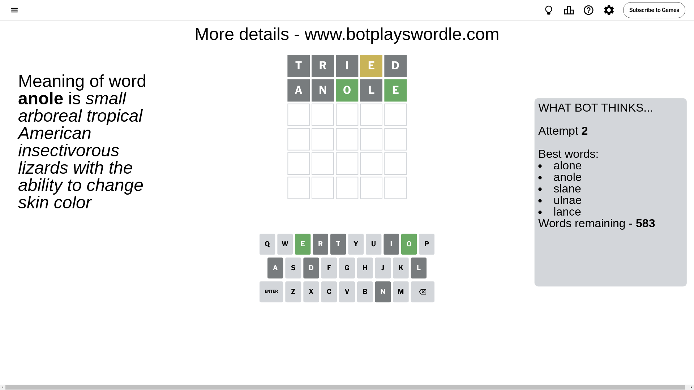
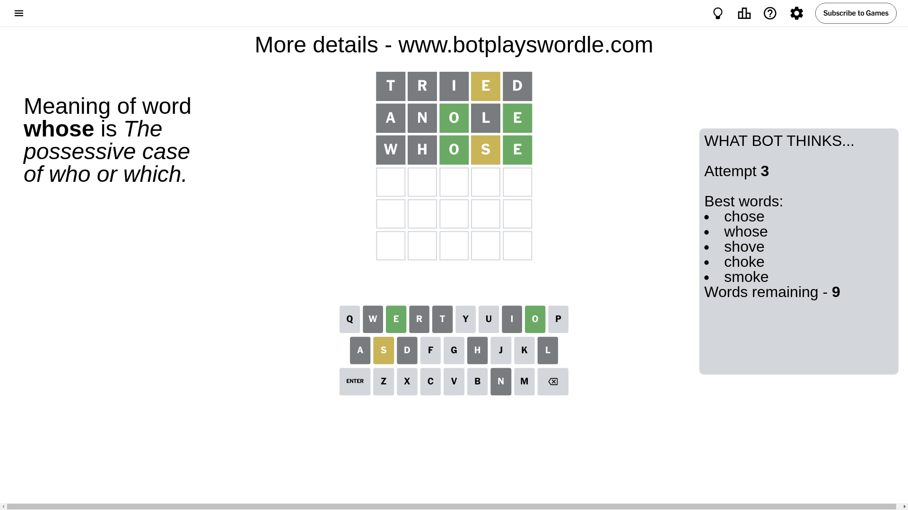
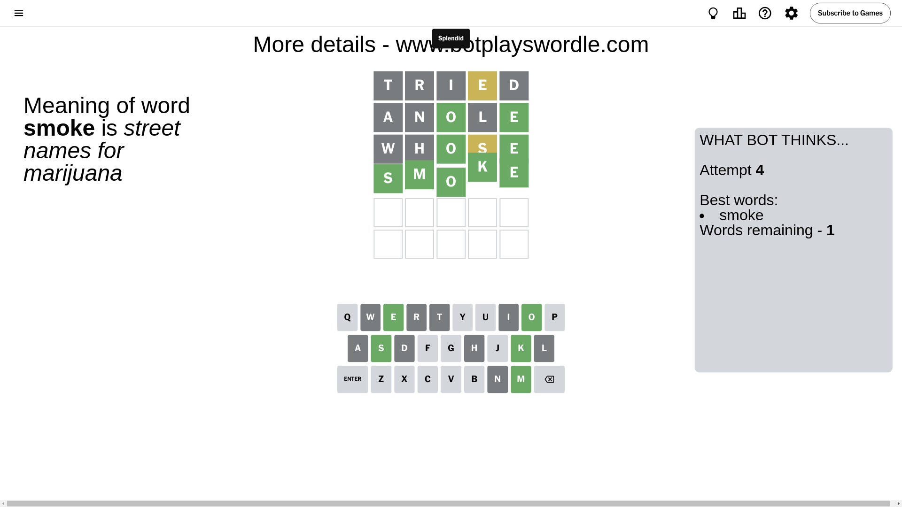

# Wordle for September 20, 2024 - \#1189

## Attempt 1

This is the first attempt and we'll choose a random word to start with.

Let's start with word `tried`

Attempt for `tried` gives us 0 correct letters, 1 present letters and 4 wrong letters.

If we look into details, we can see that:

Letter `t` is not present in the word and we will not use it any more

Letter `r` is not present in the word and we will not use it any more

Letter `i` is not present in the word and we will not use it any more

Letter `e` is on a different spot - this means that it cannot be at position 4

Letter `d` is not present in the word and we will not use it any more

Some letters are missing (like `t`, `r`, `i`, `d`) but it's also important piece of information

Word should contain letters `[e]`

That was a great guess that limited number of remaining words

## Attempt 2

Right now we have 583 words to choose from and best of them seem to be `[alone anole slane ulnae lance]`

So far we know that possible letters are:

At position 1: `[a b c e f g h j k l m n o p q s u v w x y z]`

At position 2: `[a b c e f g h j k l m n o p q s u v w x y z]`

At position 3: `[a b c e f g h j k l m n o p q s u v w x y z]`

At position 4: `[a b c f g h j k l m n o p q s u v w x y z]`

At position 5: `[a b c e f g h j k l m n o p q s u v w x y z]`

Next guess is `anole`, let's see what it gives us

Attempt for `anole` gives us 2 correct letters, 0 present letters and 3 wrong letters.

If we look into details, we can see that:

Letter `a` is not present in the word and we will not use it any more

Letter `n` is not present in the word and we will not use it any more

Letter `o` should be at position 3

Letter `l` is not present in the word and we will not use it any more

Letter `e` should be at position 5

We got information about the correct letters and it should make next attempt easier

Some letters are missing (like `a`, `n`, `l`) but it's also important piece of information

Word should contain letters `[e o]`

That was a great guess that limited number of remaining words

## Attempt 3

Right now we have 9 words to choose from and best of them seem to be `[chose whose shove choke smoke]`

So far we know that possible letters are:

At position 1: `[b c e f g h j k m o p q s u v w x y z]`

At position 2: `[b c e f g h j k m o p q s u v w x y z]`

At position 3: `[o]`

At position 4: `[b c f g h j k m o p q s u v w x y z]`

At position 5: `[e]`

Next guess is `whose`, let's see what it gives us

Attempt for `whose` gives us 2 correct letters, 1 present letters and 2 wrong letters.

If we look into details, we can see that:

Letter `w` is not present in the word and we will not use it any more

Letter `h` is not present in the word and we will not use it any more

Letter `s` is on a different spot - this means that it cannot be at position 4

Some letters are missing (like `w`, `h`) but it's also important piece of information

Word should contain letters `[e o s]`

That was a great guess that limited number of remaining words

## Attempt 4

Right now we have 1 words to choose from and best of them seem to be `[smoke]`

So far we know that possible letters are:

At position 1: `[b c e f g j k m o p q s u v x y z]`

At position 2: `[b c e f g j k m o p q s u v x y z]`

At position 3: `[o]`

At position 4: `[b c f g j k m o p q u v x y z]`

At position 5: `[e]`

It must be `smoke`

That's the correct answer! The word is `smoke`!

## Conclusion

Today's word is `smoke` and it took 4 attempts to guess it

